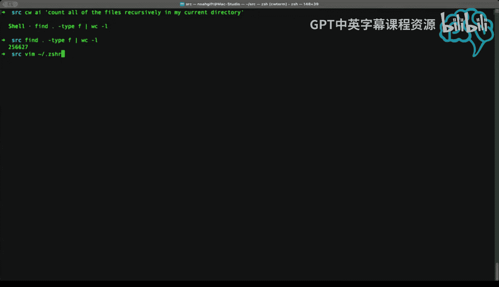
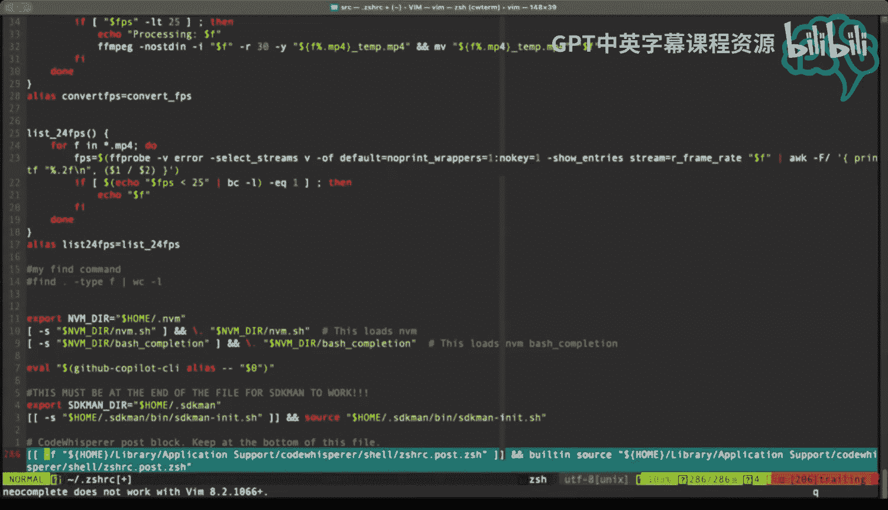

# 148：使用AWS CodeWhisperer命令行工具

在本节课中，我们将学习如何在Shell环境中使用AWS CodeWhisperer命令行工具。这个工具能够根据自然语言描述生成相应的Shell命令，不仅能即时解决问题，还能帮助我们学习和积累知识。

## 概述

AWS CodeWhisperer是一个强大的AI编程助手，它不仅能帮助编写代码，还能在命令行环境中根据你的自然语言描述生成Shell命令。这对于快速执行复杂查询、学习新命令以及提高工作效率非常有帮助。

## 在Shell中使用CodeWhisperer

上一节我们介绍了CodeWhisperer的基本概念，本节中我们来看看如何在Mac系统的Shell环境中实际使用它。

首先，打开你的终端并进入一个包含源代码的目录。你可以通过输入自然语言问题来获取命令建议。例如，输入一个以`#`开头的描述。

```
# 统计当前目录下所有文件的数量（递归）
```

按下回车后，CodeWhisperer会生成一个命令建议，例如使用`find`和`wc`命令的组合。你可以选择执行这个命令，它会递归地计算当前目录下的文件总数。

```
find . -type f | wc -l
```

执行后，你可能会看到类似“256000”的输出，这表示你的目录中有大量文件。

## 将命令保存为别名

生成命令不仅是为了即时使用，更是一个绝佳的学习机会。你可以将这些复杂的命令保存为Shell别名，方便日后调用。



以下是创建别名的方法：

1.  打开你的Shell配置文件（例如Zsh用户的`~/.zshrc`）。
2.  添加别名行，例如：`alias countfiles='find . -type f | wc -l'`。
3.  保存文件并执行`source ~/.zshrc`使别名生效。

通过这种方式，你可以逐步建立一个个性化的命令库，将学到的知识固化下来。



## 使用CWAI进行长格式提问

除了使用`#`前缀，你还可以使用`cwai`命令进行更详细的长格式提问。这种方式允许你提出更复杂、更具体的问题。

例如，你可以输入：

```
cwai 查找所有CPU使用率超过10%的进程
```

CodeWhisperer会分析你的请求，并生成一个相应的`ps`命令组合来列出符合条件的进程。

```
ps aux | awk '$3 > 10 {print $0}'
```

执行这个命令，你就能看到当前系统中所有CPU使用率超过10%的进程列表。这替代了以往需要去搜索引擎或技术论坛查找命令的步骤，极大地提升了效率。

## 总结


本节课中我们一起学习了AWS CodeWhisperer命令行工具的核心用法。我们了解到，它可以通过`#`前缀或`cwai`命令，将自然语言问题转化为可执行的Shell命令。这不仅是一个高效的即时助手，更能通过将生成的命令保存为别名，帮助我们系统地学习和积累命令行知识，从而持续提升工作效率。