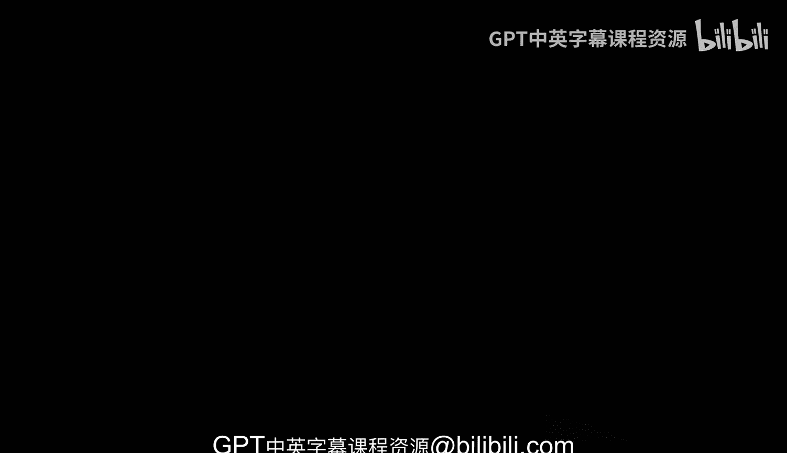

# Rust编程4-5（Linux命令行工具、LLMOps）：03：关于本课程 📘

在本课程中，我们将学习Rust和Python的基础知识，重点聚焦于CLI（命令行工具）的开发。命令行工具不仅适用于小型自动化任务，还能扩展至数据工程、机器学习及系统工程等更复杂的应用场景。

## 课程概述

命令行工具的重要性在于，它们为你提供了构建更复杂系统的基础知识和实践经验。你可以将这些脚本和程序集成到持续集成/持续交付平台中，应用于从简单自动化到复杂任务的各类场景。

上一节我们介绍了课程的整体方向，本节中我们将详细探讨课程的具体内容和学习路径。

## 课程内容与结构

以下是本课程的核心内容安排：

1.  **工具创建基础**：我们将学习如何使用Python和Rust创建命令行工具，从最简单的用例开始，逐步过渡到更复杂的模式和高级应用。
2.  **语言结合应用**：课程将展示如何混合使用Python和Rust，让两种语言相互连接。例如，你可以用Rust包来增强Python的功能。
3.  **打包与发布**：在课程后期，我们将学习如何打包这些工具，并将其发布到不同的平台。
4.  **实践实验室**：我们准备了配套的实验环境，帮助你通过实际动手操作来巩固所学知识，并高效利用课程中的示例。

## 学习目标

通过本课程的学习，你将掌握构建实用命令行工具的技能，并能够将这些新技能应用于实际工作中，从而显著提升工作效率。

---

本节课中我们一起学习了本课程的核心目标、内容结构以及最终的学习成果。接下来，我们将从基础开始，逐步深入命令行工具的开发世界。