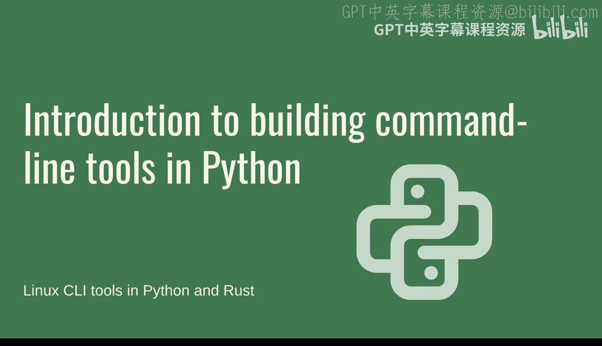
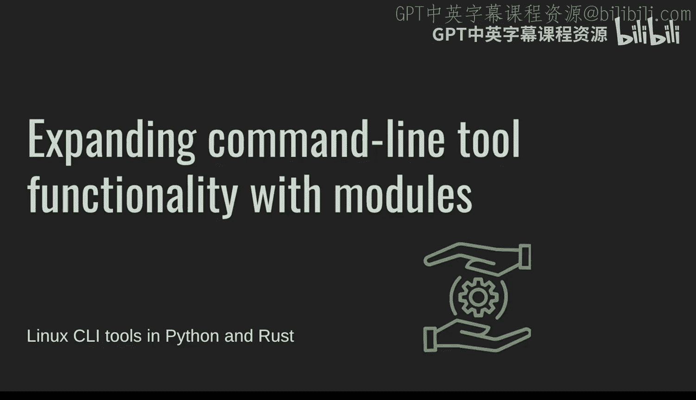

# Python命令行工具入门与最佳实践：1：概述

在本课程中，我们将学习如何开始使用Python构建命令行工具，并介绍一些最佳实践。我们将从最简单的无依赖版本开始，逐步过渡到使用更复杂的框架，并涵盖开发环境设置、模块化、依赖管理等关键主题。

## Python命令行工具入门与最佳实践：2：选择合适的库

上一节我们介绍了课程概述，本节中我们来看看如何为命令行工具选择合适的库。

选择正确的库取决于您最终想要实现的功能。您可能需要使用一个框架，这通常要求您使用Python的打包工具链。Python的打包机制相当复杂。标准库中提供了`optparse`或`argparse`等选项，但这些框架较为复杂，我们并未深入探讨。

我的建议是使用`click`框架。需要注意的是，`click`框架需要单独安装，因为它不属于标准库。因此，这有利有弊。我认为Python的`click`框架非常出色，您绝对应该尝试一下。我们展示的关于打包和安装库的技术也值得学习。

如果您需要处理子命令，`click`框架在这方面表现尤为突出。我们目前只看到了`click`框架中一些基本的参数和选项用法。但当您开始处理更复杂的领域（例如我们稍后将看到的子命令）时，`click`框架能让您更轻松地实现。

另一个方面是，使用框架可以显著简化工具的创建过程。我们看到了帮助菜单、标志和选项的自文档化、输入值的处理以及一些错误处理。一些更高级的功能（我们稍后会讲到）可以自动完成所有这些错误检查。例如，如果您想将字符串转换为整数，在使用基本参数解析时，所有内容最终都是字符串，但像`click`这样的框架可以在幕后将这些值强制转换为整数或其他类型的值。

所有这些`click`框架的功能将帮助您创建更强大的命令行工具，并方便地将`click`框架的各个部分集成到您的工具中。

## Python命令行工具入门与最佳实践：3：设置开发环境

上一节我们讨论了如何选择合适的库，本节中我们来看看如何为Python命令行工具设置一个良好、彻底的开发环境。

设置一个完善的开发环境对于构建Python命令行工具至关重要。您可以使用任何您偏好的工具。如果您使用的文本编辑器与我展示的不同，这完全没问题。我更喜欢Visual Studio Code，因为它功能丰富、免费，并且拥有大量特性。我建议安装一些扩展，例如Python扩展和一些Linting工具。您看到我在某些时候遇到了麻烦，安装这些扩展是值得的。如果您不使用Visual Studio Code，请务必探索您的文本编辑器可能提供的类似功能，以便在开发时获得同样的帮助。

我们看到的另一件事是在命令行工具中处理用户输入。这非常有用，但您需要考虑要公开哪些选项来定制工具的行为。在本例中，我们设置了一个布尔标志来增加输出的详细程度，这绝对是有用的功能。随着您为命令行工具构建更多功能，您将接触到更多此类选项。

## Python命令行工具入门与最佳实践：4：扩展功能与模块化

上一节我们介绍了开发环境的设置，本节中我们来看看如何扩展工具的功能并进行模块化。

当您想要开始扩展工具的功能时，可能会开始使用模块。您可能不希望将所有辅助函数或其他想要重用的额外代码都放在一个单独的文件中。我确实有过处理超过1000行的单个Python文件的恐怖经历，这非常难以处理。我们可以看到，每当我们将逻辑分离到其他模块中时，我们都能使主`main.py`模块更具可读性。这是使用模块的好处之一。另一个好处是，当您想要扩展功能时，您可以轻松、直接地做到这一点，并且很容易理解某些文件和代码应该放在哪里。

例如，如果您想创建异常，可以有一个`exceptions`模块，那么这些异常放在那里就很合理。我们当然还可以继续添加更多功能，比如日志记录和其他配置能力。

## Python命令行工具入门与最佳实践：5：管理依赖与虚拟环境

上一节我们讨论了功能扩展，本节中我们来看看如何管理依赖并使用虚拟环境。

当您想更进一步时，因为在`click`的情况下，您已经在安装依赖项并创建用于分发的工具包，您可以继续添加更多库以实现更复杂的工具功能。例如，如果您想进行网络请求，Python中一个流行的HTTP请求库是`requests`库。如果您想让您的工具更容易地发送HTTP请求并处理这些请求，那么您绝对可以做到这一点。

另一件事是，我们需要稍微谈谈使用虚拟环境管理依赖。这对于设置您的环境和处理这些依赖至关重要。我们看到了`Python setup.py develop`的一些用法，它允许您在开发时对工具进行更改并尝试可执行文件，这是一种非常强大的开发方式。

请务必始终使用虚拟环境。检查您是否在虚拟环境中，并且没有将库安装到不同的位置。这绝对至关重要。在创建、开发的整个过程中，甚至在您尝试发布命令行工具时，这都是您必须做的事情。稍后，当我们进入持续集成和持续交付，并尝试自动化这些工具的发布时，这也是您必须牢记的事情。

## Python命令行工具入门与最佳实践：6：总结

在本节课中，我们一起学习了使用Python构建命令行工具的入门知识和一些最佳实践。

我们涵盖了从选择合适库（特别是推荐使用`click`框架）到设置高效开发环境的全过程。我们探讨了如何通过模块化来组织代码、扩展工具功能，并深入了解了使用虚拟环境管理依赖的重要性。这些步骤和原则是构建可维护、可扩展且专业的命令行工具的基础。