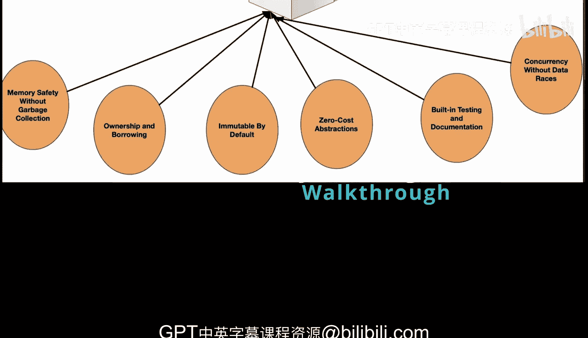
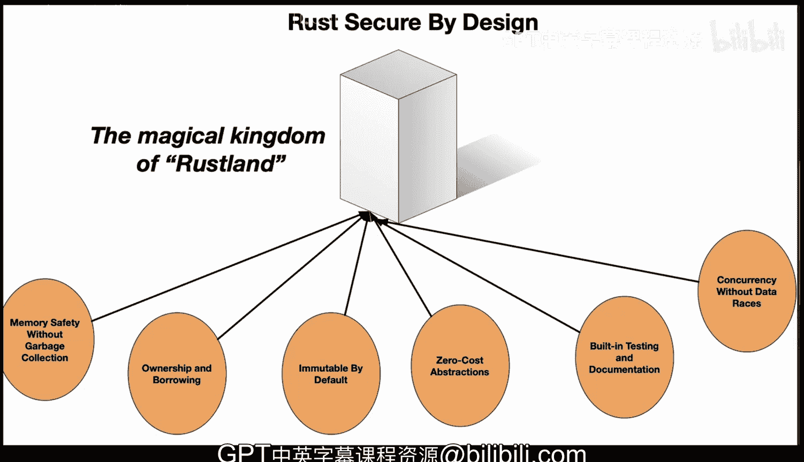

# Rust编程4-5：1：Rust安全设计原则 🛡️

在本节课中，我们将学习Rust语言的核心安全设计原则。我们将通过一个名为“Rustland”的神奇王国童话故事来理解这些抽象概念，使其变得简单易懂。

Rust是一种现代编译型语言，其设计核心就是安全。它通过一系列独特的机制，在编译时而非运行时保障程序的安全性，从而预防了广泛存在的常见错误和漏洞。

## 核心特性

上一节我们概述了Rust的安全设计理念，本节中我们来详细看看它的几个核心特性。

以下是Rust语言的核心安全特性：

1.  **无垃圾回收的内存安全**
    *   Rust无需垃圾回收器即可保证内存安全。这意味着不存在空指针或悬垂指针，也没有数据竞争。安全性在编译时就被强制执行。

2.  **所有权与借用**
    *   所有权和借用是Rust的独特功能，用于管理内存安全。在Rust中，每个值都有一个被称为其“所有者”的变量。同一时间只能有一个所有者。这可以防止多个线程同时修改数据，而这是其他语言中常见的错误和崩溃来源。

3.  **默认不可变**
    *   在Rust中，所有变量默认都是不可变的。这意味着一旦变量被赋予一个值，除非明确标记为可变，否则它不能被更改。这个设计选择可以防止对变量的意外修改和数据竞争。

4.  **零成本抽象**
    *   零成本抽象意味着Rust提供了高级语法，但不会牺牲性能。这些高级抽象使代码更容易理解和编写，从而降低了出现错误和安全漏洞的可能性。

5.  **内置测试与文档**
    *   这意味着文档贯穿于代码之中。你可以拥有更清晰的代码和易于理解的文档，并且这些都内置在Rust的安装中。

6.  **无数据竞争的并发**
    *   Rust的设计可以在编译时防止数据竞争。其所有权系统允许对状态变化进行细粒度控制，类型系统确保任何给定的数据要么只能被单个线程修改，要么可以被多个线程同时读取，但不能同时进行。这个设计选择有助于防止复杂且难以检测的并发错误，这些错误在典型的多线程应用程序中可能导致安全漏洞。

## Rustland童话故事

我们已经了解了Rust的技术特性，现在让我们通过一个童话故事来形象化地理解这些原则。

想象一个名为Rustland的神奇王国。在这个王国里，有一些特殊的规则来管理玩具（在我们的故事中，玩具代表内存）。

*   **所有权规则**：每个玩具（或每块内存）在同一时间只能有一个主人。这可以防止关于谁可以玩哪个玩具的混乱和争执。想象一下，如果两个孩子想同时玩同一个玩具，可能会导致冲突或玩具损坏。这很像Rust中的内存安全和所有权，它防止了代码的不同部分试图使用同一块内存而产生的冲突。

*   **借用规则**：有时，主人可以在严格的规则下将玩具借给另一个人：在玩具被归还之前，主人不能玩它。这很像Rust的借用特性，即使在内存被共享时也能确保安全。

*   **不可变性**：Rustland的玩具也是神奇的。一旦它们被制造出来，除非贴上一个特殊的“可变”贴纸，否则就不能被改变。这可以防止任何人意外损坏或改变玩具。这也类似于Rust中变量默认不可变的特性，防止了意外的更改。

*   **零成本抽象**：这个王国还以神奇的建造者而闻名，他们可以用简单的积木制造复杂的玩具，而且完全不会减慢玩具的生产速度。这类似于Rust的零成本抽象，允许开发者编写复杂的代码而不牺牲性能。

*   **内置文档**：Rust有一个很棒的图书馆，里面装满了关于如何正确使用每个玩具的说明书。这类似于Rust的内置文档，确保开发者知道如何正确使用代码的每个部分，从而减少了出错或出现安全问题的机会。

*   **并发模型**：最后，在Rustland，有一种独特的方法来组织游戏约会。孩子们不会以混乱的方式一起玩，而是在受控的环境中，每个孩子都有一些时间玩每个玩具，从而防止玩具丢失或损坏的机会。这很像Rust的并发模型，它通过确保数据只能被一个线程修改或被多个线程读取（但不能同时进行）来防止数据竞争。

这个童话故事的结局是，Rustland成为了一个对所有人来说都快乐且安全的王国，就像Rust对所有用户来说都是一种可靠且高效的语言。

## 总结

本节课中，我们一起学习了Rust语言的核心安全设计原则。我们了解到，Rust通过**所有权系统**、**借用检查器**、**默认不可变**和**零成本抽象**等机制，在编译阶段就主动预防了内存错误、数据竞争等常见问题。通过“Rustland”的童话比喻，我们希望这些概念对初学者而言变得更加直观和易于理解。这些设计使得Rust在提供高性能的同时，也能确保高可靠性和安全性。