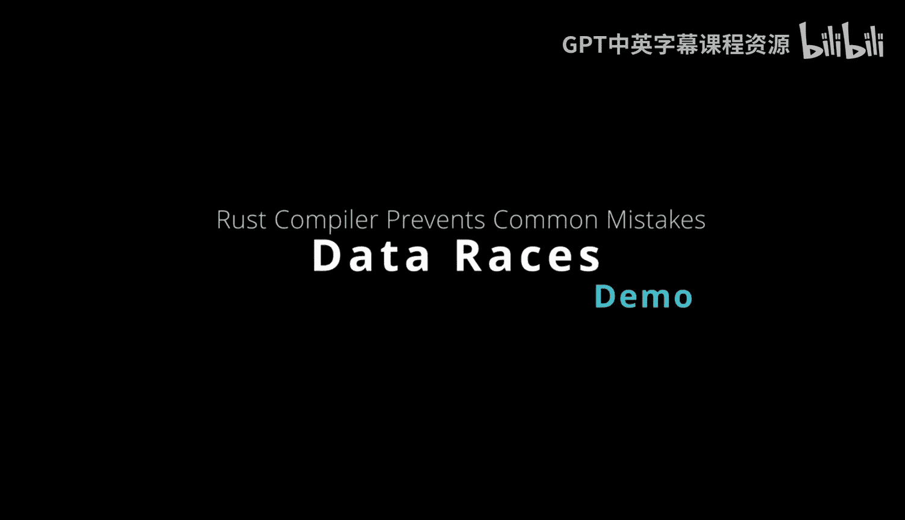
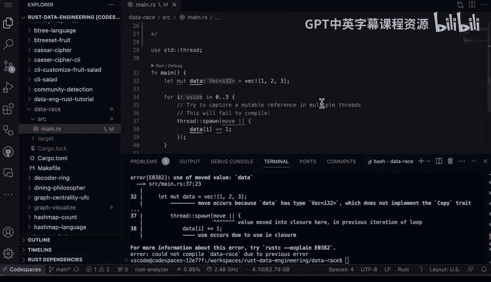

# Rust编程4-5：13_01_05：通过Rust编译器预防数据竞争 🛡️



在本节课中，我们将要学习Rust语言的一个核心特性：它如何保护开发者，避免在多线程应用程序中犯下灾难性的错误。我们将通过一个具体的代码示例，理解Rust编译器如何阻止潜在的数据竞争，并介绍如何使用互斥锁（Mutex）来安全地共享数据。

---

## 理解数据竞争的危险性

上一节我们介绍了Rust的多线程基础。本节中我们来看看一个典型的多线程编程陷阱：数据竞争。

数据竞争发生在多个线程同时访问同一块内存，且至少有一个线程进行写入操作时。这可能导致程序崩溃、数据损坏或产生不可预测的结果。在Rust中，编译器会主动识别并阻止此类不安全操作。

以下是导致数据竞争的示例代码：

```rust
use std::thread;

fn main() {
    let mut data = vec![1, 2, 3];

    for i in 0..3 {
        thread::spawn(move || {
            data[i] += 1; // 尝试在多个线程中修改同一个向量
        });
    }
}
```

在这段代码中，我们创建了一个可变向量 `data`，并尝试在三个不同的线程中捕获其可变引用并进行修改。这是一个危险的操作，因为所有线程都可能同时读写 `data`，从而引发数据竞争和内存损坏。在任何场景下，我们都不希望这种情况发生。

---

## 编译器的保护机制

当我们尝试编译上述代码时，Rust编译器会立即阻止我们。

以下是编译器的错误信息核心内容：
```
error[E0382]: use of moved value: `data`
  --> src/main.rs:8:27
   |
5  |     let mut data = vec![1, 2, 3];
   |         -------- move occurs because `data` has type `Vec<i32>`, which does not implement the `Copy` trait
...
8  |         thread::spawn(move || {
   |                           ^^^^^^^ value moved into closure here, in previous iteration of loop
```

编译器明确指出问题所在：`data` 的所有权在循环的第一次迭代中就被移动（move）到了第一个线程的闭包中。在后续的迭代中，我们试图再次使用一个已经被移动的值，这是不允许的。本质上，这是一个危险的操作，而编译器保护了我们。

如果我们无视错误强制编译，编译器会说“不，你不能这样做”。这个保护机制是Rust的核心优势之一。

---

## 解决方案：使用互斥锁（Mutex）

既然直接共享可变数据行不通，那么解决方案是什么呢？我们需要一种机制来协调多线程对数据的访问。

Rust标准库中的 `Mutex`（互斥锁）正是为此而生。互斥锁确保在任何时刻，只有一个线程可以访问被保护的数据。

以下是使用 `Mutex` 安全共享数据的代码：

```rust
use std::sync::{Arc, Mutex};
use std::thread;

fn main() {
    // 使用 Arc 实现多所有权，使用 Mutex 实现内部可变性
    let data = Arc::new(Mutex::new(vec![1, 2, 3]));
    let mut handles = vec![];

    for i in 0..3 {
        // 克隆 Arc 的指针，增加引用计数
        let data_clone = Arc::clone(&data);
        let handle = thread::spawn(move || {
            // 获取锁，这会阻塞直到锁可用
            let mut data_guard = data_clone.lock().unwrap();
            // 现在可以安全地修改数据
            data_guard[i] += 1;
            // 当 data_guard 离开作用域时，锁会自动释放
        });
        handles.push(handle);
    }

    // 等待所有线程完成
    for handle in handles {
        handle.join().unwrap();
    }

    // 打印最终结果
    println!("Result: {:?}", *data.lock().unwrap());
}
```

这段代码的工作流程如下：

1.  **包装数据**：我们将向量包装在 `Mutex` 中，然后再包装在 `Arc`（原子引用计数）中。`Arc` 允许多个线程拥有数据的所有权，`Mutex` 确保互斥访问。
2.  **获取锁**：在线程中，我们调用 `lock()` 方法来获取互斥锁。这会返回一个守卫（guard）。
3.  **操作数据**：通过这个守卫，我们可以安全地读取或修改被保护的数据。
4.  **释放锁**：当守卫离开作用域被销毁时，锁会自动释放，其他线程便可以获取锁。

这样，每次只有一个线程能操作向量元素，修改完成后释放锁，让其他线程继续。这完美解决了数据竞争问题。

---

## 总结与Rust的优势

本节课中我们一起学习了Rust如何通过其所有权系统和编译器检查来预防数据竞争。

我们首先看到了一个试图在多个线程中直接修改共享向量而导致编译失败的例子。接着，我们学习了使用 `Arc<Mutex<T>>` 这一经典组合来安全地实现线程间的数据共享与修改。

这是Rust语言一个强大的特性，它能保护你免于执行那些本不该进行的危险操作。编译器是你的朋友。这也是选择Rust进行高度并行、高并发工作的一个重要原因，因为这些安全特性已内置于语言本身。



此外，作为一个现代编译型语言，Rust从过去几十年其他语言的经验教训中汲取了智慧。一些在二三十年前设计的语言中不那么明显的问题，在Rust这样的新语言中得到了根本性的解决。这使得用Rust编写安全、高效的多线程代码变得更加容易和可靠。