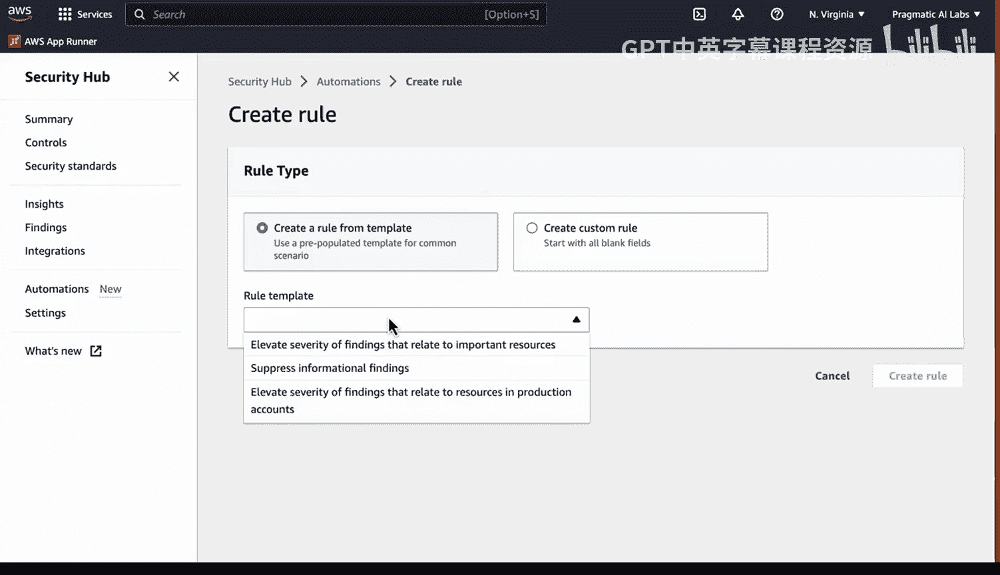
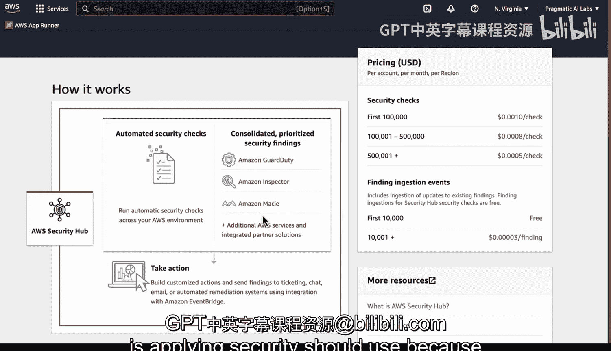

# Rust编程4-5（Linux命令行工具、LLMOps）：103：AWS Security Hub 演示 🛡️

在本节课中，我们将学习 AWS Security Hub 的核心功能。这是一个帮助您在云上管理和提升安全态势的服务。我们将了解它如何整合安全视图、自动化安全检查，并提供合规性支持。

## 概述

AWS Security Hub 帮助您在云上管理和提升安全态势。该平台的一个突出特点是它能将所有安全信息整合到一个统一的视图中。

## 安全概览与自动化检查

上一节我们介绍了 Security Hub 的整合视图功能。本节中，我们来看看它的核心自动化能力。

Security Hub 会自动化执行安全检查。这些安全检查不仅会在您当前所在的区域运行，还会覆盖您账户下的任何区域以及未来生成的任何新区域。这对于满足合规性要求有巨大帮助。

## 集成的安全服务与警报处理

Security Hub 集成了多项 AWS 安全服务。以下是它所整合的部分关键服务：

*   **Amazon GuardDuty**
*   **Amazon Inspector**
*   **Amazon Macie**

当这些服务生成警报后，您可以对警报采取行动。例如，您可以建立工单系统、聊天通知或邮件提醒。这些集成允许您为特定的安全事件设置自动化的补救措施。

## 功能界面详解

现在，让我们具体看看 Security Hub 是如何工作的。

在 Security Hub 的主界面，首先您会看到一个摘要。这里会根据您设置的安全标准，显示您通过了多少项检查。旁边会列出“安全检查失败最多的资源”，您可以在此查看具体的资源信息。

如果我们进入“基础安全最佳实践”部分，这是其中一项安全标准。我们还有“CIS AWS Foundations Benchmark 1.4”等其他标准。您甚至可以启用更多标准。这项功能的优点是，您可以根据业务需求（例如处理信用卡交易或医疗健康数据）来启用相应的合规选项。

在“控制”页面，您可以查看不同的安全控制项。再次回到“安全标准”页面，您可以深入查看特定标准包含的详细内容。这是一种非常有用的方式，可以将标准统一应用到您账户下的每一个区域。

## 深入分析与发现

“洞察”也是一个很好的功能。您可以深入查看并详细分析一些被自动发现的问题。

以下是“洞察”功能可能揭示的一些关键发现：

*   发现最多的资源
*   具有公开读写权限的存储桶（S3 Buckets）
*   存在某些问题的 EC2 实例

这些都是需要重点关注和检查的内容。同样，在“发现”页面，我们可以深入查看具体的发现项。您可以通过账户 ID 来精确追踪发生了什么。

## 集成与自动化

最后，在集成方面，您可以将 Security Hub 与其他服务集成，例如聊天机器人、审计管理器、Config 或 Detective，以实现与您系统的进一步整合。

在“自动化”部分，您可以创建规则。例如，您可以创建一条规则，提升与重要资源相关的发现项的严重等级。

## 总结

本节课中，我们一起学习了 AWS Security Hub。总而言之，Security Hub 是您进行安全优先级排序、执行首要安全检查的地方。您可以为其添加自动化流程。由于该服务提供了统一的安全视图和评估标准，任何实施安全管理的组织都应该使用它。