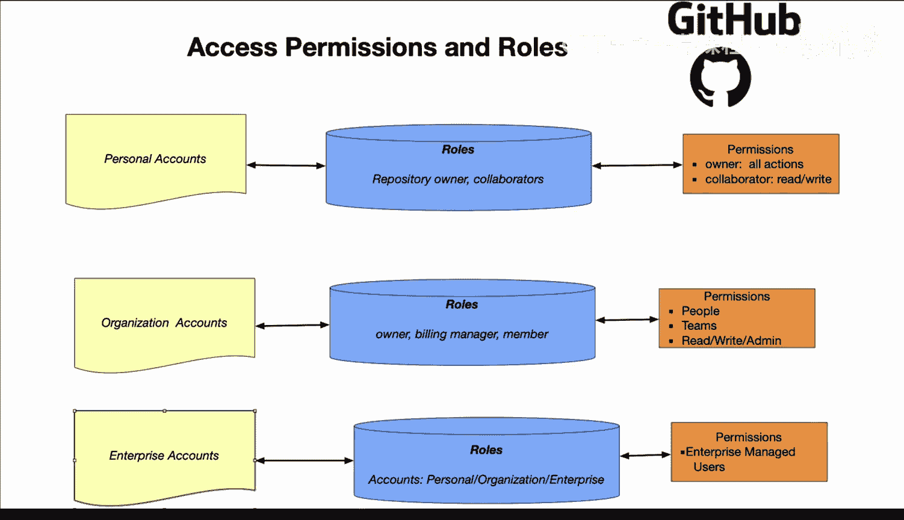

# GitHub权限管理：1：理解访问权限与角色 🔐

在本节课中，我们将要学习GitHub中的访问权限和角色。理解这些概念对于安全、有效地管理代码仓库和团队协作至关重要。

---

## 概述

GitHub的权限系统围绕用户类型、访问级别和组织结构来设计。我们将从个人账户开始，逐步探讨组织账户和企业账户的权限模型，并了解如何为不同成员分配合适的访问级别。

---

## 用户类型

首先，我们可以从用户类型的角度来考虑访问权限和规则。

以下是几种主要的用户类型：
*   **仓库所有者**：对仓库拥有完全控制权。
*   **组织所有者**：对整个组织拥有最高管理权限。
*   **团队成员**：属于组织内特定团队的成员，权限由团队设定。
*   **外部协作者**：被邀请参与特定仓库的个人，不属于该组织。

---

## 访问级别

上一节我们介绍了用户类型，本节中我们来看看不同层级的访问控制。权限不仅取决于“你是谁”，还取决于“你能做什么”。

我们可以从三个层面来思考访问级别：

1.  **仓库访问级别**：这决定了你对单个仓库的操作能力。例如，你拥有**读取**权限还是**写入**权限？
2.  **组织级别**：这涉及对整个组织的管理，例如组织所有者、账单管理等角色。
3.  **企业级别**：这是针对大型企业账户的更高层级的控制和管理。

---

## 个人账户权限

让我们从个人账户开始，这是一个很好的起点。默认情况下，个人账户的所有者拥有在GitHub上执行所有操作的权限，这很合理。你可以创建新仓库、拉取代码、写入仓库等。

然而，你经常需要与他人协作，但又不想赋予他们任何管理权限。通常，你会添加**协作者**级别的访问权限。这意味着协作者可以对你的仓库进行读取、写入或两者皆可的操作。

---

## 组织账户权限

接下来是组织账户。例如，一家公司可能拥有多个不同的仓库。在组织级别，角色通常分为**所有者**、**账单管理员**和**成员**。

如果你是组织的成员，你将无法访问账单系统，也不能销毁仓库或整个组织，除非你拥有所有者级别的权限。

在权限方面，我们需要考虑人员、团队以及读、写、管理等操作。

*   **人员**：这指的是分配给个人的典型操作角色。
*   **团队**：这是为了更有效地组织权限。你可以按团队划分访问权限。例如，某些私有或绝密代码仓库，可能只允许特定团队访问，而其他团队则不行。
*   **读/写/管理**：这些是在组织级别进行控制的权限。例如，谁可以创建新仓库，谁可以将仓库设为公开或私有。

---

## 企业账户权限

最后，我们来谈谈企业账户。这是GitHub生态系统中一个非常有趣的方面，它允许你以更企业化的方式进行组织。

这意味着你可以在整个组织范围内进行协作。管理员可以拥有可见性和管理权。企业所有者可以邀请现有组织加入账户或转移组织。你还可以在企业级别强制执行策略，这为大型组织提供了必要的控制级别。

此外，企业账户还涉及账单、使用情况、用户许可证等管理。例如，获取生成式AI编码助手、用于构建服务的GitHub Actions计算时长或GitHub代码空间等功能的访问权限。

---

## 总结

本节课中我们一起学习了GitHub的权限管理体系。重要的是思考不同的访问级别、与之关联的权限，以及根据特定的账户类型（个人、组织或企业）制定合理的规则。理解这些概念将帮助你更安全、高效地管理项目和团队协作。