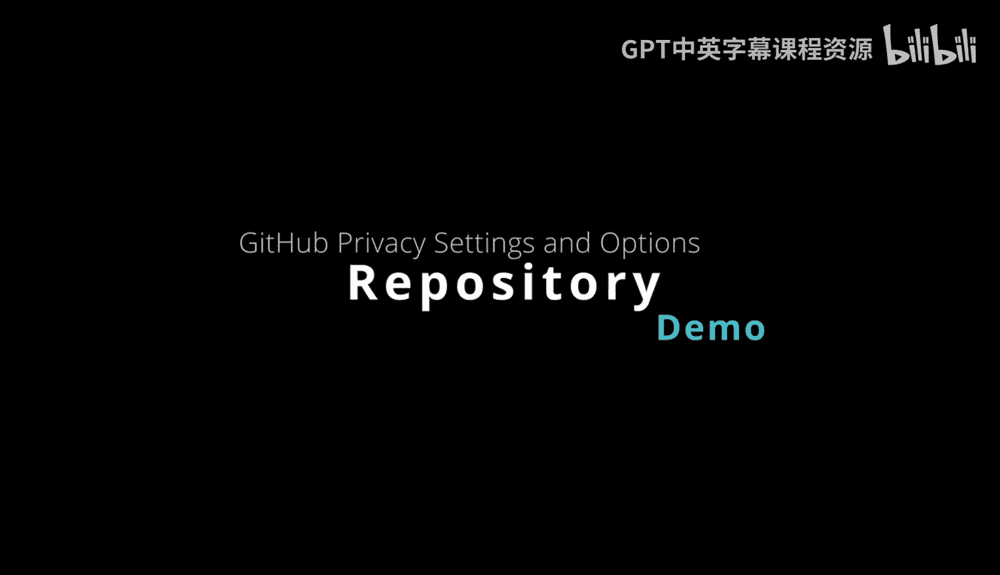

# Rust编程4-5（Linux命令行工具、LLMOps）：19_01_04：仓库隐私设置与选项 🔐

在本节课中，我们将学习GitHub仓库的隐私设置与选项。我们将从企业级别的策略开始，逐步深入到单个仓库的精细控制，了解如何管理仓库的可见性、所有权和状态。

---

## 企业级别的仓库可见性策略

首先，让我们从企业层面来审视仓库的可见性策略。企业级别的设置决定了整个组织内仓库创建和可见性的基础规则。

在企业的“策略”设置中，我们可以配置仓库可见性的全局策略。例如，我们可以完全禁用创建仓库的权限，或者对创建权限进行限制。

以下是企业级别可配置的主要选项：

*   **限制仓库创建类型**：可以设置成员只能创建特定类型的仓库，例如仅限“内部”或“私有”仓库。
*   **无策略**：也可以选择不设置任何策略，允许自由创建。
*   **限制外部协作者**：我们可以限制仓库对外部协作者的可见性，确保只有内部成员才能访问。

了解这些企业级别的可见性控制非常重要，因为它们决定了后续进行更精细控制的可能性。

---

## 组织与仓库级别的设置

上一节我们介绍了企业级的策略，本节中我们来看看在具体的组织内部，如何对单个仓库进行管理。

返回到具体的组织页面，选择目标组织后，我们可以进入“仓库”部分，对每个仓库进行单独控制。

进入任意仓库的“设置”页面，在页面最底部，有一个名为“危险区域”的部分。这里提供了仓库级别的精细控制选项。需要注意的是，这些功能的可用性同样受企业级别策略的控制。

以下是“危险区域”提供的主要操作：

*   **更改可见性**：可以将仓库在“公开”和“私有”之间切换。设为“公开”意味着外界可以访问；设为“私有”则只有您自己（或您指定的成员）可以访问。
*   **转移所有权**：可以将仓库的所有权转移给另一个用户或其他组织。
*   **归档仓库**：将仓库设置为只读状态。这意味着仓库仍然可见，但内容不可更改，适用于存档历史项目。
*   **删除仓库**：永久删除此仓库。这是一个不可逆的操作，执行后仓库将无法恢复。

例如，如果我们决定删除一个名为“Duke”的仓库，只需在确认框中输入仓库名称并确认，该仓库就会被永久删除。

---

## 总结

本节课中，我们一起学习了GitHub仓库的隐私设置。我们从企业级别的可见性策略入手，了解了如何全局限制仓库的创建和访问。接着，我们深入到组织和仓库级别，探索了如何更改单个仓库的可见性、转移所有权、归档或删除仓库。通过结合企业级策略和仓库级的精细控制，您可以确保仓库的可见性完全符合您组织的安全与协作要求。