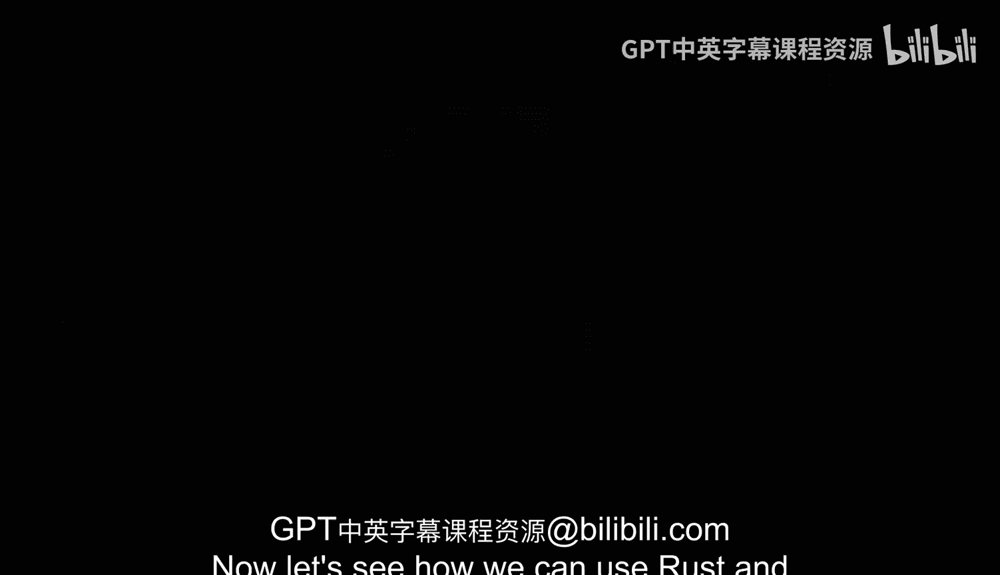

# Rust编程4-5：1：使用Rust构建命令行工具 🛠️

在本节课中，我们将学习如何使用Rust语言来构建一个命令行工具。我们将从一个最基础的例子开始，逐步理解在Rust中开发命令行工具的含义和方法，并最终构建一个实用的工具。

## 概述

我们将从最简单的用例和方法入手，逐步过渡到使用框架来构建Rust命令行工具。过程中会涉及如何安装依赖、Rust生态系统如何运作，并可能将其与Python进行简要对比。Rust拥有许多超越Python的实用特性和优势，这也是为什么学习一些Rust知识至关重要。最终，你将得到一个性能优异、可用于真实世界系统运维或DevOps场景的工具。这个工具将驻留在系统中，解析输出，并以不同的方式再次呈现信息。

现在，让我们看看如何用Rust来实现这一切，并最终拥有一个可用的工具。

---

上一节我们介绍了本课程的目标，本节中我们来看看具体的实现路径。

我们将遵循一个循序渐进的学习过程：

以下是我们的学习步骤：

1.  **从基础开始**：理解在Rust中开发命令行工具的基本概念和外观。
2.  **逐步深入**：从最简单的用例和方法开始构建。
3.  **引入框架**：学习如何使用框架来更高效地构建工具。
4.  **管理依赖**：了解如何安装依赖以及Rust的生态系统如何工作。
5.  **对比分析**：可能将Rust的方法与Python进行简要比较，理解Rust的优势。

---

本节课中我们一起学习了使用Rust构建命令行工具的路线图。我们从理解基础概念开始，规划了从简单实现到使用框架、管理依赖的逐步学习路径，并认识到Rust在构建高性能系统工具方面的价值。