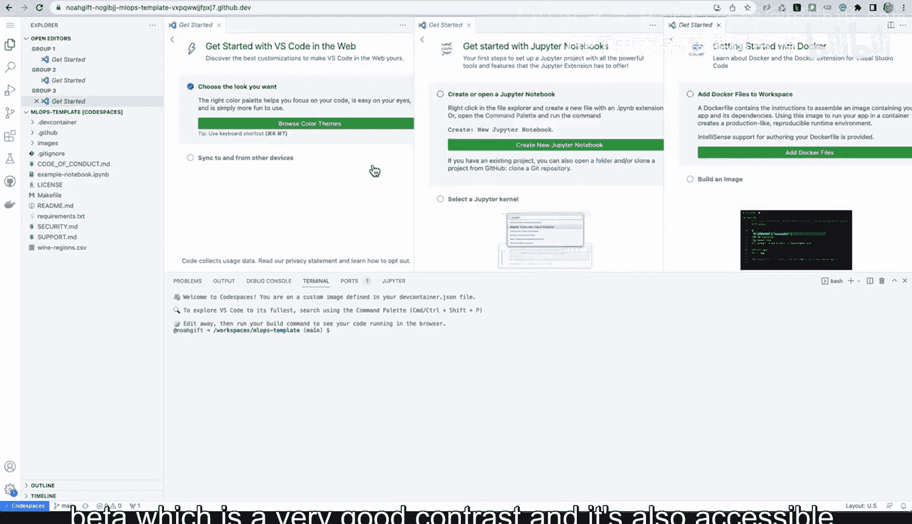
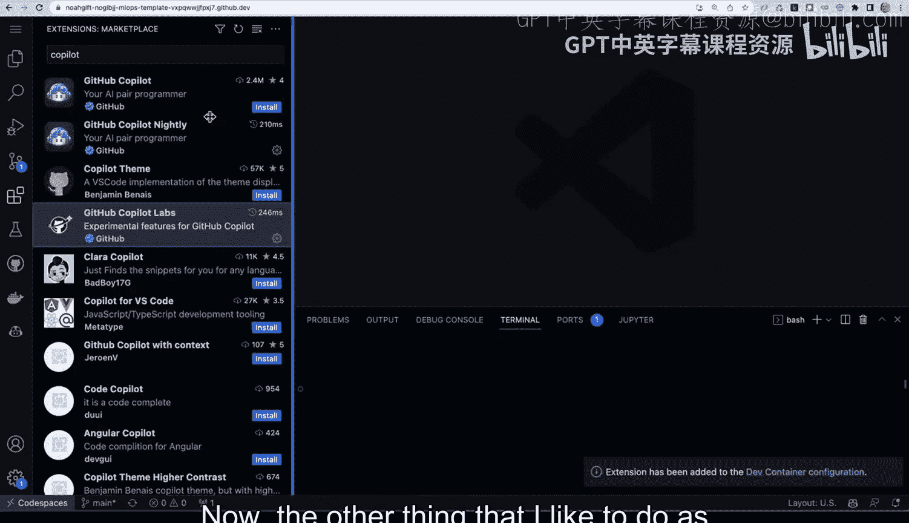

# Rust编程4-5（Linux命令行工具、LLMOps）：P110：演示：GitHub Codespaces 🚀

在本节课中，我们将学习如何使用GitHub Codespaces来自定义一个公开的代码仓库模板。我们将配置开发环境、安装扩展、修改配置文件，并最终创建一个可供他人使用的个性化模板。

## 概述

GitHub Codespaces提供了一个基于云的完整开发环境。本节演示将展示如何从一个公开模板开始，通过选择机器配置、启用预构建容器、安装必要的扩展以及修改配置文件，来定制一个满足特定需求的开发环境。

## 环境配置与启动

首先，我们有一个公开的模板仓库。该仓库内包含一些配置文件，例如用于配置Codespaces的开发容器配置文件，以及一些GitHub Actions工作流。

为了满足个人需求并修改此模板，我们可以使用Codespaces。进入Codespaces界面后，默认会进入云端编辑模式。在这里，我们可以选择默认配置，或者从多种机器配置中进行选择。

选择机器配置取决于具体任务。例如，进行需要多核处理的教学时，可以选择16核的机器。如果需要进行GPU相关的工作，例如微调Hugging Face模型，则应选择配备GPU的机器。

以下是选择GPU机器并创建Codespace的步骤：
1.  在配置菜单中选择GPU机器。
2.  点击“创建Codespace”。

创建过程需要一些时间。为了加速未来的启动，我们可以启用预构建容器功能。这是一个非常实用的功能。

## 加速启动：预构建容器

Codespace启动后，我们可以进入设置来配置预构建容器。

以下是配置预构建容器的步骤：
1.  在Codespaces设置中，选择“使用预构建配置”选项。
2.  选择主分支（main branch）。
3.  设置为每次推送代码后自动重建此Codespace。

启用此选项将显著提升未来环境启动的速度。环境启动时，系统会配置开发环境的各种选项。环境就绪后，就可以开始自定义模板了。

## 自定义开发环境

关于此环境，需要注意的一点是，我们可以通过修改开发容器配置文件来自定义它。这正是接下来要做的事情。

环境连接成功后，首先进行一些基础配置。我喜欢调整编辑器的颜色主题，选择高对比度且易于访问的“色盲测试版”主题，并适当调整字体大小。

接下来，开始为环境添加更多内容并进行个性化设置。其中一个重要步骤是安装扩展。

以下是安装扩展的步骤：
1.  转到环境中的“扩展”面板。
2.  搜索并安装“Coil it”扩展（选择夜间构建版以获取最新功能）。
3.  搜索并安装“GitHub Copilot Labs”扩展，它可用于代码翻译等功能。
4.  对每个已安装的扩展，右键点击并选择“添加到开发容器”。

这样做的好处是，将来将此环境提供给他人时，他们也能直接获得这些功能。

## 修改配置文件与模板

另一个常见的定制步骤是修改`Makefile`并为其安装语法支持扩展。

以下是相关操作：
1.  搜索并安装“Makefile”扩展。
2.  右键点击该扩展，选择“添加到开发容器”。
3.  打开仓库中的`Makefile`文件。
4.  向其中粘贴一些预设的配置内容，例如部署、安装、测试、代码格式化和项目检查等指令的模板。
5.  可以添加注释，为其他使用者提供操作建议。

至此，一个包含实用指令的模板环境就基本配置完成了。

## 环境验证与最终提交

我们可以验证环境的功能。例如，在终端中输入`htop`命令，可以查看这个高内存环境的状态。输入`nvidia-smi`命令，可以检查GPU是否正常运行。

最后，将修改提交到模板仓库。

以下是提交更改的步骤：
1.  使用`git status`查看更改。
2.  使用`git add .devcontainer`和`git add Makefile`命令添加已修改的配置文件。
3.  提交更改。

现在，其他人就可以使用这个经过我们定制和增强的模板了。

## 总结

本节课我们一起学习了如何利用GitHub Codespaces定制开发环境。我们从选择机器配置开始，通过启用预构建容器加速启动，然后安装了必要的编辑器扩展并修改了`Makefile`配置文件，最终创建并提交了一个功能更丰富、更适合特定工作流的个性化模板。这个过程展示了如何快速构建和分享可复现的开发环境。