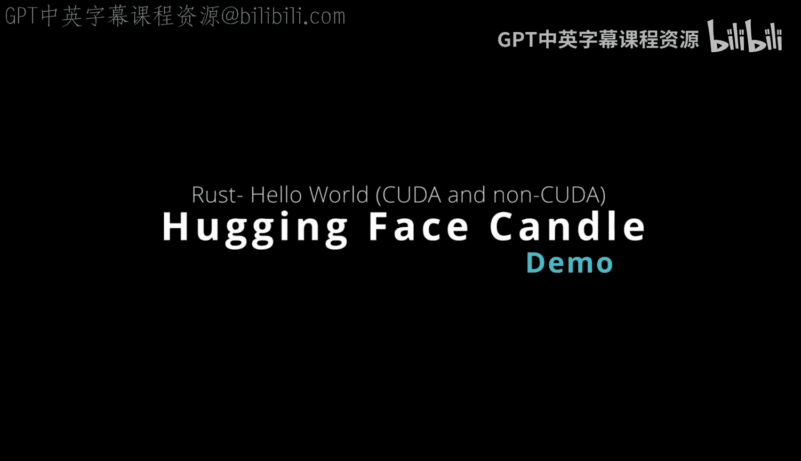
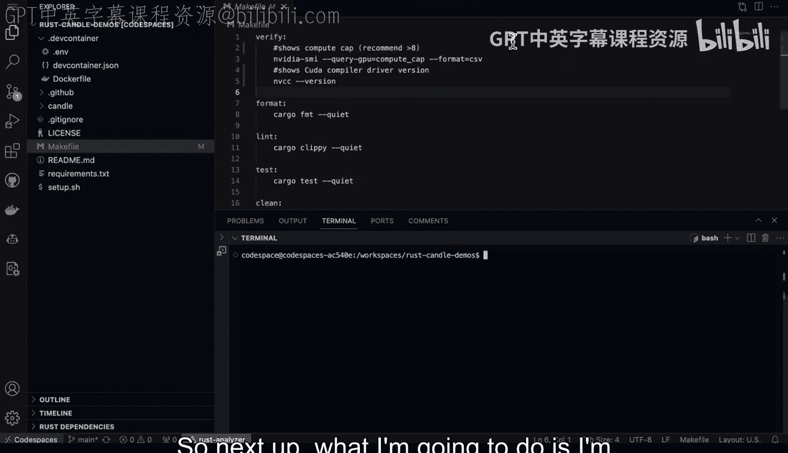
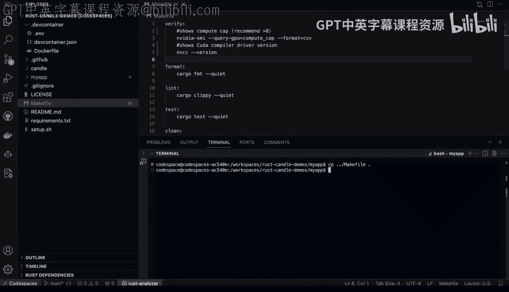
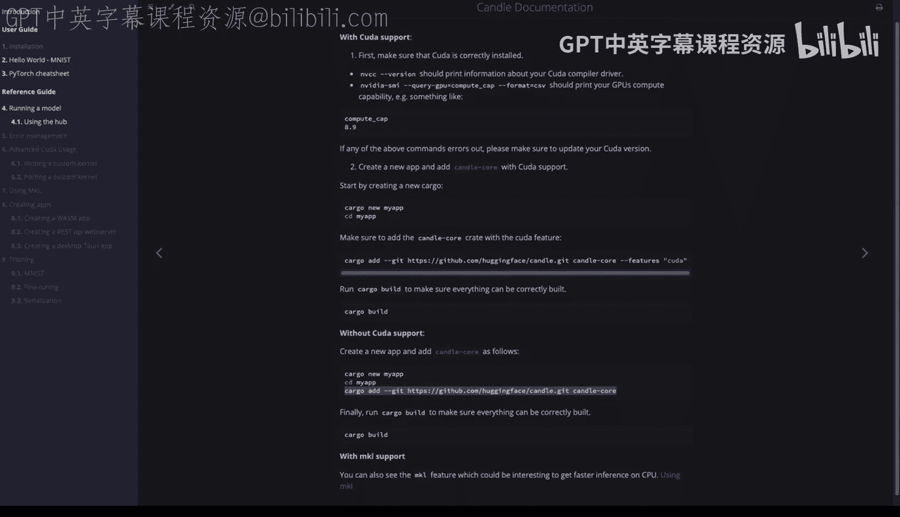
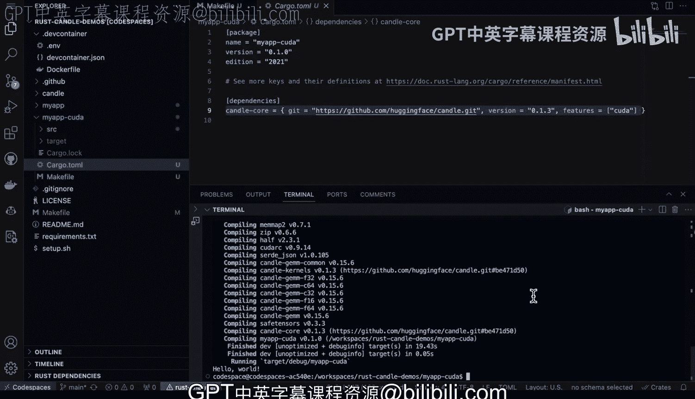

# Rust编程4-5：Linux命令行工具、LLMOps：115：构建Candle Hello World 🚀

在本节课中，我们将学习如何设置一个基于GPU的开发环境，并使用Rust的Candle库创建一个简单的“Hello World”项目。我们将涵盖从环境验证到项目构建的完整流程，包括如何添加CUDA支持以利用GPU加速。



---

## 环境准备与验证 ✅

首先，我们需要确保开发环境已正确设置，特别是GPU开发所需的工具。以下步骤用于验证环境。

打开终端，输入以下命令来检查Rust和CUDA编译器驱动是否已安装：

```bash
R C digest version
make verify
```

`make verify` 命令会显示计算能力并确认CUDA编译器驱动存在。这是进行后续GPU开发的基础。

---

## 创建基础Rust项目 🛠️

上一节我们验证了环境，本节中我们来看看如何创建一个新的Rust项目。

我们将遵循Hugging Face Rust Candle文档的指导。使用 `cargo new` 命令创建一个名为 `my_app` 的新项目：

```bash
cargo new my_app
```

命令执行后，进入项目目录：

```bash
cd my_app
```

为了便于使用各种命令和快捷方式，我喜欢将通用的 `Makefile` 复制到项目中。这样可以利用预设的构建和运行命令。

```bash
cp ../Makefile .
```

此时，我们可以先尝试在不启用GPU支持的情况下构建项目，以确保基础配置正确。

```bash
cargo build
```



---


## 添加Candle依赖并构建 🔧



现在项目骨架已经搭建完成，接下来我们需要添加Candle库作为依赖。

使用 `cargo add` 命令可以方便地添加依赖。它会自动更新 `Cargo.toml` 文件。

```bash
cargo add candle-core
```

添加完成后，查看项目源代码。默认的 `src/main.rs` 文件内容如下，它只是一个简单的“Hello, world!”程序：

```rust
fn main() {
    println!("Hello, world!");
}
```



这个阶段的目标是验证安装和构建流程是否成功。

由于我们已经复制了 `Makefile`，现在可以使用 `make build` 命令来构建项目，这等同于执行 `cargo build`。

```bash
make build
```

构建成功后，运行程序以验证一切工作正常：

```bash
make run
# 或 cargo run
```

如果终端成功打印出 “Hello, world!”，则说明基础安装和构建流程成功。

---

## 创建支持CUDA的项目 ⚡

上一节我们完成了基础项目的构建，本节我们将创建一个支持CUDA GPU加速的新项目。

再次使用 `cargo new` 命令创建一个新项目，这次我们将其命名为 `my_cuda_app`：

```bash
cargo new my_cuda_app
```

进入新项目目录，并同样复制 `Makefile` 以便操作：

```bash
cd my_cuda_app
cp ../Makefile .
```

现在，关键的区别在于我们需要为 `candle-core` 库启用CUDA特性。这可以通过在添加依赖时指定特性来完成。

以下是添加支持CUDA的Candle依赖的命令：

```bash
cargo add candle-core --features cuda
```

执行后，查看 `Cargo.toml` 文件，你会看到依赖项已更新为 `candle-core = { version = “…”, features = [“cuda”] }`。

此时，我们可以直接构建并运行项目，来验证CUDA支持是否已正确启用。

```bash
cargo build
cargo run
```

如果程序能够成功构建并运行，则证明CUDA环境配置和项目设置都已就绪。

---

## 总结 📝

本节课中我们一起学习了如何从零开始设置一个支持GPU的Rust开发环境，并使用Candle库创建项目。

我们首先验证了基础环境，然后创建了一个标准的Rust项目并添加了Candle依赖。接着，我们构建并运行了项目以确保流程正确。

最后，我们创建了第二个项目，并通过添加 `cuda` 特性启用了GPU加速支持，完成了整个CUDA开发环境的搭建验证。



通过以上步骤，你现在已经拥有了一个可以开始进行基于Candle和CUDA的Rust机器学习或LLM应用开发的基础环境。