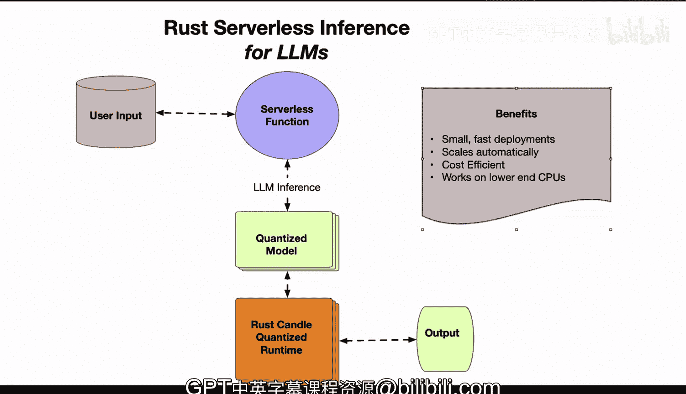

# Rust编程4-5：32_02_02：无服务器推理 🚀


在本节课中，我们将探讨一个令人兴奋的新领域：为大型语言模型（LLM）构建基于Rust的无服务器推理架构。我们将了解其核心优势、工作原理以及如何实现高效且经济的部署。

## 概述

无服务器推理为机器学习模型的部署带来了革命性的变化。它结合了可扩展性、成本效益和易于管理的特性，特别适合处理大语言模型这类计算密集型任务。接下来，我们将深入剖析其架构和关键组件。

## 架构与核心优势

上一节我们介绍了无服务器推理的概念，本节中我们来看看其具体的架构设计和带来的核心优势。

通过观察架构图，我们可以发现，部署机器学习模型可以实现**可扩展性**和**成本效益**，并且推理过程可以构建在无服务器架构之上。

用户输入可以包含文本、图像或其他数据，这些数据将被传递到例如AWS Lambda这样的无服务器函数中。该函数将包含模型本身以及用于运行量化模型的Rust Candle运行时。

## 模型量化技术

了解了整体架构后，我们来看看其中的一项关键技术：模型量化。这是实现高效推理的关键。

模型本身将被**量化**。这意味着它将使用**降低精度的整数数据类型**，而不是32位浮点数。这可以使模型大小缩小多达四倍。

量化过程可以用以下伪代码概念表示：
```rust
// 将高精度浮点权重转换为低精度整数
let quantized_weights = float_weights.quantize(to=Int8);
```

同时，Candle运行时提供了类似Llama.cpp的优化操作，能够高效地运行量化模型。

## 无服务器函数特性

模型准备好之后，需要由无服务器函数来承载和运行。以下是其主要特性：

无服务器函数能够**自动扩展**以处理任意数量的流量，确保快速的响应时间。函数规模甚至可以缩减至零，因此您只需为实际使用的资源付费。

小型化的模型和无需闲置资源的特点，使得这种方案极具成本效益。

## 成本与性能分析

那么，这种架构具体如何节省成本并提升性能呢？我们来具体分析一下。

无服务器计费基于**调用次数**，而非持续运行的高昂GPU费用。量化后的整数模型运行速度更快，即使在低端或移动CPU上也能胜任，这真正开启了新的应用场景。

对于许多模型而言，不再需要那些昂贵的GPU。输出结果也能非常快速地返回给用户，自动扩展机制将延迟降至最低。

## 总结



本节课中我们一起学习了基于Rust和Candle运行时的LLM无服务器推理架构。该架构使您能够高效、经济且大规模地将先进的机器学习模型部署到生产环境中，它通过模型量化减小尺寸、利用无服务器实现自动扩展和按需付费，从而在成本、性能和可扩展性之间取得了出色的平衡。