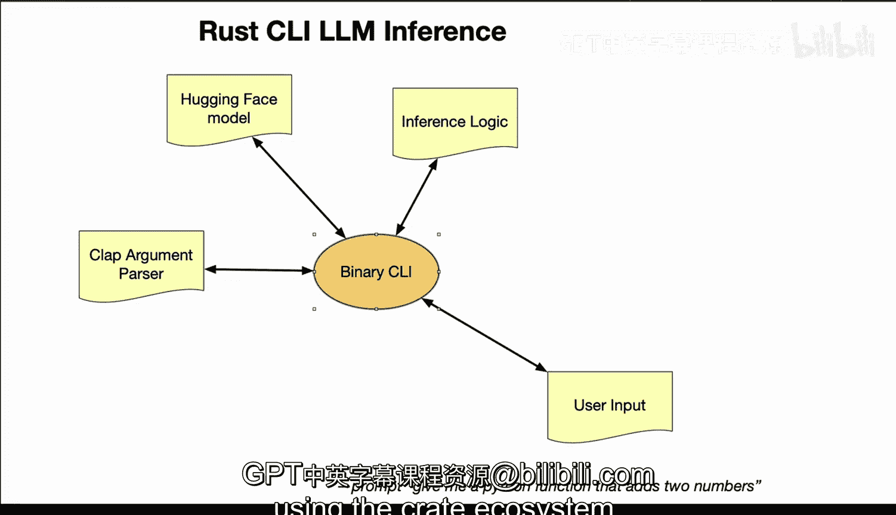

# Rust编程4-5：33_02_03：使用Rust构建命令行推理工具 🚀


在本节课中，我们将学习如何使用Rust构建一个命令行界面工具，该工具能够利用Hugging Face的预训练Transformer模型进行文本推理。我们将从下载模型开始，逐步完成模型加载、CLI构建和推理逻辑的实现。

## 概述

下图展示了构建和运行一个Rust命令行推理工具的整体流程。


该流程始于从Hugging Face Hub下载预训练的Transformer模型。接着，在Rust中加载模型并构建命令行界面。最后，实现推理逻辑，使用户能够通过CLI输入文本并获得模型的推理结果。

## 从Hugging Face下载模型

首先，我们需要从Hugging Face Hub获取一个预训练的Transformer模型。你可以选择像BERT或GPT-2这样的模型。

上一节我们介绍了整体流程，本节中我们来看看第一步：获取模型。这是所有后续步骤的基础。

## 在Rust中加载模型

下载模型后，下一步是在Rust代码中加载它。这可以通过`rust-bert`或`transformers`等crate实现，它们为Hugging Face模型提供了Rust绑定。

另一个选择是使用`rust-candle`接口。这允许我们在Rust代码中使用该模型进行推理。

以下是使用`rust-bert`加载模型的示例代码框架：
```rust
use rust_bert::pipelines::question_answering::{QuestionAnsweringModel, QaInput};

let model = QuestionAnsweringModel::new(Default::default())?;
```

## 使用Clap构建命令行界面

模型准备就绪后，我们需要构建一个用户友好的命令行界面。`clap` crate可以轻松实现参数解析，允许灵活的用户输入。

你甚至可以定制提示词。例如，如果你想为每个提示词添加一个固定的前言以获得更好的结果，可以将此逻辑集成到CLI中。

以下是构建CLI的基本步骤：

*   **定义参数**：使用`clap`的宏或构建器模式定义程序接受的参数，如输入文本。
*   **解析输入**：`clap`将自动处理命令行参数的解析和验证。
*   **组织逻辑**：将用户输入传递给后续的推理逻辑。

## 实现推理逻辑

CLI构建完成后，接下来是实现核心的推理逻辑。这部分代码负责接收用户的输入，将其传递给之前加载的Hugging Face模型，并返回推理结果。

`rust-bert`等crate会简化这个过程，自动处理数据格式转换和推理执行。

推理逻辑的核心公式可以概括为：
**输出 = 模型推理(用户输入)**

## 运行CLI并执行推理

最后，用户可以通过运行CLI并提供文本输入来使用这个工具。输入文本通过CLI传递给Hugging Face模型，推理过程在Rust中执行，最终结果将打印返回给用户。

简而言之，整个过程如下：
1.  从Hugging Face下载模型。
2.  使用模型crate在Rust中加载模型。
3.  使用`clap`构建CLI。
4.  实现推理逻辑并将其与模型集成。
5.  运行CLI，对用户输入执行推理。

## 总结



本节课中我们一起学习了使用Rust构建命令行推理工具的完整流程。通过利用Rust及其丰富的crate生态系统，特别是`rust-bert`和`clap`，我们能够高效地集成先进的AI模型并创建出强大的应用。这确实是执行大语言模型推理的一种高效方法。