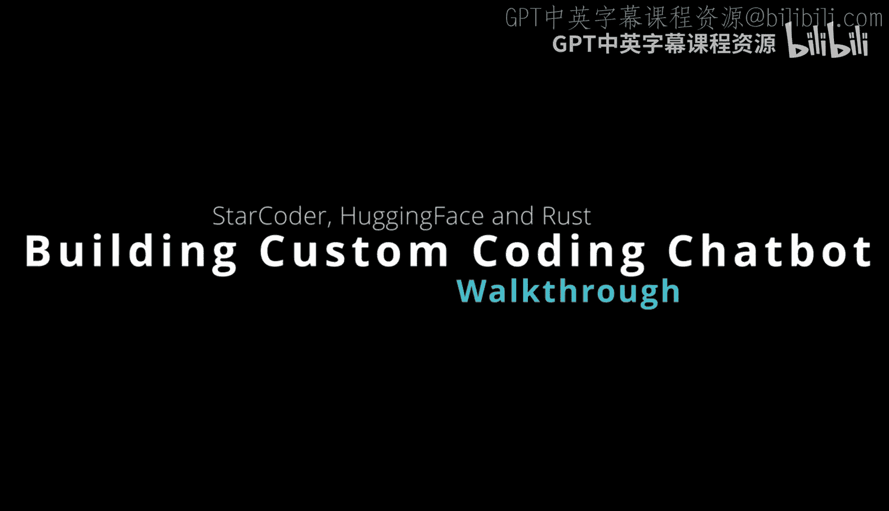

# Rust编程4-5：使用StarCoder构建自定义聊天循环

## 概述

在本节课中，我们将学习如何利用大型语言模型构建自定义的聊天循环。具体来说，我们将使用Hugging Face的StarCoder模型，结合Rust的异步编程和类型安全特性，创建一个专属于编程任务的AI助手。这个助手能够理解代码上下文，并提供有意义的响应，而无需依赖外部付费服务。

---

## 构建自定义对话AI

上一节我们介绍了大型语言模型在聊天循环中的应用潜力。本节中，我们来看看如何实际构建一个自定义的对话AI。

使用Hugging Face的StarCoder模型构建自己的编程助手，是一件令人兴奋的事情。该模型的表现甚至超越了OpenAI的早期模型或其他竞争方案。

观察以下具体示例，你可以了解如何深入构建自己的定制化对话AI。

## 核心组件与流程

以下是构建聊天循环所需的核心组件和步骤。

首先，设计一个能够引发深思熟虑响应的提示词（prompt）。接着，调用StarCoder模型端点。这个端点可以部署在GPU实例上，例如AWS的G5实例。

使用异步客户端请求可以实现非阻塞的异步通信。这样，聊天机器人能够轻松快速地做出响应。

将每一组对话消息追加到对话历史中，可以为AI提供上下文信息。

使用`serde`库进行序列化和反序列化操作非常方便，它支持JSON格式。

利用Rust强大的类型系统和内存安全性，可以确保聊天机器人既健壮又安全。

使用Hugging Face的Candle推理引擎，可以轻松集成StarCoder大型语言模型。

最后，构建基于Tokio的自定义聊天循环。你可以看到，我们定义了一个`pub async`函数来实现聊天循环，并能够遍历和响应用户输入的评论。

## 总结

本节课中，我们一起学习了如何从零开始构建一个自定义的聊天循环。简而言之，整个过程非常直接：利用StarCoder的模型能力、Hugging Face的推理引擎、Tokio的异步运行时，以及围绕JavaScript的开源客户端等构建模块，你就可以打造属于自己的编程聊天循环，并且无需向任何人支付费用。