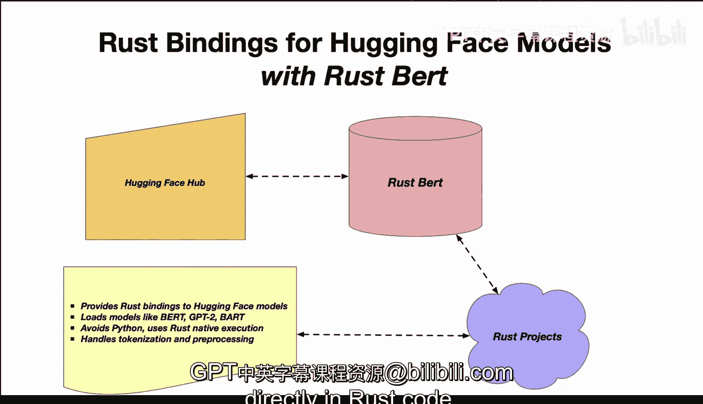

# Rust编程4-5：39_03_01：Rust BERT简介 🦀

在本节课中，我们将要学习一个名为 **Rust BERT** 的库。这个库为Rust程序提供了访问Hugging Face平台上预训练NLP模型的能力，使我们能够在纯Rust环境中高效地使用这些强大的模型。

## 概述

Rust BERT 是一个为Hugging Face模型提供Rust绑定的库。它的核心思想是，我们可以利用Hugging Face上已有的、预训练好的NLP模型（如BERT、GPT-2、BART等）。这些模型最初是用PyTorch等框架训练的，而Rust BERT这个crate则提供了与这些模型的绑定，从而让我们可以在自己的Rust代码中使用它们。

## 核心工作原理

上一节我们介绍了Rust BERT的基本概念，本节中我们来看看它是如何工作的。

简单来说，Rust程序现在可以通过Rust BERT访问Hugging Face Hub上的预训练模型。这些模型的**原生Rust绑定**可以被加载，并在Rust环境中高效执行，整个过程**无需使用Python**。

Rust BERT 主要完成以下转换工作：
*   **模型格式转换**：将Hugging Face上原始的PyTorch模型转换为Rust代码可用的格式。
*   **文本处理**：在**纯Rust**环境中处理分词（tokenization）和其他文本预处理任务，这使其运行速度极快。

转换完成后，Rust代码便可以调用Rust BERT进行**推理**（inference），甚至对强大的NLP模型进行**微调**（fine-tuning）。最终的结果会被转换回Rust的原生类型。

这一切使得Rust能够充分利用Hugging Face的模型，同时避免了Python带来的性能开销。

## 主要优势与特点

了解了工作原理后，以下是使用Rust BERT带来的主要好处：

*   **直接绑定**：提供了Rust到Hugging Face模型的直接绑定。
*   **模型加载**：可以加载诸如BERT、GPT-2等多种预训练模型。
*   **原生执行**：避免了Python，完全在Rust原生环境中执行，效率更高。
*   **高速处理**：分词和预处理等任务均在Rust中完成。Rust是地球上最快的语言之一，因此这些操作极其迅速。
*   **便捷访问**：能够轻松地在Rust代码中访问先进的NLP功能。

总而言之，**Rust BERT 使得在Rust代码中无缝、直接地使用Hugging Face的NLP模型成为可能。**

## 总结

本节课中我们一起学习了Rust BERT库。我们了解到它是一个桥梁，让Rust开发者能够直接、高效地利用Hugging Face生态系统中丰富的预训练NLP模型，同时享受Rust语言带来的高性能与安全性优势。通过避免Python中间层，它在保持功能强大的同时，提供了更快的执行速度。