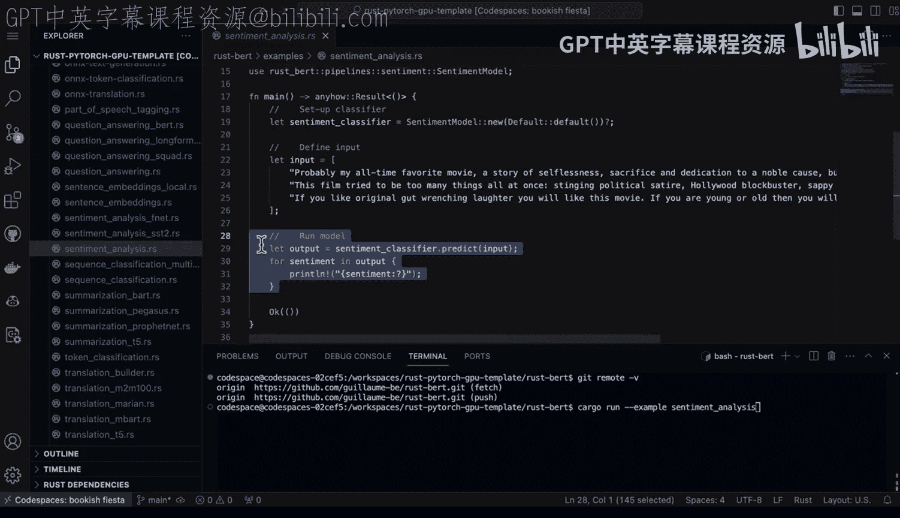

# Rust编程4-5（Linux命令行工具、LLMOps）：129：基础语法与模型加载

在本节课中，我们将学习如何在Rust环境中加载和使用预训练的机器学习模型。我们将通过一个具体的代码仓库示例，了解Rust生态系统中运行模型推理的基本流程，并与传统的Python方法进行简单对比。

## 环境准备与代码获取

上一节我们介绍了Rust环境的基本设置，本节中我们来看看如何获取并运行一个现成的模型示例。

我已经在Github Codespace环境中安装好了Rust。接下来，我想查看并运行通过Git拉取即可执行的不同示例。Rust生态系统的一大优势在于，只要我执行了`git clone`，并且拥有一个配置了Cargo的合适环境（例如Github Codespaces），我就可以非常轻松地运行每一个示例。

让我们来尝试一下。首先，查看这个代码仓库并执行`git remote -v`，可以看到我已经克隆了它。如果我展开目录并进入`examples`文件夹，会发现这里有许多非常酷的示例可以尝试，而且操作起来非常简单。

## 运行示例的基本命令

以下是运行示例的基本步骤：

运行一个示例只需要执行`cargo run --example`命令，后面跟上Rust文件的名称。

## 深入分析示例代码

现在，让我们以情感分析为例，深入了解一下具体发生了什么。

首先，代码中引入了两个库：`anyhow`和`rustbert`。然后定义了一个`main`函数。这个单行示例的结构非常清晰。

具体流程如下：
1.  创建分类器：这是一个情感分类器。
2.  创建输入：输入是一个字符串向量，例如 `["string1", "string2", "string3"]`。
3.  将输入传递给模型。
4.  获取并输出情感分析结果。

通过深入研究这个示例仓库并实际运行代码，可以非常容易地复现这些示例。

## Rust与Python的简单对比

我认为，相较于传统的基于Python的数据科学方法，这是一个巨大的优势，因为它尝试示例的过程非常直接明了。

本节课中我们一起学习了在Rust中加载和运行预训练模型的基本方法。我们了解了如何从Git仓库获取示例、运行命令的结构，并剖析了一个情感分析示例的代码流程。最后，我们看到了Rust在此类任务中展现出的简洁性和易用性优势。