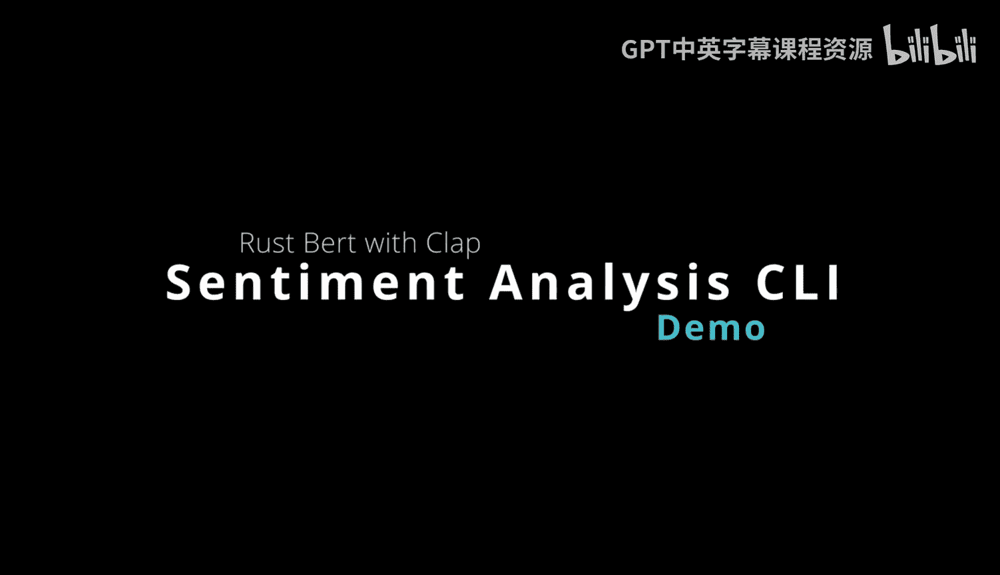

# Rust编程4-5：构建情感分析命令行工具



在本节课中，我们将学习如何使用Rust构建一个情感分析命令行工具。我们将利用`rust-bert`库来调用预训练的自然语言处理模型，并结合`clap`库来解析命令行参数，最终创建一个可以轻松分发给他人使用的独立二进制程序。

## 概述

我们将创建一个名为`sentiment`的命令行工具。该工具接收一段文本作为输入，使用`rust-bert`库中的情感分析模型进行分析，并输出该文本的情感倾向（积极或消极）。整个过程将展示如何将复杂的机器学习模型封装成一个简单易用的命令行应用。

---

## 构建过程详解

上一节我们介绍了项目的目标，本节中我们来看看具体的代码实现和依赖配置。

### 1. 核心功能函数

首先，我们来看实现情感分析的核心函数。这个函数负责接收文本，调用模型，并返回分析结果。

```rust
use rust_bert::pipelines::sentiment::SentimentModel;

pub fn classify(input: &str) -> String {
    // 1. 加载预训练的情感分析模型
    let sentiment_classifier = SentimentModel::new(Default::default()).unwrap();

    // 2. 将输入字符串转换为模型所需的向量格式
    let input_as_vec = vec![input.to_string()];

    // 3. 进行情感预测
    let output = sentiment_classifier.predict(&input_as_vec);

    // 4. 格式化并返回结果
    format!("{:?}", output)
}
```

这个函数非常简洁。它首先初始化模型，然后将输入文本包装成向量，最后调用模型的`predict`方法并返回结果。

### 2. 项目依赖配置


为了使用上述功能并构建命令行界面，我们需要在`Cargo.toml`文件中声明以下依赖项。

以下是项目所需的三个核心依赖：

*   **`rust-bert`**：这是Hugging Face模型在Rust生态中的移植，提供了我们所需的情感分析等NLP功能。
*   **`clap`**：这是一个强大的命令行参数解析库，用于构建我们的工具界面。
*   **`anyhow`**：这个库简化了错误处理，便于我们返回和传播错误结果。

```toml
[package]
name = "sentiment"
version = "0.1.0"
edition = "2021"

[dependencies]
rust-bert = "0.21.0"
clap = { version = "4.0", features = ["derive"] }
anyhow = "1.0"
```

### 3. 主函数与命令行集成

现在，我们来看如何将核心功能与命令行参数解析结合起来。主函数`main.rs`是程序的入口点。

```rust
// 导入我们编写的分类函数和必要的库
use sentiment::classify;
use clap::Parser;
use anyhow::Result;

/// 一个简单的情感分析命令行工具
#[derive(Parser)]
#[command(name = "sentiment")]
#[command(about = "分析输入文本的情感倾向", long_about = None)]
struct Cli {
    /// 需要分析的文本
    #[arg(default_value = "I love you.")]
    input: String,
}

fn main() -> Result<()> {
    // 解析命令行传入的参数
    let args = Cli::parse();

    // 调用分类函数并打印结果
    let result = classify(&args.input);
    println!("情感分析结果: {}", result);

    Ok(())
}
```

代码首先定义了一个`Cli`结构体来描述命令行参数，这里我们定义了一个`input`参数，并设置了默认值。在`main`函数中，我们调用`Cli::parse()`来获取用户输入，然后将其传递给`classify`函数并输出结果。

---

## 工具的使用方法

我们已经完成了工具的构建，本节中我们来看看如何编译和运行它。

### 编译与运行

你可以使用Cargo直接运行程序，也可以编译成独立的二进制文件。

**使用Cargo运行（开发模式）**：
在项目根目录下执行以下命令。默认情况下，程序会分析“I love you.”这句话。

```bash
cargo run
```
运行上述命令，你会看到类似“情感分析结果: [Sentiment { polarity: Positive, score: 0.999...”的输出，表明情感为积极。

**传递自定义输入**：
你可以通过`--input`（或`-i`）参数来指定要分析的文本。

```bash
cargo run -- --input "The football season is terrible."
```
运行此命令，输出会显示情感为消极（Negative polarity）。

**查看帮助信息**：
要了解所有可用参数，可以运行：

```bash
cargo run -- --help
```

### 分发独立二进制文件

Rust的一个强大之处在于可以轻松编译出独立的、可分发的二进制文件。

**编译发布版本**：
以下命令会生成一个优化过的二进制文件，位于`target/release/`目录下。

```bash
cargo build --release
```

**直接运行二进制文件**：
编译完成后，你可以直接运行生成的可执行文件，无需依赖Cargo。

```bash
# 进入编译输出目录
cd target/release
# 运行程序
./sentiment --input "It is beautiful today."
```

这种方式使得你可以将`sentiment`这个可执行文件轻松分享给团队成员或客户，即使他们的电脑上没有安装Rust环境也能使用。

---

## 总结

本节课中我们一起学习了如何使用Rust构建一个实用的情感分析命令行工具。我们主要完成了三件事：

1.  **利用`rust-bert`库**调用预训练的NLP模型，实现了核心的情感分析功能。
2.  **使用`clap`库**为工具添加了命令行参数解析能力，使其易于交互。
3.  **将两者结合**，创建了一个可以编译为独立二进制程序的应用，展示了Rust在构建可分发工具方面的便利性。


通过这个项目，你不仅学会了如何集成复杂的机器学习库，也掌握了构建标准命令行工具的基本流程，这是开发现代化、可维护的Rust应用的重要一步。