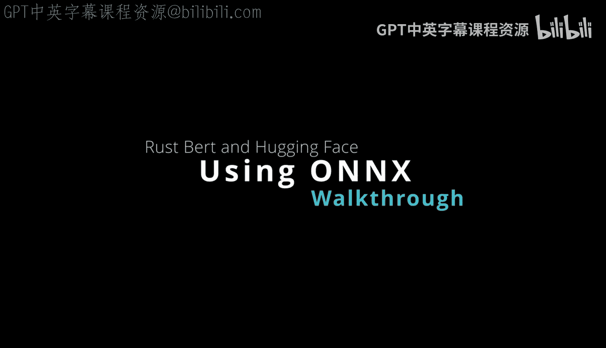

# Rust编程4-5：Linux命令行工具、LLMOps：第136章：ONNX格式转换 🚀

在本节课中，我们将学习Rust中ONNX格式支持的具体含义及其应用。我们将了解如何利用ONNX运行时进行模型格式转换，以及如何将其集成到构建流程中，以实现模型的便携式部署。

---

## ONNX支持概述

Rust的一个出色特性是它支持ONNX。接下来，我们具体看看这意味着什么。

## ONNX运行时的作用

借助ONNX支持，你可以使用一个运行时，它允许你将模型从一种格式转换为另一种格式。此外，你还可以在这里设置`ort`路径，以便使用该运行时。例如，它可以是一个共享对象文件（`.so`文件）。这些文件可以作为你构建过程的一部分被下载。

假设你有一个构建过程，它编译必要的二进制文件，同时也可以拉取这个`.so`文件。这样，你就能为你的模型拥有一个真正便携的运行时。

## 使用Optimum库进行转换

这里还需要注意的是，你可以使用`optimum`库。对于Transformer模型，你实际上可以转换它们，并且我们有一些关于如何操作的信息。

让我们继续，看看如何从Hugging Face导出模型到ONNX。我们可以看到，这里展示了你可以进行安装，从而导出模型，之后你就能使用ONNX了。

## 为何选择ONNX？

那么，我们为什么要使用ONNX呢？如果我们查看这份指南，会发现它是一个开放标准。这意味着，即使你原本使用的是PyTorch或TensorFlow等框架，通过转换，你都能获得一个中间表示。这使你能够在不同框架之间切换。

即使你未来不打算使用其他框架，你的部署过程也可能因此变得更优，因为你拥有一个统一的系统来处理任何类型的模型。所以，这里的核心理念是：通过使用ONNX运行时，你可以进行优化，甚至可以包含量化步骤来真正缩小模型的体积。任何能够打包、提高效率的操作，都是人们使用ONNX的原因之一。

---

## 总结

本节课中，我们一起学习了Rust对ONNX格式的支持。我们探讨了ONNX运行时在模型格式转换和便携式部署中的作用，了解了如何利用`optimum`库从Hugging Face导出模型，并理解了采用ONNX作为开放标准所带来的优势，如框架间的互操作性和部署优化。