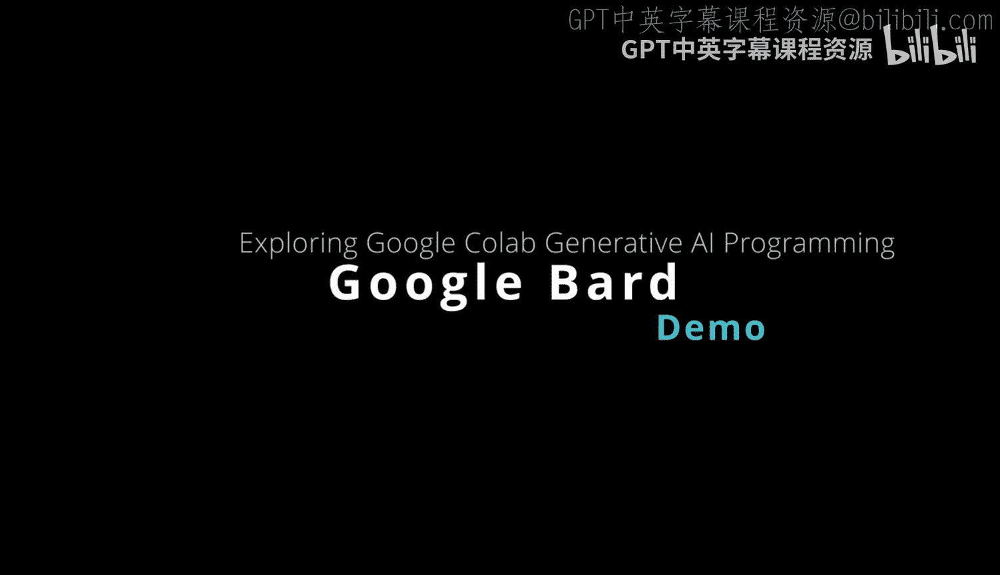
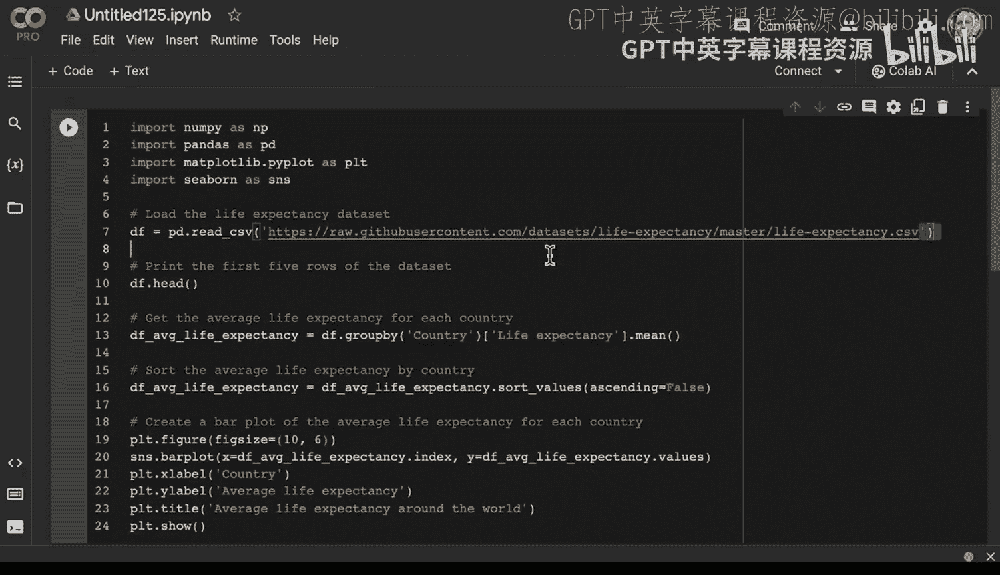
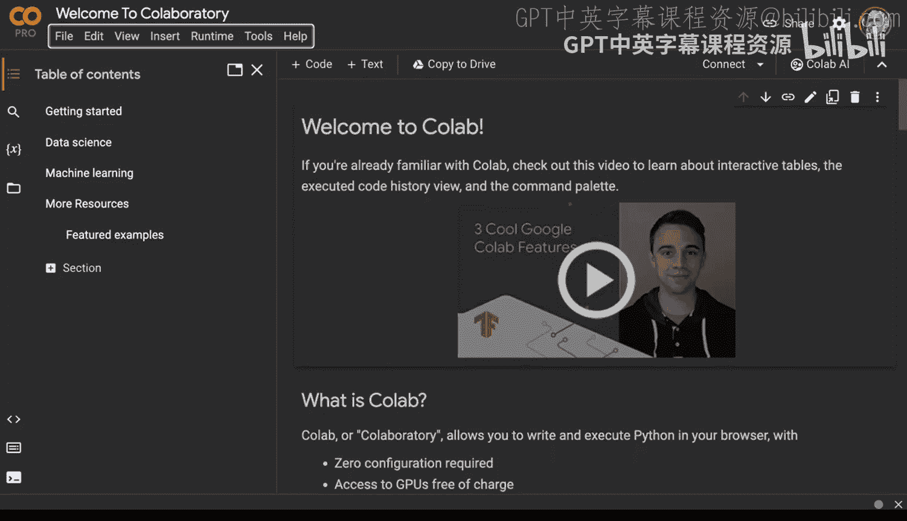
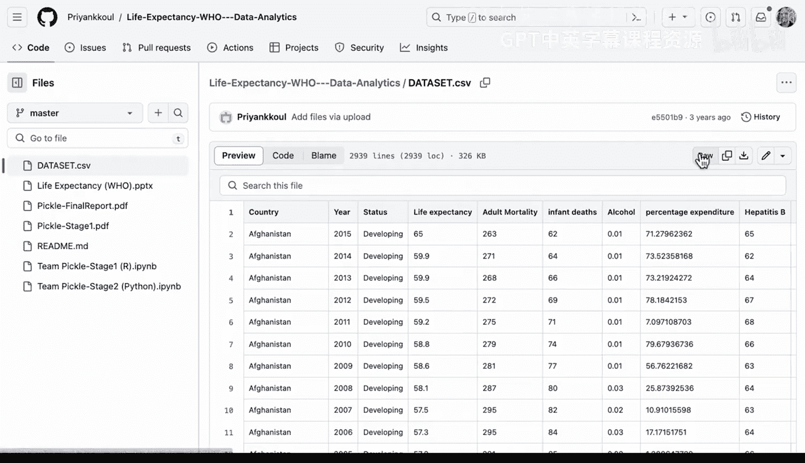

# Rust编程4-5（Linux命令行工具、LLMOps）：4.2：通过Bard探索Google Colab 🧪

在本节课中，我们将学习如何利用Google Bard与Google Colab的集成功能来辅助数据科学工作。我们将看到Bard如何生成代码，以及如何在实际操作中验证和调整这些生成的代码，以应对可能出现的“幻觉”问题。

---

Google Bard的一个实用功能超越了简单的摘要或传统的生成式AI技术。它与Google Colab有集成。我们可以利用它来帮助我们开始进行数据科学工作。

为了做到这一点，我将输入：“help me create a colab notebook for exploring life expectancy”。

现在，我们看到它将告诉我具体的操作指令：前往Google Colab，点击新建笔记本，为笔记本命名。完成这些后，我们可以将Bard生成的信息粘贴进去。这里展示了一个如何创建此类笔记本的示例。

现在，一个有趣的问题是：这些信息真的存在吗？这是我们接下来可以探索的事情之一。

让我们继续尝试，并将其放入一个笔记本中。

---

我们前往Colab，点击“文件”->“新建笔记本”。

然后，我将粘贴Bard生成的代码。它写道：“import life expectancy”。首先，我可能需要确认这个数据集是否真的存在。

因此，我们可以回到Bard，粘贴这段代码。请注意，对于GitHub上的资源，很多时候你需要双重检查它是否真实存在。

在这个案例中，它没有生效。逻辑看起来是对的，但我们没有正确的数据集。我们可以说：“嘿，帮我找另一个数据集。”

Bard给出的那个数据集返回了404错误。

没问题，这里还有一些其他数据集。我甚至可以进一步要求：“给我几个包含预期寿命数据的GitHub URL。” 这可能是绕过一些“幻觉”问题的方法之一。我需要继续深入。

我可以要求：“给我另一个数据集。”

这次，它说在这个位置有一个数据集。让我们尝试一下。

---

我们在这里确实获得了一些数据。Bard之前能够索引到这个数据集，我们可以看到这个特定的数据集看起来不错。我们可以继续，点击“Raw”获取原始数据链接。

让我们继续，把这个新链接替换到我们的Colab代码中。现在，我们可以基于之前生成的代码开始构建。

当然，不能保证列名是相同的或完全匹配，但这是一个良好的开端，看看我们能否让事情运转起来。这可能是遇到的第一个问题。

那么，我们如何解决这个问题呢？我们不必盲目遵循生成式AI的输出。

我可以在这里新建一个单元格，并且不运行之前有问题的那个单元格。我会重新运行当前有效的单元格，这样我就可以将工作的部分和有问题部分分离开。

在这个案例中，我可能甚至不需要那个有问题的单元格，我们只想从这个有效的部分开始继续开发。

例如，如果我在这个单元格下面再新建一个，我可以输入 `df.describe()` 并运行，来描述这个特定数据集的基本统计信息。

---

我在这里的一个建议是：当你处理生成式AI解决方案时，不要轻易放弃。假设总会遇到一些问题，本质上要“为失败而设计”，能够剔除有问题的部分并继续向前推进。

如果你采用这种方法，就像在现实世界中一样，即使生成式AI会产生“幻觉”，它仍然是一个有用的助手。

---

**本节课总结**

本节课中，我们一起学习了如何将Google Bard作为助手，在Google Colab中启动一个数据科学项目。我们实践了从Bard获取代码建议、验证数据源的真实性、以及当遇到“幻觉”或错误时如何通过迭代和隔离问题来继续推进工作。关键点在于将AI视为协作工具，始终保持验证和调试的主动性。