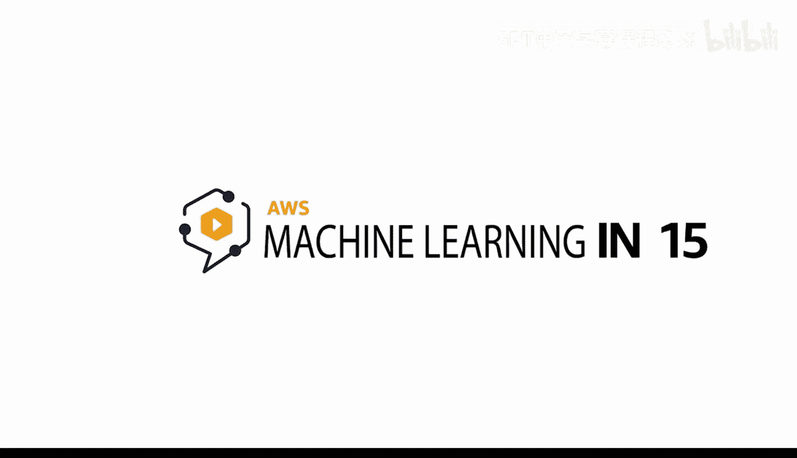
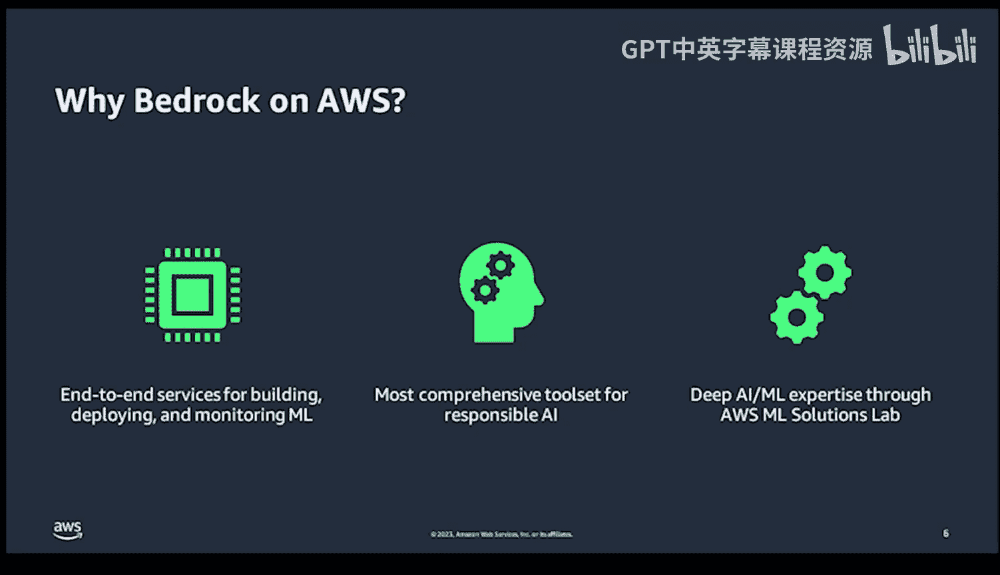

# Rust编程4-5：基于AWS Bedrock的责任AI

## 概述

在本节课中，我们将深入学习AWS Bedrock，这是一个用于构建和部署负责任AI系统的核心工具集。我们将探讨其重要性、核心支柱、支持服务以及实际应用场景。

---

## 为什么需要负责任AI？🤔

上一节我们介绍了AWS Bedrock的基本概念，本节中我们来看看为什么构建负责任的AI系统如此重要。

考虑在刑事司法、医疗保健或版权法领域使用带有偏见的AI系统可能带来的严重后果，其风险极高。因此，确保AI的公平、透明和可靠至关重要。

---

## AWS Bedrock的七大核心支柱 🏛️

AWS Bedrock不仅仅是一个工具，更是一种理念，它体现在以下七个关键支柱中。以下是这些支柱的详细介绍：

1.  **教育**
    知识就是力量。确保团队接受培训，了解如何避免AI中的偏见。

2.  **多样性**
    多元化的视角有助于我们发现可能被忽视的问题。

3.  **用例评估**
    每个工具都有其正确和错误的使用方式，关键在于进行评估。

4.  **高质量数据**
    “垃圾进，垃圾出”的思维模式至关重要，高质量、有代表性的数据是基础。

5.  **偏见测试**
    持续进行偏见测试，以确保公平性。

6.  **人工审查**
    在审查环节，人类的判断无可替代。

7.  **监控与再训练**
    这不是一项一劳永逸的操作，意味着定期检查必不可少。

---

## 支持核心支柱的关键服务 ⚙️

了解了核心支柱后，我们来看看AWS提供哪些强大的服务来支持这些理念的实现。

*   **Amazon SageMaker Clarify**
    这项服务用于分析和解释模型的偏见，就像一个监督这些实践执行的“看门狗”。

*   **Amazon Augmented AI (A2I)**
    这项服务旨在促进“人在回路”的审查流程。

*   **Amazon SageMaker Model Monitor**
    这项服务如同模型的质量保证经理，持续监控模型性能。

*   **Amazon SageMaker Data Wrangler**
    这是进行数据准备和分析的首选工具。

这些服务共同构成了一个强大的、用于伦理AI开发的框架。

---

## AWS Bedrock的实际应用场景 🌍

理论需要联系实际。那么，Bedrock在现实世界中是如何应用的呢？

*   在**金融服务**领域，它支撑着无偏见的贷款和风险模型。
*   在**人力资源**领域，它有助于消除简历筛选中的偏见。
*   在**内容审核**领域，它确保能够可靠地捕捉违反政策的内容。

在当今的AI环境中，信任的重要性怎么强调都不为过。

---

## 选择AWS平台的三大理由 ✅

为什么亚马逊是实施Bedrock理念的理想平台？主要有以下三个原因：

*   **全面的机器学习服务**
    例如Amazon SageMaker，它涵盖了机器学习项目的完整生命周期。

*   **强大的工具集**
    AWS拥有目前最全面的负责任AI工具集。

*   **专业的知识与支持**
    AWS在AI/ML技术方面拥有丰富的知识宝藏，并愿意通过专家咨询等方式进行分享。

---

## 如何开始您的负责任AI之旅 🚀

最后，如果您想立即开始您的负责任AI实践，可以遵循以下步骤：

1.  首先，阅读并理解AWS提供的全面Bedrock白皮书。
2.  接着，访问AWS官网，查看“负责任AI”部分，进一步探索相关服务。
3.  最后，联系AWS专家，他们可以为您的项目采用Bedrock提供量身定制的指导。

借助AWS Bedrock，合乎伦理的AI不仅是一种可能，更是一种保障。

---

## 总结

本节课中，我们一起学习了AWS Bedrock作为负责任AI框架的重要性。我们探讨了其七大核心支柱、支持这些支柱的具体AWS服务、Bedrock在多个行业的实际应用，以及选择AWS平台的优势。最后，我们了解了开始实践负责任AI的具体步骤。希望本教程能帮助您构建更公平、更可靠的AI系统。