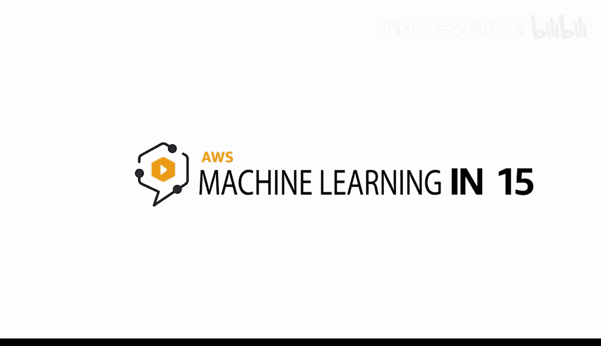
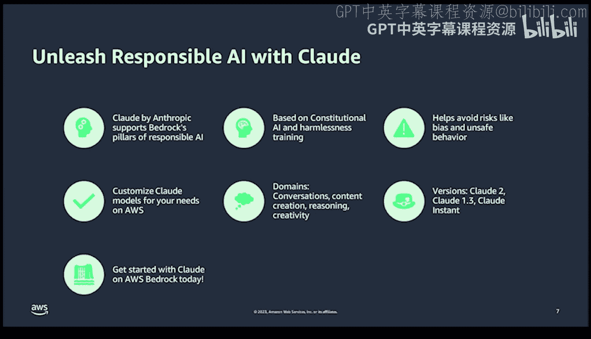

# Rust编程4-5：第54章：AWS Bedrock与Claude模型 🎼

在本节课中，我们将要学习AWS Bedrock平台与Anthropic公司开发的Claude模型。我们将探讨Claude模型的核心概念、工作原理、能力特点，以及它如何与AWS Bedrock的负责任AI原则相结合。

## 概述：什么是宪法AI？

上一节我们介绍了课程主题，本节中我们来看看Claude模型背后的核心创新理念——宪法AI。

宪法AI是一种创新的方法，其核心关注点是安全性、诚实性和有益性。这与传统模型不同，其核心特质不仅仅是模型准确性，还包括确保系统安全性的具体措施。该方法从宪法法律中汲取灵感，旨在编程使AI避免暴力行为、避免盗窃、避免诽谤等。

这项技术之所以重要，是因为它包含了自我监督和基于价值的学习，这些构成了模型的基础，并融入了这项特定技术中。

## Claude模型的命名与设计理念

了解了宪法AI的概念后，我们来看看Claude模型本身。首先，它为何被命名为Claude？

Claude被设计用于进行自然语言对话。这意味着它能提供响应迅速、有益且无害的交互。它不会说谎、不会诽谤、也不会评判用户。这在AI伦理方面是一大进步。此外，Claude能够基于现实世界的反馈持续改进。想象一下，拥有一个不仅能理解你意图，还能随着时间推移学会更好地协助你的AI助手。

## Claude系统的工作原理

认识了Claude的设计目标后，本节我们来深入了解其内部工作机制。

首先，其核心秘诀在于对来自互联网的海量数据集进行自我监督学习，并且这些数据是以符合伦理的方式筛选的。但关键在于，其训练方向是面向人类价值和社会规范的，并且这是一个永不停歇的循环，会持续吸收人类反馈。本质上，这个AI将随着社会自身的演变而进化。

这是与其他技术平台的关键区别，因为它从设计之初就旨在真正有益于社会。

## Claude的核心能力

理解了工作原理后，我们来看看Claude具体能做些什么。以下是Claude的一些关键能力：

*   **总结、任务跟踪与事实核查**：例如，你可以给Claude一份商业报告或测验，要求它进行事实核查，以验证其中所有细节的准确性。
*   **文档总结**：例如，你可以上传一份多页的PDF文档，要求Claude提取前三个关键点，以便在会议中进行总结。这能大大节省时间，让你更快地消化更多内容。
*   **个性化对话与推荐**：如果正确设置了上下文窗口，你可以进行基于关键信息的深度对话。
*   **广泛的技能范围**：它能够回答从技术话题、医学话题到当前新闻事件等各种主题的问题。

## 负责任AI与AWS Bedrock的整合

上一节我们介绍了Claude的能力，本节中我们来看看它如何与AWS的平台结合，并体现负责任AI的原则。

Anthropic的负责任AI方法与AWS Bedrock的负责任AI支柱相一致，它充当了防范风险（如不安全行为和算法偏见）的保障。这意味着你使用的不仅是一项智能技术，更是一项符合伦理的智能技术。随着大语言模型领域的竞争加剧，伦理基础将成为区分不同平台的关键因素之一。如果你能切实展示伦理考量、表明你减少了偏见、确保了安全性，你就能建立消费者的信任，并且不会发布可能对人类造成广泛危害的产品。这实际上可以成为一种竞争优势。

通过有效地将其作为公司声誉的基石，你将比那些不太可能将此视为核心特质的公司更具优势。这也是发展伦理AI的原因之一——它是一种竞争优势，而非劣势。

## 释放Claude负责任AI潜力的关键细节

了解了整合的重要性后，我们来具体看看如何利用Claude实现负责任AI。以下是关键细节：

*   **支持AWS Bedrock支柱**：Anthropic系统支持AWS Bedrock的负责任AI支柱，这是将其用作竞争优势的关键原因之一。
*   **模型定制**：你可以使用AWS技术（例如SageMaker）根据需求定制Claude模型。这种定制允许你针对特定的使用场景进行专业化调整。
*   **宪法AI与无害训练**：我们知道，在数据集、模型及其训练方式上投入了大量思考，以确保它们对社会产生真正积极的影响。
*   **适用领域**：在具体用例方面，它适用于对话、内容创作、推理和创造力等领域，是一个非常适合多种直接适用于商业的领域的模型。
*   **风险规避**：它能够避免偏见或不安全行为等风险。短期内这可能看似不重要，但长期来看，如果不考虑这些方面，可能会导致大规模的声誉损害。因此，你能在未来问题发生之前就与之隔离，这是使用Claude这类模型的巨大战略优势。
*   **版本多样性**：Claude有多个不同版本，例如功能最强大、最新的Claude 2，以及版本1.3和Claude Instant。这些版本提供了不同的特性，例如在速度、性能与准确性之间进行优化。

## 总结

本节课中，我们一起学习了AWS Bedrock与Anthropic的Claude模型。我们探讨了其背后的宪法AI理念、模型的设计目标与工作原理，以及其强大的总结、对话和跨领域问答能力。最重要的是，我们了解了Claude如何通过与AWS Bedrock负责任AI原则的深度整合，将伦理和安全作为核心竞争优势，为开发者提供了既强大又可靠的大语言模型选择。