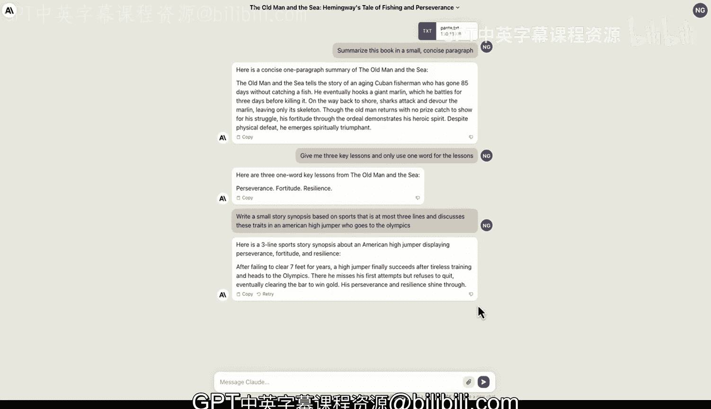

# Rust编程4-5：4：使用Claude进行文本摘要

在本节课中，我们将学习如何利用Claude AI助手进行文本摘要与分析。我们将通过一个具体的例子——分析海明威的《老人与海》——来演示如何上传文档、请求摘要、提取关键信息，并最终结合AI的能力与我们自己的想法，生成新的内容。

## 概述与工具介绍

上一节我们介绍了AI助手的基本概念，本节中我们来看看如何具体应用。这里我们使用的是Anthropic公司开发的Claude，它是一个通用的AI助手。我们可以用它来处理和分析文本，例如，针对海明威的著名小说《老人与海》的文本内容提出问题。

## 上传文档与请求摘要

以下是使用Claude进行文本处理的第一步：上传文档。

1.  首先，找到《老人与海》的文本内容。
2.  将文本全部复制。
3.  在Claude的界面中，可以直接粘贴文本。Claude能够自动识别并将其处理为一个文本文件。

这种技术的一个显著优势是能够处理上传的文档。这比单纯的聊天功能是一个重要的增强，因为你可以为AI提供更丰富的上下文信息，并且能够处理不同格式和风格的数据，而不仅仅局限于聊天界面。

接下来，我们可以请求AI对这段文本进行摘要。我们可以输入指令：“summarize this book, in a small, concise paragraph.”（用一小段简洁的文字总结这本书。）

## 分析摘要结果

Claude生成的摘要如下：

> 《老人与海》讲述了一位年迈的古巴渔夫在连续84天没有捕到鱼之后，终于钓到一条巨大的马林鱼。他与这条鱼搏斗了三天并将其杀死。在返回岸边的途中，鲨鱼袭击并吞噬了马林鱼，只留下它的骨架。尽管老人没有带回战利品，但他在整个磨难中表现出的坚韧不拔，彰显了他虽败犹荣的英雄气概。

这个摘要非常精准，展示了AI在总结归纳这类任务上的强大能力。我们甚至可以进一步要求它以更精炼的形式提取关键信息。

## 提取关键信息与互动

我们可以继续与AI互动，要求它提供更具体的信息。例如，输入指令：“give me three key lessons, and only use one word for the lessons.”（给我三个关键的启示，每个启示只用一个词。）

与AI助手互动的最佳方式之一，就是充分利用它最擅长的功能，比如总结归纳和快速阅读大量文本。这可以作为一种头脑风暴的工具，或者说，在处理生成式AI时，它就像一个协作伙伴。

AI返回了三个词：**perseverance**（坚持不懈）、**fortitude**（坚毅）、**resilience**（韧性）。

## 结合创意生成新内容

基于从AI获得的信息，我们可以进一步发挥自己的创意，要求AI进行扩展。例如，我们可以输入指令：“write a small synopsis based on sports that is at most three lines and discusses these traits in an American high jumper who goes to the Olympics.”（基于体育写一个不超过三行的简短剧情概要，描述一位参加奥运会的美国跳高运动员如何体现这些特质。）

将AI助手最擅长的能力与我们自己的生活经验和想法结合起来，产生协同效应，是使用这些AI助手的最佳方式之一。当然，我们也可以通过API或在云平台上实现这些功能，将基于云的生成式AI机器学习解决方案与我们现有的基础设施、用户界面和命令行工具相结合，从而开发新兴技术。

AI生成的概要如下：

> 一位多年来始终无法跳过七英尺高度的跳高运动员，经过不懈训练终于成功，并进军奥运会。在奥运赛场上，他首次试跳失败，但拒绝放弃，最终越过横杆赢得金牌。他的坚持与韧性闪耀全场。

## 总结

本节课中我们一起学习了如何使用Claude AI助手进行文本处理。我们演示了从上传文档、获取摘要、提取关键词到结合自身想法生成新内容的完整流程。这个过程表明，生成式AI并非魔法，而是一个我们可以用来构建新解决方案的有用工具。通过有效的反馈循环，我们可以更好地理解生成式AI的原理与应用方式。

