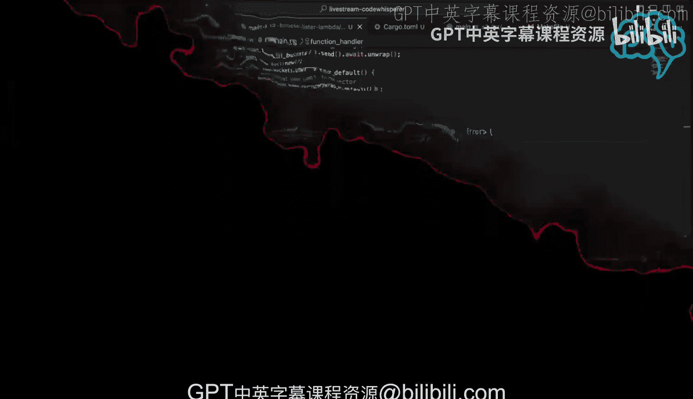

# Rust编程4-5：AWS CodeWhisperer实时编码（第二部分）🎯


## 概述
在本节课中，我们将学习如何使用AWS CodeWhisperer辅助编写一个更复杂的AWS Lambda函数。我们将扩展之前的基础函数，使其能够与AWS S3服务交互，具体实现列出账户中所有S3存储桶的功能。我们将逐步介绍如何添加依赖、编写业务逻辑以及处理异步编程模型。

## 本地测试环境

上一节我们介绍了如何设置和运行一个基础的Lambda函数。本节中我们来看看如何利用现有的本地测试环境。

视频中展示了一个内置的简单浏览器界面，用于查看Lambda函数的输出，无需切换到其他应用程序。


接下来，测试功能会启动。由于代码尚未修改，测试应该能通过。

测试会发送一个特定的负载（payload）：
```json
{"command": "echo", "data": "Hello"}
```

为了执行测试，我们需要在终端中运行命令。以下是操作步骤：

1.  打开一个分屏终端。
2.  手动输入测试命令（因为视频中复制粘贴功能出现了问题）：
    ```bash
    cargo lambda invoke --data-ascii '{"command":"echo","data":"Hello"}'
    ```
3.  命令成功执行，输出结果符合预期，证明本地Lambda函数运行正常。

## 扩展函数功能：集成AWS SDK

目前，我们的函数功能比较简单。现在，让我们让它做一些更有趣的事情，例如与AWS服务交互。这正是CodeWhisperer可以大显身手的地方。

一个非常实用的Lambda函数用例是结合AWS SDK调用其他服务。我们将使用Rust版的AWS SDK。

首先，我们需要为项目添加必要的依赖。查看已有的S3列表示例，可以发现其`Cargo.toml`文件中包含了`aws-config`和`aws-sdk-s3`。

因此，我们需要在当前项目的依赖项中添加这两项。原始的`Cargo.toml`由`cargo-lambda`工具生成，已包含`lambda_runtime`、`tokio`等。我们手动添加以下两行：

```toml
[dependencies]
aws-config = "0.56.1"
aws-sdk-s3 = "0.28.1"
```

添加后，可以运行`cargo build`来验证依赖是否正确解析并能被编译。

## 使用CodeWhisperer编写业务逻辑

接下来，我们将编写一个列出所有S3存储桶的辅助函数。我们将尝试使用CodeWhisperer来生成这部分代码。

我们计划创建一个名为`list_buckets_in_account`的函数。在代码编辑器中，我们输入函数签名和简单的描述作为提示：

```
// 使用AWS SDK for S3列出存储桶，并返回一个字符串向量
fn list_buckets_in_account
```

CodeWhisperer开始提供建议。它生成的代码框架大致如下：

```rust
async fn list_buckets_in_account() -> Result<Vec<String>, Box<dyn std::error::Error>> {
    let shared_config = aws_config::load_from_env().await;
    let client = aws_sdk_s3::Client::new(&shared_config);
    let resp = client.list_buckets().send().await?;

    let mut buckets = Vec::new();
    for bucket in resp.buckets() {
        buckets.push(bucket.name().unwrap_or("").to_string());
    }
    println!("{:?}", buckets);
    Ok(buckets)
}
```

这段代码基本符合我们的需求：加载配置、创建S3客户端、调用API、将结果收集到向量中并返回。CodeWhisperer还自动处理了异步（`async`）和错误处理（`Result`）。

## 调试与集成

生成的代码并非一帆风顺，我们遇到了一些需要手动修复的编译错误：

1.  **`await` 关键字错误**：提示`await`只允许在`async`函数中使用。这提醒我们需要将函数标记为`async`，我们已照做。
2.  **未找到 `unwrap` 方法**：错误提示`resp`上没有`unwrap`方法。这是因为`client.list_buckets().send()`返回的是一个`Future`，需要`.await`来获取结果，我们已经使用了`await?`。
3.  **值移动（move）错误**：提示“use of moved value”。这通常发生在尝试在循环中使用一个已经被消耗的所有权时。解决方案是获取`resp.buckets()`的引用，例如使用`.iter()`或直接迭代。CodeWhisperer生成的`for bucket in resp.buckets()`实际上已经正确处理了借用。

修复错误后，我们得到了一个可以编译的辅助函数。但由于尚未在主处理函数中调用它，编译器会提示“dead code”警告。

## 修改主处理器

现在，我们需要在Lambda函数的主处理器（`func`）中调用这个新的辅助函数。

我们暂时保留空的负载处理逻辑，然后调用`list_buckets_in_account`函数。我们需要处理其返回的`Result`类型，并将得到的存储桶列表转换为Lambda响应。

我们尝试让CodeWhisperer帮助完成这部分集成。我们给出提示：“在响应中以字符串形式返回桶列表”。

经过一些调整，最终的主函数逻辑可能如下：

```rust
async fn func(event: LambdaEvent<Value>) -> Result<Response, Error> {
    // 调用辅助函数列出存储桶
    let buckets_result = list_buckets_in_account().await;

    let message = match buckets_result {
        Ok(buckets) => {
            // 将桶列表连接成一个字符串
            buckets.join(", ")
        }
        Err(e) => {
            format!("Failed to list buckets: {}", e)
        }
    };

    // 构建并返回Lambda响应
    let resp = Response::builder()
        .status(200)
        .header("content-type", "text/html")
        .body(message.into())
        .map_err(Box::new)?;
    Ok(resp)
}
```

在这个过程中，我们可能会遇到类型不匹配的错误（例如，期望的返回类型是`Result<Response, Error>`，但函数返回的是其他类型）。为了快速验证功能，我们可以采用一个更简单的方法：暂时不修改返回结构，而是在主函数中直接打印出存储桶列表。

## 最终测试

完成代码编写和初步修复后，我们进行最终测试。

1.  首先运行代码格式化工具保持代码整洁：
    ```bash
    cargo fmt
    ```
2.  启动`cargo lambda watch`模式，它会监控代码变化并自动重新构建。
3.  构建成功后，在另一个终端使用之前的命令调用这个Lambda函数：
    ```bash
    cargo lambda invoke --data-ascii '{}'
    ```
4.  函数成功执行，并在输出中列出了AWS账户中的所有S3存储桶名称。


## 总结

本节课中我们一起学习了如何利用AWS CodeWhisperer加速开发一个集成了AWS服务的Rust Lambda函数。我们经历了以下步骤：

1.  **环境确认**：在本地成功测试了基础Lambda函数。
2.  **添加依赖**：在`Cargo.toml`中添加了`aws-config`和`aws-sdk-s3`以使用AWS服务。
3.  **AI辅助编码**：使用CodeWhisperer生成与S3交互、列出存储桶的核心业务逻辑代码。
4.  **调试与集成**：手动修复了异步标记、所有权等常见的Rust编译错误，并将新功能集成到主Lambda处理器中。
5.  **功能验证**：最终通过本地调用，验证了Lambda函数能够成功查询并返回S3存储桶列表。





对于一门我仍在熟悉中的语言（Rust）和一个仍在学习的框架（Lambda），CodeWhisperer提供了相当不错的开发体验，它能有效帮助生成样板代码和解决常见模式，让开发者能更专注于业务逻辑。