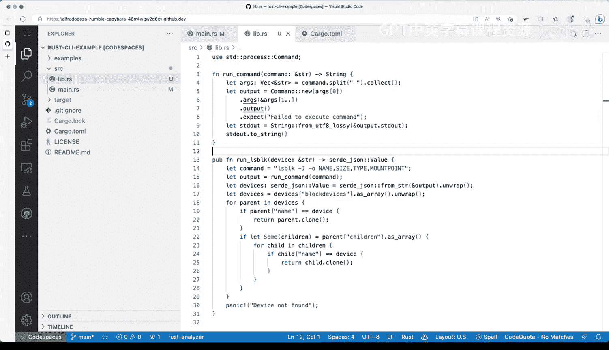

# Rust编程4-5：15：通过模块和库扩展工具功能 🧩

在本节课中，我们将学习如何通过模块和库来组织和扩展Rust命令行工具的功能。我们将把一个单一文件的项目拆分成更模块化的结构，以提高代码的可维护性和组织性。

---

## 概述

目前，我们的工具使用Rust实现了`lsblk`命令的功能。所有代码都位于`main.rs`文件中。虽然这可以正常工作，但随着项目增长，将所有代码放在一个文件中会变得难以管理。本节我们将学习如何通过创建库模块来更好地组织代码。

## 从单一文件到模块化结构

上一节我们介绍了在单一文件中实现功能的方法。本节中，我们来看看如何将代码拆分成模块。

在Python等语言中，将所有代码放在一个文件中是可以的，直到你希望更好地组织代码。Rust应用也是如此。我们将使代码更加模块化，从在`src`目录中添加内容开始，这是Rust应用中的常见做法。

首先，我们将添加一个`lib.rs`文件。通常，你至少会有`main.rs`和`lib.rs`。根据组织需求，你还可以拥有更多文件甚至包含更多模块和文件的子目录。我们将探索如何为当前项目进行模块化。虽然有很多不同选项，但我们将从最简单的开始：直接在这里添加一个`lib.rs`文件。

## 创建库模块

以下是创建库模块的步骤：

1.  **从`main.rs`中提取代码**：回到`main.rs`，查看现有代码。我们有`run_command`函数和`run_lsblk`函数，以及`main`函数。我将保持`main`函数不变，选择`main`函数之外的所有内容并剪切。

2.  **粘贴到`lib.rs`**：现在转到`lib.rs`文件，粘贴刚才剪切的所有内容并保存。此时，Rust分析器会显示警告，因为一些函数未被使用，这是正常的。

3.  **在`main.rs`中引用模块**：回到`main.rs`，现在会遇到错误：“cannot find `run_lsblk` in this scope”。这是因为`run_lsblk`现在位于不同的模块中。如何解决呢？如果你记得应用程序的名称，可以打开`Cargo.toml`文件查看。我们的包名是`blokrs`。因此，在`main.rs`中，我们可以使用`blokrs::`来调用函数。

4.  **设置函数为公有**：即使通过包名引用，我们可能仍会看到错误提示：“function `run_lsblk` is private”。这是因为当所有代码在单一文件`main.rs`中时，函数默认不是公开可用的。我们需要使其公开。转到`lib.rs`，找到`run_lsblk`函数，在其前面添加`pub`关键字将其设为公有。

5.  **测试运行**：完成上述步骤后，回到`main.rs`，错误提示应该消失。现在可以切换回终端，运行`cargo run`命令进行测试。首次编译可能会稍慢，因为进行了更改。再次运行则会很快，因为Rust知道无需重新编译。

## 使用`use`声明提高代码清晰度

目前我们处于良好状态，拥有两个模块。你可以继续模块化，使代码随着项目增长而更加有序。这种最小化的模块化方式是一个好的起点，后续课程中我们将看到如何进一步扩展。

我们看到了如何使用包名`blokrs`直接调用`run_lsblk`。实际上，我们也可以在文件顶部定义`run_lsblk`，使其以我们期望的方式工作。这样做的方法是在顶部添加`use`声明，明确说明从另一个模块使用了哪些内容。例如，可以写`use blokrs::run_lsblk;`。然后，在代码中可以直接使用该函数，无需前缀。这样可以使代码更清晰。

同样，我们也可以对`clap`库这样做，以更清晰地展示我们在做什么。我个人更喜欢在顶部明确声明使用的外部依赖和内部模块，这有助于保持代码组织有序。我们可以写`use clap::{App, Arg};`，然后在代码中直接使用`App`和`Arg`。这样更加有序，顶部明确列出了使用的内容，而输出调用部分的代码保持不变。

## 总结

本节课中，我们一起学习了如何通过模块和库来组织和扩展Rust命令行工具。我们从一个单一文件的项目开始，逐步将其拆分成`main.rs`和`lib.rs`两个模块，使代码结构更加清晰和可维护。通过使用`pub`关键字公开函数，以及利用`use`声明提高代码可读性，我们建立了一个良好的模块化基础。这是一个非常直接和入门级的方法，展示了如何在Rust命令行工具中组织代码，为将来构建更复杂的多文件项目奠定了坚实的基础。