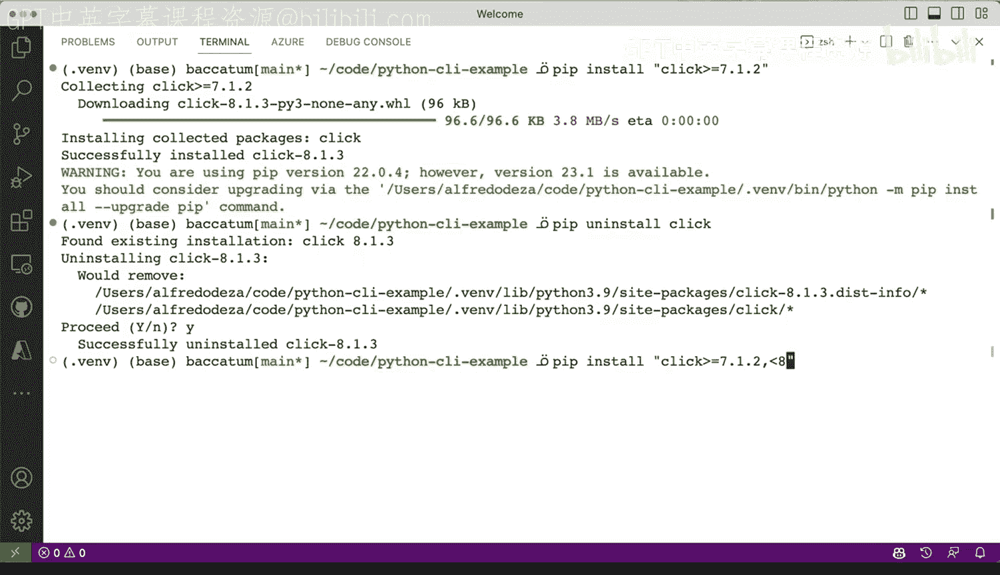

# Rust编程4-5：20：处理Python依赖项与库 📦


在本节课中，我们将深入学习如何管理Python项目的依赖项，特别是通过`requirements.txt`文件。我们将探讨如何精确锁定依赖版本，以及如何灵活地指定版本范围，以适应不同的开发需求。

---

## 概述

我们已经初步了解了`requirements.txt`文件及其基本要求。然而，在处理这些文件时，还有更多细节可以深入探讨，使其用法更加清晰。本节将使用一个名为`block_pi`的Python CI示例项目进行演示，其`requirements.txt`文件目前仅包含一个依赖项。

---

## 精确锁定依赖版本

在`requirements.txt`文件中，当您以`click==7.1.2`这样的格式声明依赖时，您正在执行**锁定**操作。这意味着`click`框架库将始终尝试安装版本`7.1.2`。

这种做法非常可靠，但有时您可能需要更多灵活性，而不必严格指定确切的版本。

---

## 灵活指定版本范围

您可以放松版本限制。例如，将`click==7.1.2`改为`click==7`，这表示将安装任何主版本号为7的版本，但不会安装低于或高于7的版本。

为了验证环境，请确保您已激活虚拟环境。使用系统Python解释器时可能无法找到依赖。激活虚拟环境后，在Python中执行`import click`和`print(click)`，可以确认`click`库来自正确的虚拟环境路径。

让我们进行一些实际操作。首先清除当前环境，然后查看`requirements.txt`文件。使用`pip install click`命令，即使不修改`requirements.txt`文件，我们也可以进行一些测试。

---

## 验证已安装的包

在尝试新操作之前，另一种验证方法是使用`pip freeze`命令。该命令会列出当前虚拟环境中安装的所有包。

以下是使用`pip freeze`的示例：
```bash
pip freeze
```
此命令将输出当前环境中所有已安装包及其精确版本。

---

## 处理版本冲突

现在，让我们尝试安装`click`。执行命令`pip install "click==7"`。您可能会遇到一个错误，提示`click==7`不兼容。这是因为在虚拟环境中，我们的项目`block_pi_demo`已声明需要`click==7.1.2`。

为了解决这个冲突，我们可以先卸载项目本身：
```bash
pip uninstall block-pi-demo
```
确认卸载后，再次运行`pip freeze`，会发现除了`click==7`外没有其他安装项。接着，卸载`click`：
```bash
pip uninstall click
```
现在环境已清理干净。

---

## 指定版本范围约束

让我们重新开始，尝试更灵活的版本指定。执行`pip install "click>=7.1.2"`。您会发现，系统选择了版本`8.1.3`，因为它满足“大于等于7.1.2”的条件。

如果您不希望安装版本8，可以添加更多约束。再次卸载`click`，然后执行：
```bash
pip install "click>=7.1.2, <8"
```
现在，系统将匹配并安装版本`7.2`。这为您提供了灵活性。

---



## 使用requirements.txt文件安装

您还可以直接在`requirements.txt`文件中添加依赖。例如，添加一行`click`（不指定版本）。然后，使用以下命令根据该文件安装依赖：
```bash
pip install -r requirements.txt
```
由于没有指定精确版本（即没有使用`==`），`pip`将安装最新的可用版本，在本例中是`8.1.3`。

---

## 开发与生产环境管理

以下是处理依赖时的一些关键考虑点：

*   **开发灵活性**：在开发过程中，您可能希望尝试其他库或不同版本，而不与生产级或发布级命令行工具冲突。
*   **版本控制技巧**：利用`pip freeze`生成精确的依赖列表，或使用宽松的版本约束来平衡稳定性和灵活性。
*   **环境隔离**：始终使用虚拟环境来隔离项目依赖，避免全局Python环境混乱。

---

## 总结

本节课中，我们一起学习了如何通过`requirements.txt`文件管理Python依赖。我们探讨了精确锁定版本与灵活指定版本范围的方法，解决了可能出现的版本冲突，并了解了如何在开发和生产环境中妥善管理依赖。掌握这些技巧将帮助您更高效地构建和维护Python项目。