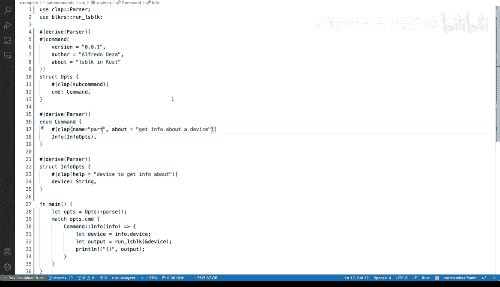

# Rust编程：4-5：在Rust中创建带子命令的命令行工具


在本节课中，我们将学习如何使用`clap`库的`derive`特性，为我们的Rust命令行工具添加子命令功能。我们将重构现有代码，使其结构更清晰、更模块化。

## 概述

我们将对一个现有的Rust命令行工具进行重构。该工具是一个`lsblk`命令的包装器，用于查询设备信息并以JSON格式输出。目前，它使用`clap`库的基本方式来解析命令行参数。我们的目标是将其升级，使用`clap`的`derive`特性来支持子命令，使代码结构更优、更易于维护。

## 重构为使用Derive特性

首先，我们需要更新`Cargo.toml`文件，为`clap`库启用`derive`特性。这是后续所有操作的基础。

```toml
[dependencies]
clap = { version = "4", features = ["derive"] }
```

完成配置后，我们开始修改主程序文件。我们将移除原有的基于`App::new`的参数构建方式，转而使用结构体（`struct`）和枚举（`enum`）来定义命令行接口。

### 定义主选项结构体

我们创建一个名为`Opts`的结构体，并使用`#[derive(Parser)]`宏。这个结构体将代表我们程序的根命令。

```rust
use clap::{Parser, Subcommand};

#[derive(Parser)]
#[command(author, version, about)]
struct Opts {
    #[command(subcommand)]
    cmd: Command,
}
```

在上面的代码中：
*   `#[command(author, version, about)]`会自动从`Cargo.toml`中读取程序的元信息。
*   `#[command(subcommand)]`属性表明`cmd`字段将包含一个子命令。

### 定义子命令枚举

接下来，我们定义一个枚举`Command`，它列出了所有可用的子命令。目前我们只有一个`info`命令。

```rust
#[derive(Subcommand)]
enum Command {
    /// Get info about a device
    Info(InfoOptions),
}
```

`Info`变体关联了一个`InfoOptions`结构体，这个结构体定义了`info`子命令特有的参数。

### 定义子命令选项

我们创建`InfoOptions`结构体，用于定义`info`子命令需要接收的参数，例如要查询的设备名。

```rust
#[derive(Parser)]
struct InfoOptions {
    /// The device to query
    device: String,
}
```

现在，我们的命令行结构已经定义完毕。主程序逻辑需要相应调整，以匹配新的参数解析方式。

## 调整主函数逻辑

在`main`函数中，我们首先解析参数，然后根据匹配到的子命令执行相应的逻辑。

```rust
fn main() -> Result<()> {
    let opts = Opts::parse();

    match opts.cmd {
        Command::Info(info_opts) => {
            let output = get_device_info(&info_opts.device)?;
            let json_output = serde_json::to_string_pretty(&output)?;
            println!("{}", json_output);
        }
    }
    Ok(())
}
```

代码解析如下：
1.  `Opts::parse()` 会自动处理命令行输入，并填充我们定义的结构体。
2.  使用`match`语句匹配`opts.cmd`。
3.  如果匹配到`Command::Info`，则从其关联的`info_opts`中取出`device`参数。
4.  调用核心函数`get_device_info`获取数据，序列化为格式化的JSON字符串并打印。

## 测试与验证

让我们测试一下新的命令行工具。

首先，运行帮助命令查看结构：

```bash
cargo run -- --help
```

你会看到输出中包含了`info`子命令及其描述。

然后，运行`info`子命令来查询一个设备（例如`vda1`）：

```bash
cargo run -- info vda1
```

程序应该能正确运行，并输出该设备的JSON信息。

### 关于子命令命名

你可以轻松地修改子命令的名称。例如，将枚举中的`Info`改为`Part`：

```rust
#[derive(Subcommand)]
enum Command {
    /// Get info about a device
    Part(InfoOptions),
}
```

那么对应的调用命令就变成了：

```bash
cargo run -- part vda1
```

**注意**：为了保持代码清晰，建议子命令枚举变体的名称与其关联选项结构体的用途保持一致，避免造成混淆。

## 总结

本节课中，我们一起学习了如何使用`clap`库的`derive`特性为Rust命令行工具添加子命令。我们通过以下步骤完成了重构：

1.  在`Cargo.toml`中启用`clap`的`derive`特性。
2.  使用`#[derive(Parser)]`定义主选项结构体(`Opts`)。
3.  使用`#[derive(Subcommand)]`定义子命令枚举(`Command`)。
4.  为每个子命令定义其专属的选项结构体（如`InfoOptions`）。
5.  在`main`函数中解析参数并使用`match`语句根据不同的子命令执行相应逻辑。



这种方法的优势在于代码结构清晰、类型安全且易于扩展。当需要添加新的子命令时，只需在`Command`枚举中添加新的变体并实现其处理逻辑即可，极大地提升了代码的可维护性。