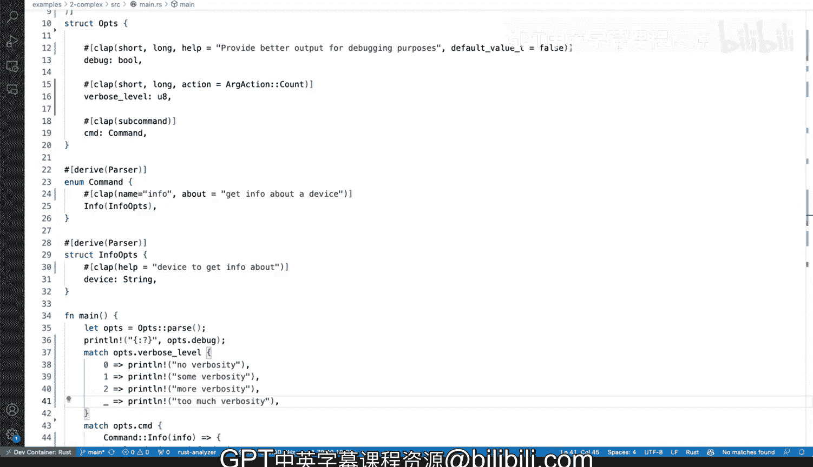

# Rust编程4-5：29：在Rust中解析复杂命令行参数


在本节课中，我们将学习如何为Rust命令行工具添加复杂的全局标志（flags）。我们将重点介绍如何添加布尔类型的调试标志和具有计数功能的详细级别标志。

## 概述

上一节我们为`ls`命令的Rust包装器添加了子命令。本节中，我们来看看如何为其添加全局命令行标志，以增加程序的复杂性和功能性。

## 添加调试标志

首先，我们为程序添加一个简单的布尔类型调试标志。这个标志将提供用于调试目的的额外输出。

以下是添加`debug`标志的步骤：

1.  在`OptionStruct`结构体中添加一个字段。
2.  使用`clap`属性宏为这个字段定义短格式（`-d`）和长格式（`--debug`）选项。
3.  为该标志设置一个默认值。

```rust
#[derive(Parser, Debug)]
struct OptionStruct {
    #[command(subcommand)]
    pub command: Commands,

    #[arg(short, long, help = "提供用于调试的更好输出", default_value_t = false)]
    pub debug: bool,
}
```

添加此标志后，运行`--help`命令，可以在帮助菜单中看到新增的`-d, --debug`选项。

为了验证标志是否正常工作，我们可以在主函数中打印其值。

```rust
fn main() {
    let ops = OptionStruct::parse();
    println!("调试标志的值是：{}", ops.debug);
}
```

运行程序时，如果不带`-d`参数，`debug`的值将为`false`；如果带上`-d`参数，其值将变为`true`。

## 添加详细级别标志

接下来，我们添加一个更复杂的标志：详细级别（verbosity level）。这个标志允许用户通过重复使用`-v`来增加输出的详细程度。

以下是添加`verbosity`标志的步骤：

1.  在`OptionStruct`结构体中添加一个`u8`类型的字段。
2.  使用`clap`属性宏，并指定`action = ArgAction::Count`。这个动作允许标志被多次使用，每次使用都会增加计数值。
3.  这个标志同样支持短格式（`-v`）和长格式（`--verbose`）。

```rust
use clap::{ArgAction, Parser};

#[derive(Parser, Debug)]
struct OptionStruct {
    #[command(subcommand)]
    pub command: Commands,

    #[arg(short, long, help = "提供用于调试的更好输出", default_value_t = false)]
    pub debug: bool,

    #[arg(short, long, action = ArgAction::Count, help = "设置输出详细级别")]
    pub verbosity: u8,
}
```

`action = ArgAction::Count`是关键，它使得`-v -v -v`等同于`-vvv`，并且`verbosity`字段的值会是`3`。

## 处理详细级别

添加标志后，我们需要在代码中根据不同的详细级别执行不同的操作。这可以通过`match`语句来实现。

```rust
fn main() {
    let ops = OptionStruct::parse();

    match ops.verbosity {
        0 => println!("无详细输出"),
        1 => println!("一些详细输出"),
        2 => println("更多详细输出"),
        _ => println!("详细程度过高"),
    }
}
```

现在，运行程序时：
*   不使用`-v`：输出“无详细输出”。
*   使用一次`-v`：输出“一些详细输出”。
*   使用两次`-v`：输出“更多详细输出”。
*   使用三次或更多次`-v`：输出“详细程度过高”。

## 总结

本节课中我们一起学习了如何在Rust命令行工具中添加复杂的全局标志。我们实践了两种主要类型：
1.  **布尔标志**：如`debug`，用于开关某项功能。
2.  **计数标志**：如`verbosity`，通过`action = ArgAction::Count`实现累加计数，非常适合用于表示级别或强度。



通过`clap`库，我们可以方便地定义这些标志的短格式、长格式、帮助文本和默认值，从而构建出功能丰富且用户友好的命令行接口。你可以根据实际需求，在此基础上构建更复杂的标志逻辑。