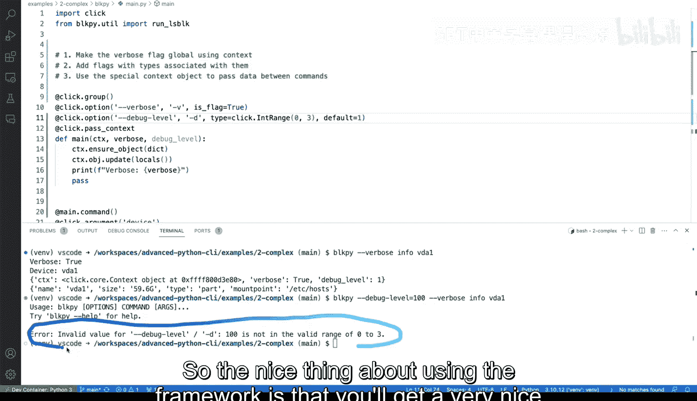

# Rust编程4-5：30：在Python中解析复杂命令行参数


在本节课中，我们将学习如何使用Click库处理命令行工具中的一些复杂场景。我们将重点探讨如何使标志全局可用、如何为标志关联特定类型，以及如何使用上下文对象在命令间传递数据。

## 使`verbose`标志全局可用

上一节我们介绍了基本的命令行参数解析。本节中我们来看看如何使一个标志（如`verbose`）在多个子命令中全局可用。目前，`verbose`标志仅在`main`函数中定义，子命令`info`无法直接访问它。

为了解决这个问题，Click提供了一个特殊的上下文对象。我们可以通过`pass_context`装饰器注入一个名为`ctx`的上下文对象。这个对象本质上是一个字典，可以用于存储和传递数据。

以下是实现步骤：
1.  在主命令函数上使用`@click.pass_context`装饰器。
2.  在函数内部，通过`ctx.ensure_object(dict)`确保上下文对象是一个字典。
3.  将`verbose`标志的值存入这个字典：`ctx.obj[‘verbose’] = verbose`。
4.  在子命令函数上同样使用`@click.pass_context`装饰器。
5.  在子命令函数内部，通过`ctx.obj[‘verbose’]`来获取全局的`verbose`值。

通过这种方式，`verbose`标志的状态就可以在主命令和所有子命令之间共享和访问了。

## 为标志关联特定类型和约束

除了传递数据，我们还可以为命令行参数指定类型并添加约束，这能有效提升程序的健壮性和用户体验。

Click允许我们使用`type`参数来指定输入值的类型，例如整数(`int`)、浮点数(`float`)或字符串(`str`)。更重要的是，我们可以使用`click.IntRange`来定义一个数值范围。

以下是定义带类型和范围约束的标志的方法：
```python
@click.option(‘--debug-level‘, ‘-d‘, type=click.IntRange(0, 3), default=0)
```
这段代码定义了一个`--debug-level`选项：
*   `-d`是其短格式。
*   `type=click.IntRange(0, 3)`指定其值必须是0到3之间的整数。
*   `default=0`设置了默认值为0。

如果用户输入了范围之外的值（例如100），Click会自动提供一个清晰的错误提示：“Error: Invalid value for ‘–debug-level‘: 100 is not in the range 0<=x<=3.”。这省去了我们手动编写验证逻辑的麻烦。

指定类型后，在代码中可以直接将该参数当作相应的Python类型（如`int`）使用，进行数学比较或运算，这使内部逻辑处理更加方便和安全。

## 使用上下文对象传递多个数据

如果需要传递多个全局变量，逐个设置会显得繁琐。Click提供了一种便捷的方法，可以一次性将函数的所有局部变量注入到上下文对象中。

在主命令函数中，我们可以使用以下代码：
```python
ctx.obj.update(locals())
```
`locals()`函数会返回当前函数作用域内所有局部变量及其值的字典。通过`ctx.obj.update()`方法，我们可以将这些变量全部添加到上下文对象中。



这样，所有在`main`函数中定义的参数（如`verbose`, `debug_level`等）都会自动成为上下文对象的一部分，无需再手动逐个添加。子命令通过`ctx.obj`即可访问所有这些共享数据。

## 总结

本节课中我们一起学习了使用Click库处理复杂命令行参数的三个高级技巧：
1.  我们学会了使用`@click.pass_context`装饰器和`ctx.obj`字典使标志（如`verbose`）在不同命令间全局可用。
2.  我们探索了如何使用`type`参数（特别是`click.IntRange`）为命令行参数指定类型和添加输入约束，从而提升程序的健壮性。
3.  我们掌握了利用`ctx.obj.update(locals())`一次性将多个数据注入上下文对象的高效方法，简化了命令间的数据传递。


这些功能共同帮助开发者构建出更强大、更灵活、更用户友好的命令行工具。