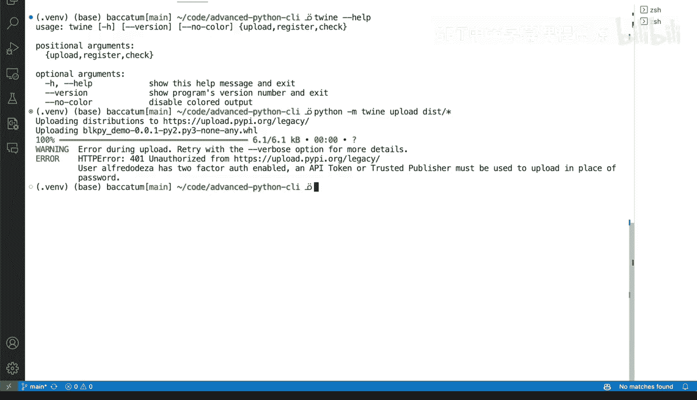

# Rust编程4-5（Linux命令行工具、LLMOps）：38：发布到Python包索引(PyPI) 📦


在本节课中，我们将学习如何将你的Python工具发布到官方的Python包索引（PyPI）。我们将介绍传统的发布方法为何已弃用，并详细讲解使用现代工具`twine`进行发布的全过程，包括如何配置API令牌进行身份验证。

## 传统方法已弃用

当你准备好发布工具时，需要确保使用Python中特定的专用工具。

过去，如果你查阅一些旧文章或帮助文档，可能会看到类似`python setup.py upload`的命令。实际上，我们可以尝试运行这个命令，但会得到一个错误代码（如403或401）。这代表了旧有的发布方式，现在它已**100%完全弃用**，不再被允许。

即使命令本身能运行，它也已过时。这里的错误信息“无效或不存在的身份验证信息”虽然部分正确（因为确实缺少正确的认证），但根本原因在于该方法本身已被禁用。

## 使用Twine进行发布

因此，正确的发布方式是使用`twine`工具。首先，我们需要安装它。请确保你已激活虚拟环境（通常命令行提示符会有标识），然后运行安装命令：

```bash
pip install twine
```

安装完成后，你可以查看`twine`的帮助菜单。它允许你执行上传（upload）、注册（register）或检查（check）等操作，用于向代码仓库发布你的包。你可以通过Twine命令行接口（CLI）或使用`python -m twine`来调用它。

基本的上传命令结构如下，你需要指定目标仓库。对于PyPI，默认仓库就是`pypi`：

```bash
twine upload --repository pypi dist/*
```

运行上述命令后，我遇到了“未授权”的错误，因为我尚未登录，并且启用了双因素认证。错误信息提示：“必须使用API令牌或受信任的发布者来代替密码进行上传”。这是正确的，信息也详细说明了情况。

## 配置PyPI API令牌

那么，这个API令牌如何工作呢？让我们转到PyPI网站（pypi.org）。你需要在此创建一个账户（注意，此账户与GitHub账户不关联，这与Rust的crates.io等平台不同）。

登录后，进入你的账户设置。在账户设置页面中，向下滚动直到找到“创建API令牌”的选项。点击创建后，你需要为令牌命名，并选择其作用范围（例如，它可以用于哪些特定的包）。这将帮助你正确地进行上传身份验证。




## 测试发布流程


让我们回到我们的项目。如果你想在上传和发布前进行测试，可以使用PyPI提供的测试仓库。命令如下：

```bash
twine upload --repository testpypi dist/*
```

这样，系统会提示你输入用户名和密码。这是一种良好且可靠的方式来测试上传流程，确保一切准备就绪。虽然我因为未使用正确密码而得到了403禁止访问错误，但你在测试时应该能预期它正常工作。

## 首次发布：注册包

对于全新的包，你需要做的第一件事是注册。`register`子命令的使用方式与`upload`基本相同。你需要提供你的凭证，构建好所有文件，然后运行命令以确保它在Python包索引（PyPI）中正确注册。


## 总结


本节课中，我们一起学习了如何将Python包发布到PyPI。我们了解到传统的`python setup.py upload`方法已被弃用，现代的标准做法是使用`twine`工具。整个过程包括：安装`twine`、在PyPI官网创建并配置API令牌以进行安全身份验证、使用测试仓库（TestPyPI）验证发布流程，以及最终使用`twine upload`命令将包发布到正式的PyPI仓库。对于新包，还需要先使用`twine register`命令进行注册。