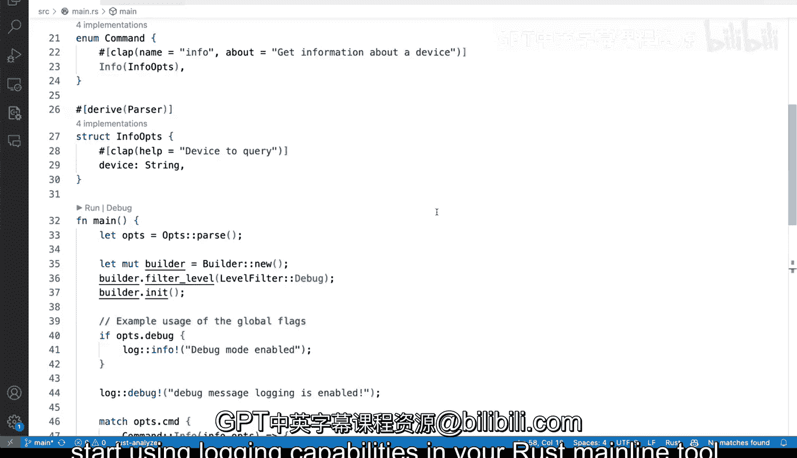

# Rust编程4-5：41：在Rust中实现基础日志 📝


## 概述
在本节课中，我们将学习如何在Rust命令行工具中实现基础日志功能。我们将使用两个核心库来构建一个灵活的日志系统，它可以控制日志输出的详细程度，并替代简单的`println!`宏。

## 日志库介绍
在Rust中，可以通过几个库的组合来实现基础日志功能。我已经将这些库添加到了我的`Cargo.toml`文件中。

以下是`Cargo.toml`文件中的相关依赖项：
```toml
[dependencies]
log = "0.4"
env_logger = "0.10"
```
`log`和`env_logger`这两个crate协同工作，为我们的工具提供日志记录能力。

## 现有代码的问题
现在，我们转到`main.rs`文件开始实现日志功能。如果向下滚动查看代码，会发现我们一直在使用`println!`宏来输出信息，并且这种用法遍布各处。

`println!`的问题在于它不允许你调整日志的详细级别。如果你希望某些消息处于特定的级别（例如调试信息），这是无法直接实现的。你当然可以使用`if-else`语句来控制，但你不希望到处都是这样的条件判断。实现日志系统将为你提供诸多特性，这只是其中之一。

## 导入必要的模块
首先，我们需要在文件顶部添加实现日志功能所需的一些导入项。

第一个导入是`LevelFilter`，它将允许我设置正确的日志级别。
```rust
use log::LevelFilter;
```
接下来，我不使用`simple_logger`，而是使用一个叫做`env_logger`的模块及其`Builder`。
```rust
use env_logger::Builder;
```
`env_logger`为我提供了构建日志格式和所有我们想要的功能的能力。虽然添加两个crate可能看起来有些繁琐，但你会看到它对我们来说工作得非常好。

## 配置日志构建器
保存更改后，我们滚动到`main`函数。在`main`函数中，我们将开始创建构建器，以便在这里建立我们的日志设施。

我声明一个可变的`builder`对象，并使用`Builder::new()`来创建它。
```rust
let mut builder = Builder::new();
```
然后，我们设置`builder`的过滤器级别。
```rust
builder.filter_level(LevelFilter::Debug);
```
这里我们将级别设置为`Debug`（而不是`Info`）。`Debug`级别将允许我们至少看到所有调试级别的消息。

这样，我们就为想要做的事情做好了准备。请注意，这里的方法是`filter_level`，而不是`filter`。

## 测试日志功能
首先，让我们确保一切正常工作。切换到终端，运行`cargo run info v1`。一切正常。

快速检查`help`命令是否正常工作，它确实运行正确。关闭这些输出，我们仍然到处使用`println!`。

现在，让我们开始添加一些日志语句。例如，在这里我们可以使用`log::debug!`宏。
```rust
log::debug!("Debug message: logging is enabled");
```
添加分号后，我们再次切换到终端。这次不运行`help`，而是运行`info vd1`，你会看到我们的消息开始出现。

我们得到了时间戳、调试级别（显示为蓝色和粗体）、`R2`标识，以及实际的消息。这就是我们启用简单日志的方式。

不仅如此，我们还可以开始调整设置。例如，将`LevelFilter`从`Debug`改为`Info`，然后再次尝试运行终端命令。

我们将看不到那条调试消息。在输出中，没有像之前那样的调试信息。原因是我们已经更改了过滤器级别。

## 填充日志消息
你可以开始围绕你想要的内容进行调整，并开始填充这里的消息。例如，在`if options.debug`的条件块中，我们可以使用`log::info!`。
```rust
log::info!("Debug mode enabled");
```
所有这些都可以更改，然后你开始看到生成更多消息的能力。

让我们再尝试一次终端命令，并确保调试级别正常工作。如果我们使用`-t -D`选项（来自那个参数），让我们看看它是否工作。

现在我们同时得到了两条信息：“info: Debug mode enabled” 和 “debug: Debug message: logging is enabled”。我或许应该做得更好，不要在一个信息消息中添加调试消息以免混淆大家，但你应该明白了：在你的Rust命令行工具中添加和使用日志功能并不复杂。



## 总结
本节课中，我们一起学习了如何在Rust中实现基础日志系统。我们引入了`log`和`env_logger`库，配置了日志构建器并设置了日志级别，最后用日志宏替换了原有的`println!`语句。这个系统提供了按级别过滤消息的能力，使得调试和控制输出变得更加灵活和高效。