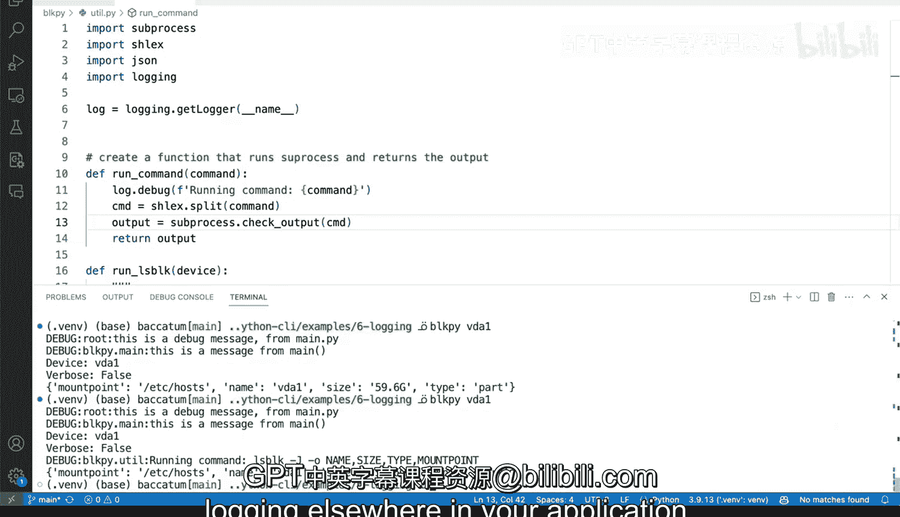

# Rust编程4-5：42_02_03：在Python中实现基础日志 📝


在本节课中，我们将学习如何在Python应用程序中添加基础的日志记录功能。Python的`logging`模块是标准库的一部分，无需额外安装，这使得入门变得非常简单直接。我们将从最基本的配置开始，逐步了解如何定制日志记录器，以便更清晰地追踪程序执行过程中的信息。

## 概述

Python的`logging`模块提供了一个灵活且强大的日志记录系统。通过简单的配置，我们可以快速开始记录信息，这对于调试和理解程序流程非常有帮助。本节将演示如何设置基础日志，并解释日志记录器的层级结构。

## 基础配置与使用

首先，我们来看如何使用`logging`模块进行最基本的配置。`logging.basicConfig`函数可以处理日志模块的大部分默认设置，提供一个良好的起点。

以下是使用基础配置记录日志的步骤：

1.  导入`logging`模块。
2.  调用`logging.basicConfig()`进行配置。
3.  使用`logging.debug()`等函数记录消息。

```python
import logging

logging.basicConfig()
logging.debug("This is a debug message from main.py")
```

运行上述代码，日志消息会默认输出到标准错误流（终端）。这是一种快速开始记录日志的方式。

## 使用命名记录器

上一节我们介绍了基础配置，本节中我们来看看如何创建和使用命名记录器，以获得更清晰的日志来源信息。

默认情况下，日志使用“根记录器”（root logger）。为了更好地标识日志来源，我们可以创建具有特定名称的记录器。

以下是创建和使用命名记录器的步骤：

1.  使用`logging.getLogger(__name__)`获取或创建一个记录器。`__name__`变量会自动设置为当前模块的名称。
2.  使用这个记录器对象来调用日志方法，如`log.debug()`。

```python
import logging

# 创建一个命名记录器，通常使用 __name__
log = logging.getLogger(__name__)

def main():
    logging.basicConfig()
    # 使用根记录器
    logging.debug("This is from the root logger")
    # 使用我们创建的命名记录器
    log.debug("This is a message from main function")

if __name__ == "__main__":
    main()
```

运行修改后的代码，你会发现日志输出中包含了模块名（例如`__main__`），这能帮助我们快速定位日志语句的来源。

## 在多个模块中记录日志

理解了单个模块中的日志记录后，我们可以在应用程序的其他模块中也添加日志功能。这有助于追踪跨模块的程序执行流程。

假设我们有一个工具模块`utility.py`，我们想在其中添加日志。

在`utility.py`中：

```python
import logging

# 为这个模块创建一个记录器
log = logging.getLogger(__name__)

def some_function():
    log.info("Loading utility module")
    # ... 其他代码
```

然而，这里有一个关键点需要注意：**日志配置必须在所有日志语句之前设置**。如果`utility.py`中的代码在`main.py`调用`basicConfig()`之前就执行了，那么它的日志可能不会被输出。

因此，最佳实践是在程序的主入口点（通常是`main()`函数）尽早完成日志配置。

```python
# main.py
import logging
import utility

def main():
    # 首先进行日志配置
    logging.basicConfig(level=logging.DEBUG)
    log = logging.getLogger(__name__)

    log.debug("Starting the application...")
    utility.some_function()
    # ... 其他代码

if __name__ == "__main__":
    main()
```

这样，所有模块的日志都会按照统一的配置进行输出，并且每条日志都带有其模块名称，使得调试和追踪变得非常清晰。

## 总结



本节课中我们一起学习了在Python中实现基础日志记录。我们从最简单的`logging.basicConfig()`开始，了解了如何快速输出日志。接着，我们引入了命名记录器的概念，使用`logging.getLogger(__name__)`来创建能标识来源的日志器，这比使用根记录器提供了更多的上下文信息。最后，我们探讨了如何在多模块应用程序中组织日志，强调了在主入口点统一配置的重要性。通过这些步骤，你可以为你的Python程序添加有效且易于管理的日志功能。