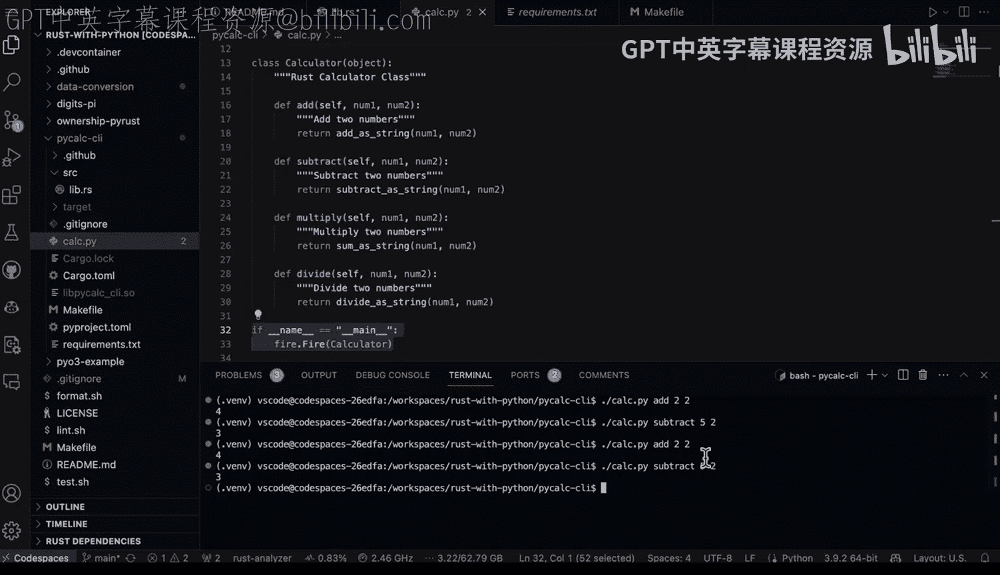

# Rust编程4-5：53：使用Python Fire和Rust编写计算器CLI 🧮


在本节课中，我们将学习如何结合Rust和Python的优势，创建一个命令行计算器工具。我们将使用Rust编写高性能的计算核心，然后利用Python的Fire库轻松构建一个命令行界面。

## 概述

本教程将展示一个名为`pcalc`的Rust-Python混合项目。其核心思想是：**用Rust编写高性能的计算逻辑，用Python构建易用的命令行接口**。这种方法结合了Rust的执行效率与Python的开发便捷性。

## 项目结构

以下是该项目的整体工作流程示意图。


首先，你需要在Rust中构建所需的核心部件。在本例中，核心部件是计算功能。这可以是任何内容，例如使用第三方库、执行MLOps代码，或是编写某种在Rust中运行效率极高的自定义算法。

接着，你需要将这些功能放入`add`等函数中，并将它们全部封装起来。

完成上述步骤后，我倾向于使用一个`Makefile`来将`.so`库文件构建到正确的目录中。我推荐的最佳实践之一是使用像**Python Fire**这样的库来包装它。

这样一来，你几乎不需要编写任何额外代码就能让你的程序运行起来。然后，你就可以从终端调用这些Rust代码了。这真正结合了Python和Rust两者的优点。


理论部分就到这里，接下来我们进入演示环节。


## 代码详解

现在，让我们深入这个示例项目`pcalc`。我们首先要查看的是源代码。

### Rust核心库

如果我进入`lib.rs`文件，会看到一个计算器函数。我首先使用了`pyo3`库，然后包装了一系列Rust代码。

这是一个传统的Rust函数，但我为其添加了`#[pyfunction]`属性，使其能够被`pyo3`调用。

请注意，我对`add_string`、`subtract_string`、`divide_string`等函数也做了同样的处理。最后，在构建`.so`库时，需要通过`#[pymodule]`来暴露这些函数。

以下是关键代码结构示意：
```rust
use pyo3::prelude::*;

#[pyfunction]
fn add_string(a: &str, b: &str) -> PyResult<String> {
    // Rust计算逻辑
    let result = a.parse::<i32>()? + b.parse::<i32>()?;
    Ok(result.to_string())
}

#[pymodule]
fn pcalc(_py: Python, m: &PyModule) -> PyResult<()> {
    m.add_function(wrap_pyfunction!(add_string, m)?)?;
    // ... 暴露其他函数
    Ok(())
}
```

### 构建脚本（Makefile）

接下来，我们看看`Makefile`。在这里，我定义了一个`build`命令。这样做的好处是，原始的构建命令通常很繁琐，而使用Makefile后，我只需记住`make build`即可。

`Makefile`中的命令依次执行以下操作：
1.  运行`cargo build --release`编译Rust项目。
2.  使用`cbindgen`生成C语言头文件（如果需要）。
3.  将编译好的动态库（如`libpcalc.so`）复制到当前工作目录。

### Python接口层

完成上述设置后，我需要做的最后一件事是进入`calc`目录，实际使用Python Fire库。

首先，查看`requirements.txt`文件，其中固定了Python Fire的版本（例如0.5.0）。固定版本是个好习惯，可以确保创建可复现的示例。

回到`calc`目录下的Python脚本，我在这里导入那些Rust函数。这个过程非常直接，就像导入任何常规的Python模块一样。

最后，我利用了Python Fire CLI库的强大功能。这是一个非常精巧的库，因为我只需要在这里创建一个名为`Calculator`的类，然后将那些Rust函数作为这个类的方法来使用。

我在此创建了一个清晰的抽象层，定义了`add`、`subtract`、`multiply`、`divide`等方法。美妙之处在于，一旦我将这个类传递给`fire.Fire()`，`Calculator`就能通过终端被调用。

我认为这是Rust与Python集成的绝佳方式。下面是一个简化的Python包装器示例：
```python
import fire
from pcalc import add_string, subtract_string # 导入Rust编译的函数

class Calculator:
    def add(self, a, b):
        return add_string(str(a), str(b))
    def subtract(self, a, b):
        return subtract_string(str(a), str(b))
    # ... 其他方法

if __name__ == '__main__':
    fire.Fire(Calculator)
```

## 运行演示

我已经使用过这个工具了，但让我们再演示一次加深理解。

在终端中，我们可以这样使用：
```bash
# 调用加法
calc add 2 2
# 调用减法，例如5减2
calc subtract 5 2
```



## 设计理念回顾

如果我们回顾最初的结构图，审视其中发生的一切，我认为这是一种更为精巧的Rust与Python集成方式。

其核心是**利用各自所长**：
*   **发挥Rust的优势**：计算性能、能效和内存安全。
*   **发挥Python的优势**：构建优雅的抽象层和便捷的工具链。

通过将两者结合，我们有望在未来看到许多新兴的数据工程和MLOps工作流采用这种模式。

## 总结


本节课中，我们一起学习了如何构建一个Rust-Python混合的命令行计算器。我们了解了如何使用`pyo3`将Rust函数暴露给Python，如何用`Makefile`自动化构建流程，以及如何用`Python Fire`库快速创建命令行接口。这种架构充分利用了Rust的高性能和Python的易用性，为开发高效的命令行工具提供了强大范式。