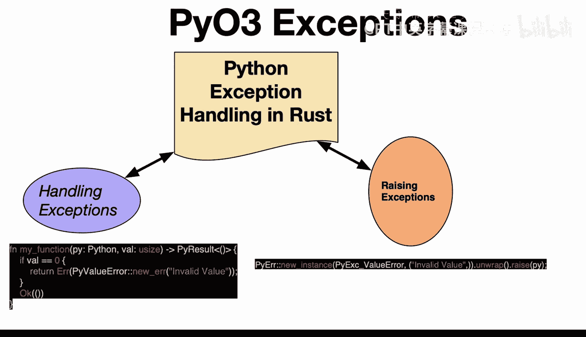
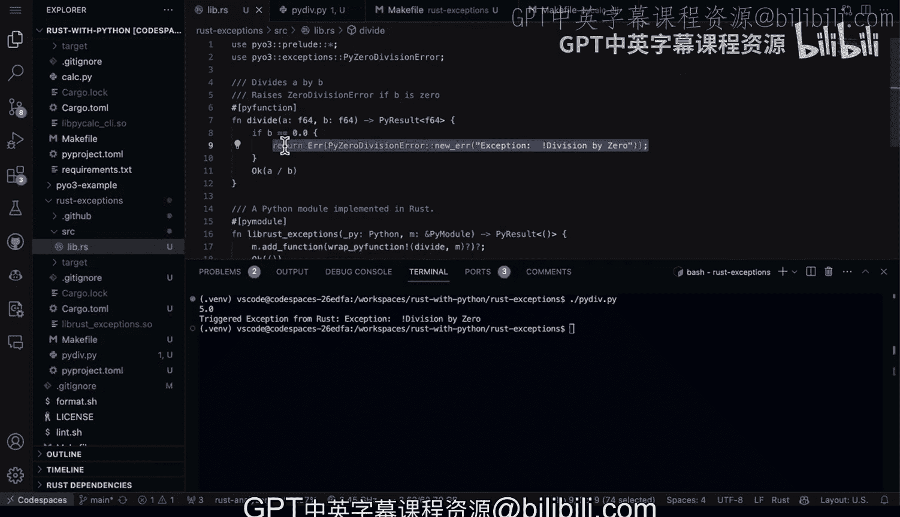

# Rust编程4-5：55_03_02：使用PyO3进行异常处理 🐍


在本节课中，我们将学习如何在Rust和Python的混合编程环境中处理异常。具体来说，我们将探讨如何使用PyO3库在Rust代码中引发Python异常，以及如何在Python中捕获这些异常。

## 概述

在Rust和Python的交互中，错误处理是一个需要特别注意的环节。Rust使用`Result`类型来处理错误，而Python则使用异常机制。PyO3库提供了桥梁，允许我们将Rust的错误转换为Python的异常，反之亦然。本节我们将通过一个具体的例子来演示这一过程。

## 在Rust中引发Python异常

上一节我们介绍了Rust和Python在错误处理机制上的差异。本节中我们来看看如何在Rust代码中主动引发一个Python异常。

在PyO3中，你可以使用`PyErr::new::<ExceptionType>`或`PyErr::from_type`来创建一个Python异常对象，然后使用`.raise()`方法在Python中引发它。

以下是创建和引发异常的核心代码示例：



```rust
use pyo3::exceptions::PyZeroDivisionError;
use pyo3::prelude::*;

#[pyfunction]
fn divide(a: i32, b: i32) -> PyResult<i32> {
    if b == 0 {
        // 创建并引发一个Python的ZeroDivisionError异常
        return Err(PyZeroDivisionError::new_err("除数不能为零"));
    }
    Ok(a / b)
}
```

## 在Python中处理Rust引发的异常

了解了如何在Rust中引发异常后，接下来我们看看如何在Python端捕获并处理这些异常。

在Python中，你可以使用标准的`try...except`块来捕获从Rust函数中引发的异常。PyO3确保Rust的`Err`结果会被正确地转换为Python异常。

以下是调用Rust函数并处理异常的Python代码：

```python
import lib_rust_exceptions

try:
    result = lib_rust_exceptions.divide(10, 0)
    print(f"结果是: {result}")
except ZeroDivisionError as e:
    print(f"捕获到异常: {e}")
    # 这里可以执行你的错误处理逻辑
```

## 实战演练：一个完整的例子

现在，让我们通过一个完整的项目来实践上述概念。我们将创建一个名为`rust_excepts`的Rust库，并在Python中调用它。

首先，我们来看Rust库的源代码结构。以下是`lib.rs`文件的内容：

```rust
use pyo3::exceptions::PyZeroDivisionError;
use pyo3::prelude::*;

/// 一个会引发Python异常的除法函数
#[pyfunction]
fn divide(a: i32, b: i32) -> PyResult<i32> {
    if b == 0 {
        // 当除数为零时，返回一个Python的ZeroDivisionError
        return Err(PyZeroDivisionError::new_err("触发来自Rust的异常：除数不能为零"));
    }
    Ok(a / b)
}

/// 将Rust函数暴露给Python的模块
#[pymodule]
fn lib_rust_exceptions(_py: Python, m: &PyModule) -> PyResult<()> {
    m.add_function(wrap_pyfunction!(divide, m)?)?;
    Ok(())
}
```

接下来，我们需要构建这个Rust库。通常，我们会使用一个`Makefile`或构建脚本来完成编译和复制共享库文件的工作。构建成功后，会生成一个`.so`（Linux）或`.pyd`（Windows）文件。

然后，在Python中，我们可以像导入普通模块一样导入这个Rust库：

```python
# py_div.py
import lib_rust_exceptions

print("测试正常除法：")
try:
    result = lib_rust_exceptions.divide(5, 1)
    print(f"5 / 1 = {result}")
except ZeroDivisionError as e:
    print(f"异常: {e}")

print("\n测试除数为零：")
try:
    result = lib_rust_exceptions.divide(5, 0)  # 这将引发异常
    print(f"5 / 0 = {result}")
except ZeroDivisionError as e:
    print(f"捕获到异常: {e}")
    # 在这里执行你的错误恢复逻辑
```

运行这个Python脚本，你将看到以下输出：

```
测试正常除法：
5 / 1 = 5

测试除数为零：
捕获到异常：触发来自Rust的异常：除数不能为零
```

## 总结

本节课中我们一起学习了如何使用PyO3在Rust和Python之间进行异常处理。我们掌握了两个核心技能：

1.  **在Rust中引发Python异常**：通过创建`PyErr`并使用`.raise()`方法，我们可以将Rust中的错误条件转换为Python的异常。
2.  **在Python中处理Rust异常**：使用标准的`try...except`块，可以无缝地捕获和处理从Rust函数中传播过来的异常。



通过这种机制，我们能够在保持Rust代码安全性和表现力的同时，与Python的异常生态系统完美集成，编写出健壮的混合语言应用程序。