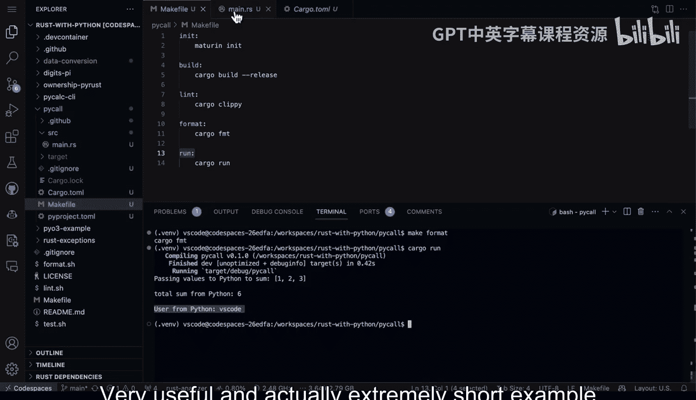

# Rust编程4-5：3：从Rust调用Python 🐍➡️🦀


在本节课中，我们将学习如何使用PyO3库，在Rust项目中导入并调用Python代码。这使你能够结合Rust的生态系统优势（如出色的包管理、工具链、安全性和性能）与Python丰富的库资源。

上一节我们介绍了Rust与Python交互的基本概念，本节中我们来看看如何在Rust代码中具体执行Python操作。

## 项目结构与依赖


首先，我们来看一个示例项目的结构。该项目包含一个`Cargo.toml`文件和一个`main.rs`源文件。在`Cargo.toml`中，我们导入了`pyo3`库。

以下是`main.rs`中的核心代码步骤：

## 代码逐步解析

### 1. 导入与准备
第一步是导入PyO3的预导入模块，并准备Python解释器环境。

```rust
use pyo3::prelude::*;
use pyo3::types::IntoPyDict;

fn main() -> PyResult<()> {
    // 准备Python解释器（支持多线程）
    Python::with_gil(|py| {
        // 代码将在此作用域内执行
        Ok(())
    })
}
```
`Python::with_gil`会获取Python的全局解释器锁（GIL），确保线程安全。

### 2. 传递数据并调用Python内置函数
接下来，我们创建一个Rust向量（类似Python列表），并将其传递给Python的`sum`函数进行计算。

```rust
let values = vec![1, 2, 3];
println!("我们将传递这些值给Python进行求和：{:?}", values);

let sum: i32 = py.eval(&format!("sum({:?})", values), None, None)?.extract()?;
println!("求和结果是：{}", sum);
```
这里，`py.eval`用于执行一段Python代码字符串，并提取返回结果。

### 3. 导入Python标准库
除了内置函数，我们还可以直接导入Python的标准库模块。

```rust
let os = py.import("os")?;
let user: String = os.getattr("getenv")?.call1(("USER",))?.extract()?;
println!("当前用户是：{}", user);
```
这段代码导入了Python的`os`模块，并调用其`getenv`函数获取环境变量`USER`的值。

## 开发与构建实践

在开发过程中，保持良好的实践非常重要。以下是推荐的步骤：

### 代码检查与格式化
使用`cargo clippy`进行代码检查，使用`cargo fmt`进行代码格式化，可以确保代码质量和风格统一。

```bash
# 代码检查
cargo clippy
# 代码格式化
cargo fmt
```

### 运行项目
你可以直接使用`cargo run`来编译并运行项目。

```bash
cargo run
```

## 运行结果

执行上述程序后，你将在终端看到类似以下的输出：
```
我们将传递这些值给Python进行求和：[1, 2, 3]
求和结果是：6
当前用户是：vscode
```
这表明我们成功地在Rust中调用了Python代码，完成了数据传递、函数计算以及标准库的使用。




本节课中我们一起学习了如何在Rust项目中集成Python。我们通过PyO3库，逐步实现了导入Python解释器、调用内置函数、使用标准库模块等功能。这种结合方式让你既能享受Rust的性能与安全，又能利用Python庞大的生态系统，是构建复杂应用的有效策略。