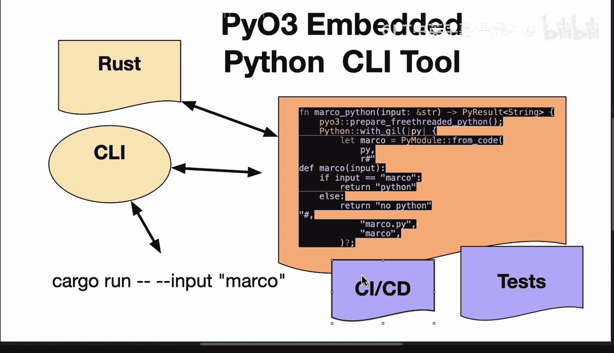

# Rust编程4-5：58_03_05：基于Clap的嵌入式Python Rust CLI架构图解

在本节课中，我们将学习如何构建一个结合了Rust和Python的生产级命令行工具。我们将重点介绍使用Clap框架为嵌入式Python代码创建命令行界面，并探讨测试与自动化交付的完整工作流程。

## 从嵌入式Python到命令行界面

上一节我们介绍了在Rust中嵌入Python代码的基本方法。本节中我们来看看如何为其添加一个命令行界面，使其成为一个真正的生产工具。

这里有一个使用`pyo3`嵌入Python的Rust工具。Rust作为主框架调用Python。你可以看到，我嵌入了一个Python函数，它接收一个输入。这个函数很简单：如果输入的字符串匹配“Marco”，就返回“Python”；否则，返回“no Python”。这段代码虽然简单，但它通过`pyo3`进行了封装。这部分在某种程度上是直接明了的。

但许多在生产环境中工作的人可能会考虑的下一步，是让这个工具成为一个真正的生产工具。我认为，对于大多数接口来说，下一步是创建一个命令行界面。在Rust语言中，有许多优秀的命令行工具框架。事实上，它们允许你进行非常复杂的操作，比如二进制部署——这是我最喜欢的部署方式之一。因为你不需要告诉任何人如何打包工具，只需给他们一个二进制文件即可执行。这在某种意义上，弥补了Python的一些局限性，即Python无法进行二进制部署，它是一种需要解释器的脚本语言。

在这个场景中，如果我使用一个CLI框架（例如我使用的Clap）将其包装起来，会发生什么呢？我可以在交互模式下运行并传入“Marco”这个词。这样做的好处是，我可以获得即时反馈循环。这是一种很好的开发方式，因为我利用了Rust的Cargo系统的强大功能，这确实是该语言在打包方面的优势之一，并弥补了Python的弱点（Python有许多相互竞争的打包方案）。

## 为CLI工具添加测试

在获得命令行界面之后，下一步还需要考虑如何测试你的应用程序。通常，我们需要进行某种形式的测试，包括功能测试和单元测试。这是一个好主意，可以确保业务逻辑是正确的。因此，即使Rust本身具有出色的安全特性，你也需要确保业务逻辑是正确的。这就是为什么对CLI工具进行功能测试通常是一个非常好的想法。

不过，一旦你设置好了这些测试，你希望以自动化的方式进行，这样每次你做出更改时，它都会尝试编译、格式化，如果所有这些都通过了，你就可以创建可交付成果。这将是其持续交付的方面，可交付成果可以是你提供给其他人的二进制工件。

## 推荐的工作流程

我认为，混合使用Python和Rust的推荐工作流程之一是：快速将其放入CLI中进行测试，然后编写测试，最后自动化测试，以便你可以将工件提供给你一起工作的其他人。或者，如果你在一家需要交付产品的初创公司或企业工作，你可以快速交付一个工件，例如在GitHub上，这些GitHub工件随后可以交付给任何用户，甚至可以打包到像RPM或Debian这样的包管理系统中，供人们使用你的产品。

## 总结

本节课中我们一起学习了如何构建一个结合Rust与Python的生产级命令行工具。我们探讨了使用Clap框架为嵌入式Python代码创建CLI界面的方法，理解了二进制部署的优势，并介绍了为工具添加测试以及建立自动化构建与交付流水线的重要性。这套工作流程能有效结合Rust的性能、安全性与Python的生态及灵活性，是构建可交付、可维护混合语言应用的推荐实践。