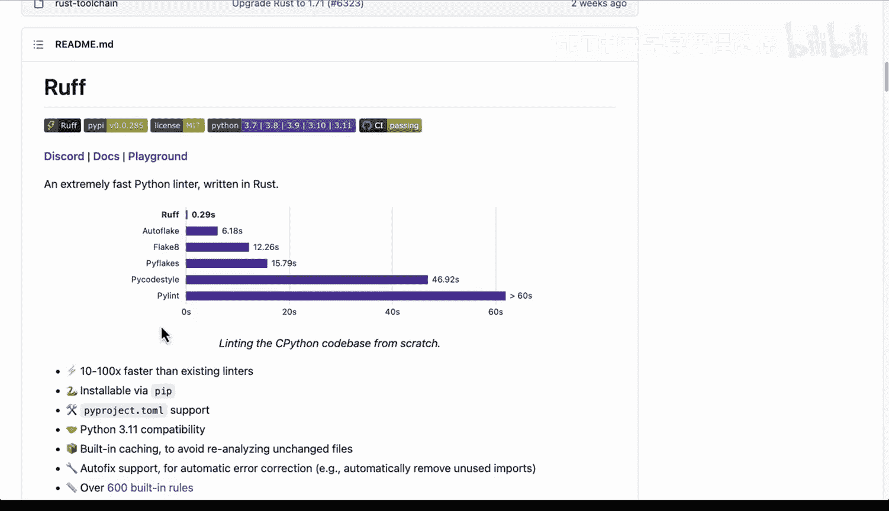
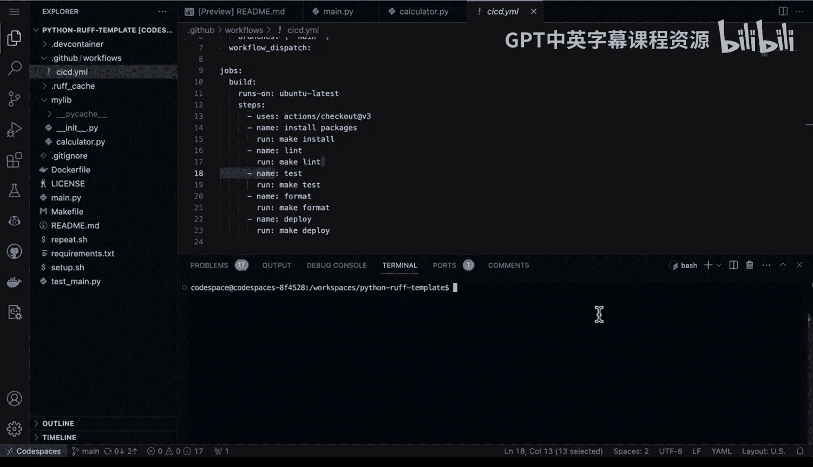
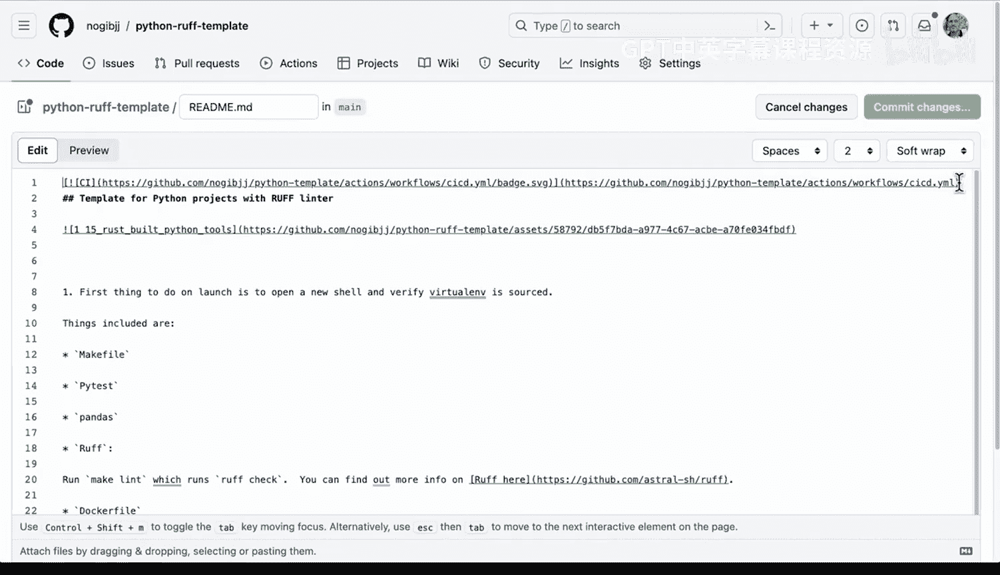
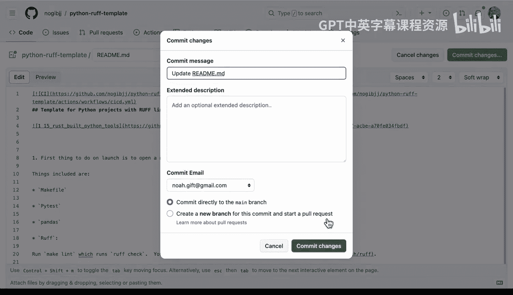

# Rust编程4-5：4：使用Rust Ruff进行Python代码检查


在本节课中，我们将要学习如何使用Ruff，一个用Rust编写的、极其快速的Python代码检查工具。我们将了解其性能优势，并通过实际演示学习如何在项目中和持续集成流程中集成Ruff。

## 概述：什么是Ruff？

Ruff是一个用Rust语言编写的、速度极快的Python代码检查工具。它展示了如何使用Rust为Python生态开发高性能工具。其性能提升非常显著，例如，一次检查耗时0.29秒，而传统工具Pylint可能需要60秒。如此巨大的差异使得选择更慢的检查工具变得缺乏说服力。此外，Ruff还具备缓存等高级功能。

## 在线体验Ruff



上一节我们介绍了Ruff的基本概念，本节中我们来看看如何快速上手体验。一个简单的方法是访问其在线Playground。

通过访问Playground链接，我们可以直接与检查器交互。例如，界面会提示“移除对未使用变量的赋值”这类错误。我们可以根据提示进行修改，比如将未使用的变量用于打印语句来修复问题。同时，我们也可以注意到，Python代码中不需要分号。

这里的核心思想是，得益于Ruff的速度，我们可以获得实时的代码格式化和检查反馈。

## 在项目中集成Ruff

在线体验很方便，但实际开发中我们需要将Ruff集成到自己的项目中。接下来，我们将学习如何在Github项目模板和Codespace环境中使用Ruff。

我创建了一个名为“Python Ruff模板”的Github仓库。Github生态系统的一个优点是允许用户创建项目模板。在仓库设置中将其标记为模板后，未来就可以基于此模板快速创建新项目。


现在，让我们在Codespace中启动这个项目。这个项目已经配置好了Ruff检查器。


如果我们查看项目中的`requirements.txt`文件，会发现我已经固定了依赖版本，并且注释掉了Pylint。这是因为基于Ruff的检查器性能要高得多。

## 使用Makefile运行检查

为了测试Ruff，我们来看一些代码。我喜欢将检查命令放在Makefile中，这样操作更简单，也避免了记忆复杂命令或输入错误。

以下是一个Makefile的示例片段：

```makefile
lint:
    ruff check .
```

现在，我们可以在终端中运行`make lint`命令。执行后，可能会发现一个问题：“一行上有多个语句”。这会导致构建失败。

要修复这个问题，我们可以回到源代码文件。例如，在`main.py`中，可能有一行包含了两个语句（如`import click`和一个不必要的分号）。我们可以删除或注释掉多余的部分。

修复后，再次运行`make lint`，就不会再报错了。

我们也可以在库代码中进行测试。例如，故意写一个不完整的语句`var =`，然后运行检查。Ruff会立即提示第5行存在语法错误，无法解析不完整的语句。这证明了Ruff能快速有效地发现潜在错误。

## 集成到Github Actions CI/CD流程

代码检查是保证代码质量的重要环节，将其集成到自动化流程中效果更佳。上一节我们学会了在本地使用Ruff，本节我们将其整合到Github Actions中，实现持续集成。

Github Actions允许我们通过定义一系列步骤来实现经典的持续集成和持续交付，例如安装软件、代码检查、测试、格式化和部署。这些步骤能显著提升代码质量。




由于我们使用了速度极快的Ruff工具，它将大大加速我们的构建流程。

要触发这个流程，我只需要执行`git push`推送代码。然后，在Github仓库的“Actions”标签页下，就能看到一个新的工作流正在运行。

我们可以实时观察工作流执行每个步骤的过程。持续集成的经典组成部分就是确保项目中的每个步骤都是可复现的，并且有日志记录问题发生的具体情况。


当然，运行速度越快越好。可以看到，Ruff检查步骤速度极快，几乎无法察觉。这使我们能够获得更快的反馈，因此将其纳入CI流程至关重要。

## 添加状态徽章

我还喜欢为项目创建状态徽章。这能直观地展示构建状态。

我们可以在项目模板的README文件中添加状态徽章。在这个案例中，这就是我们新的状态徽章。提交更改后，如果未来构建失败，徽章状态会改变，我们可以据此快速发现问题并修复。



## 总结




本节课中我们一起学习了Ruff工具。总而言之，Ruff是一个能极大提升构建速度的优秀代码检查工具。在某些场景下，传统检查可能需要数分钟，而Ruff则是瞬间完成的亚秒级操作。它是提升代码构建质量、并利用Github Actions增强持续集成流程的绝佳方式。