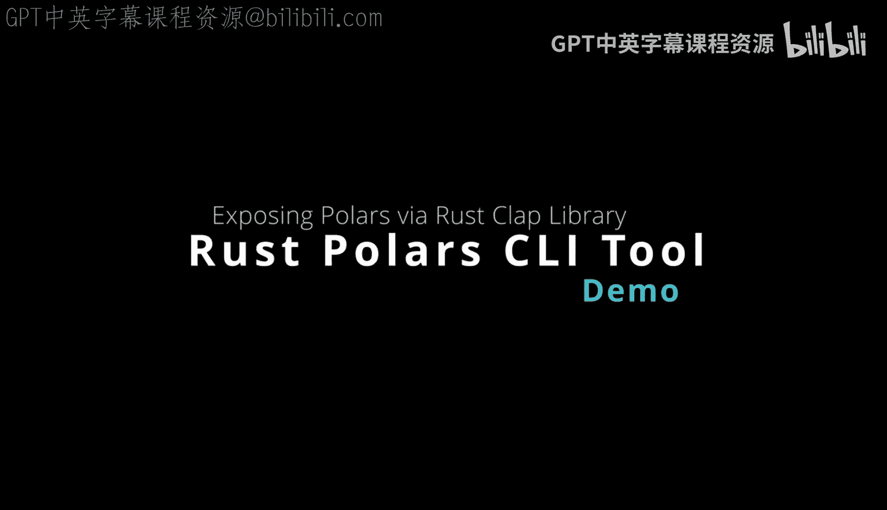
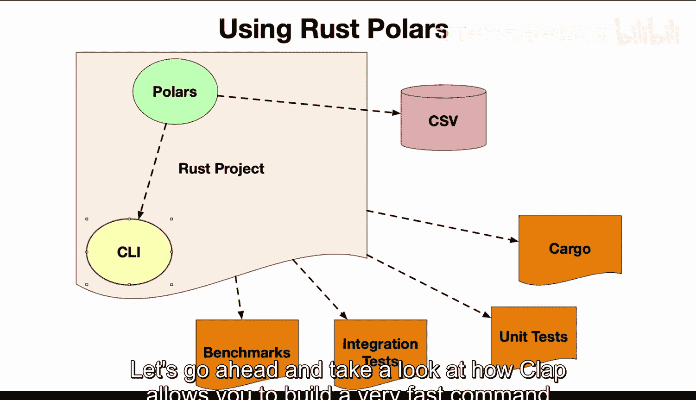
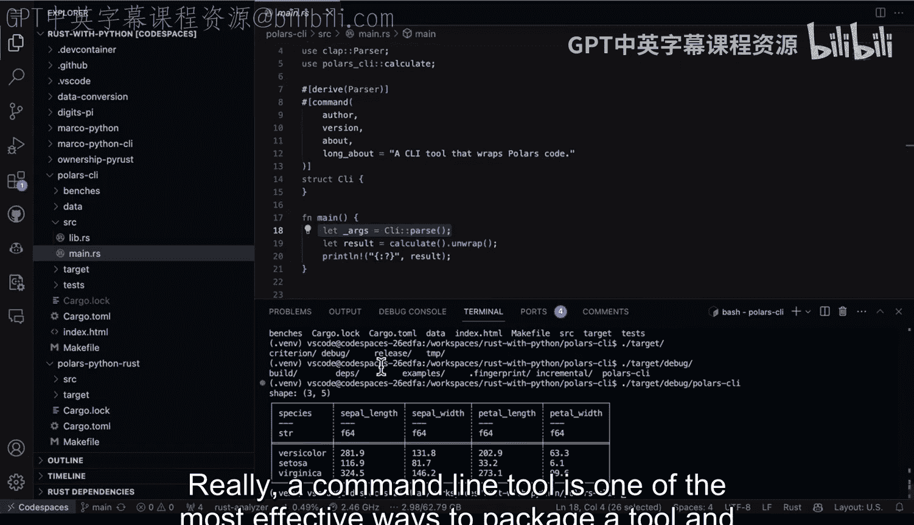

# Rust编程4-5：3.5：Rust版Polars CLI测试 🧪



在本节课中，我们将学习如何为Rust项目构建一个命令行界面（CLI）。我们将使用`clap`库来创建一个高效、易用的命令行工具，并集成`polars`库进行数据处理。通过这个过程，你将了解如何将Rust代码打包成一个可执行工具。

---

## 项目结构概览

首先，让我们了解一下Rust项目的典型结构。这对于理解代码组织和构建过程非常重要。

以下命令可以清晰地展示项目目录结构，排除`target`构建目录：

```bash
tree -I target
```

运行后，你会看到类似的结构：
- `benches/`: 基准测试代码
- `Cargo.toml`: 项目配置文件
- `data/`: 数据集文件（如Iris数据集）
- `Makefile`: 构建脚本
- `src/`: 源代码目录
  - `lib.rs`: 库代码
  - `main.rs`: 主程序入口
- `tests/`: 集成测试代码

这种结构有助于分离关注点，使项目更易于维护。

---

## 依赖配置

上一节我们查看了项目结构，本节中我们来看看项目的核心依赖是如何配置的。这主要在`Cargo.toml`文件中完成。



打开`Cargo.toml`文件，你可以看到项目依赖：

```toml
[dependencies]
clap = { version = "4.0", features = ["derive"] }
polars = "0.30.0"
```

- **`clap`**: 这是一个功能强大的命令行参数解析器。我们使用它来构建CLI。
- **`polars`**: 这是一个高性能的数据处理库，类似于Python的Pandas，但用Rust编写，速度更快。

---

## 核心库函数

配置好依赖后，我们来看看实际的数据处理逻辑。这部分代码通常放在`src/lib.rs`文件中。

在`lib.rs`中，我们定义了一个函数，它对Iris数据集执行基本的分组聚合计算：

```rust
use polars::prelude::*;

pub fn calculate_group_stats() -> Result<DataFrame, PolarsError> {
    // 1. 读取CSV数据
    let df = LazyCsvReader::new("data/iris.csv")
        .has_header(true)
        .finish()?
        .collect()?;
    
    // 2. 按物种分组并计算平均萼片长度
    let result = df
        .lazy()
        .groupby(["species"])
        .agg([col("sepal_length").mean()])
        .collect()?;
    
    Ok(result)
}
```

这个函数执行以下操作：
1. 从CSV文件加载Iris数据集。
2. 按照`species`列进行分组。
3. 计算每个物种的`sepal_length`（萼片长度）的平均值。

---

## 构建命令行界面

我们已经有了数据处理的核心逻辑，现在需要一种简单的方式来调用它。这就是命令行界面的作用。我们将使用`clap`库来实现。

在`src/main.rs`文件中，我们设置CLI：

```rust
use clap::{Arg, Command};
use polars_cli::calculate_group_stats;

fn main() {
    // 定义命令行应用
    let matches = Command::new("polars-cli")
        .version("1.0")
        .author("Your Name")
        .about("Performs group-by aggregation on Iris dataset")
        .get_matches();
    
    // 执行计算
    match calculate_group_stats() {
        Ok(df) => println!("Result:\n{}", df),
        Err(e) => eprintln!("Error: {}", e),
    }
}
```

这段代码的作用是：
- 使用`clap::Command`定义了一个名为`polars-cli`的应用。
- 设置了版本、作者和描述信息。
- 调用我们在`lib.rs`中定义的`calculate_group_stats`函数。
- 打印结果或错误信息。

`clap`库自动为我们生成了帮助菜单和参数解析功能，这大大简化了CLI开发。

---

## 运行与测试

构建好CLI后，我们需要知道如何运行和测试它。Rust的Cargo工具使这个过程变得非常简单。

以下是运行和测试CLI的步骤：

1.  **使用Cargo运行**:
    这是开发过程中最常用的方式。它会自动编译并运行程序。
    ```bash
    cargo run -- --help
    ```
    这里的`--`用于将参数传递给我们的程序，`--help`会显示自动生成的帮助菜单。

2.  **直接运行二进制文件**:
    编译后，你可以在`target/debug/`目录下找到可执行文件。
    ```bash
    ./target/debug/polars-cli
    ```
    这种方式适合测试最终的可执行文件。

3.  **构建发布版本**:
    当你准备分发工具时，可以构建一个优化的发布版本。
    ```bash
    cargo build --release
    ```
    发布版本的可执行文件位于`target/release/`目录下，运行速度更快，文件体积更小。

使用命令行工具是打包和分发Rust程序最有效的方式之一。你可以轻松地将单个可执行文件分享给他人，无需他们安装复杂的依赖环境。

---

## 总结

本节课中我们一起学习了如何为Rust数据处理项目构建一个完整的命令行界面。



我们首先了解了典型的Rust项目结构，然后通过`Cargo.toml`文件配置了`clap`和`polars`依赖。接着，我们编写了核心的数据处理函数，并使用`clap`库将其包装成一个用户友好的CLI工具。最后，我们探讨了如何使用Cargo运行、测试以及构建最终的可分发版本。


通过将Rust代码与强大的CLI框架结合，你可以创建出高性能、易用且易于分发的数据处理工具，非常适合自动化任务或提供给其他用户使用。