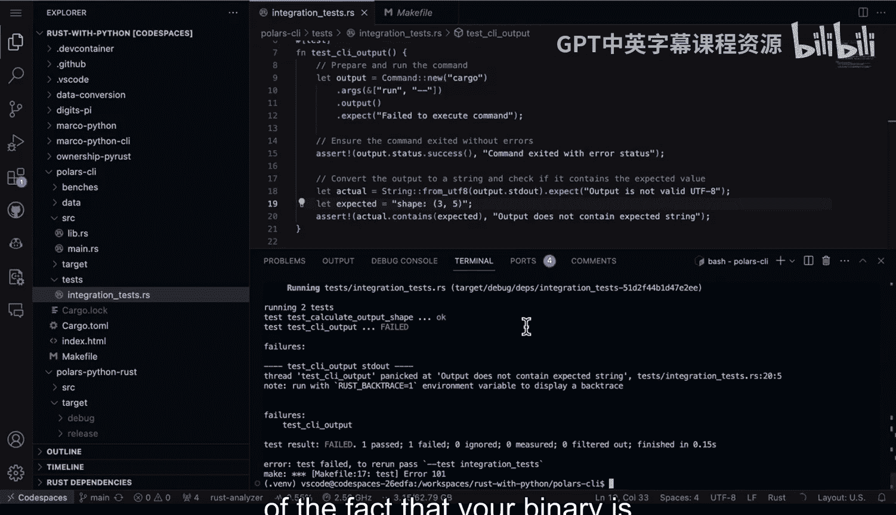

# Rust编程4-5：66：构建Polars与Clap集成测试 🧪


在本节课中，我们将学习如何为Rust命令行工具构建集成测试。集成测试能够验证程序的最终输入和输出行为，是确保项目在交付前按预期工作的关键步骤。

---

## 概述

集成测试不同于单元测试，它直接测试命令行工具的完整执行流程。这对于验证最终用户（如客户或开源工具使用者）的实际体验至关重要。在Rust这类安全且构建特性良好的语言中，集成测试是项目收尾阶段的重要环节，能确保每次构建都按计划执行。

上一节我们介绍了项目的基本结构，本节中我们来看看如何为其添加集成测试。

---

## 项目结构

首先，我们来看一下包含集成测试的Rust项目结构。该项目包含了命令行工具、基准测试等组件。

```
.
├── Cargo.toml
├── src/
│   ├── lib.rs
│   └── main.rs
├── benches/
├── data/
└── tests/
    └── integration_test.rs
```


我们的集成测试文件位于 `tests/integration_test.rs` 目录下。

---

## 编写集成测试

集成测试的核心思想是模拟用户调用命令行工具的过程，并验证其输出结果。

以下是编写集成测试的关键步骤：

1.  **导入待测试功能**：首先，从我们的库中导入需要测试的函数。
2.  **准备并运行命令**：使用标准库的 `std::process::Command` 来构建和运行我们的命令行工具，并传入必要的参数。
3.  **验证输出**：最后，断言命令的执行结果（如退出状态、标准输出）符合我们的预期。

这种方法非常强大，因为它测试的是最终结果，而不仅仅是孤立的函数单元。

让我们通过代码来具体了解。

```rust
// tests/integration_test.rs
use my_cli_tool::some_polars_function; // 导入待测试的功能
use std::process::Command; // 导入标准库的命令模块

#[test]
fn test_cli_basic_functionality() {
    // 准备并运行命令
    let output = Command::new("cargo")
        .arg("run")
        .arg("--")
        .arg("--input")
        .arg("data/input.csv")
        .arg("--output")
        .arg("data/output.csv")
        .output()
        .expect("Failed to execute command");

    // 验证命令执行成功
    assert!(output.status.success());

    // 验证输出中包含特定内容（示例）
    let stdout = String::from_utf8(output.stdout).unwrap();
    assert!(stdout.contains("Processing complete"));
}
```

在这段代码中，我们构建了一个 `cargo run` 命令，并传递了工具所需的输入输出文件参数。测试会检查命令是否成功执行，并验证标准输出中是否包含预期的信息。

---

## 运行与验证测试

现在，让我们运行测试来验证一切是否正常。

在终端中执行以下命令来运行所有测试（包括单元测试和集成测试）：

```bash
cargo test
```

这个命令会编译项目并运行 `tests` 目录下的所有集成测试以及 `src` 目录中的单元测试。如果所有测试通过，则意味着我们应用程序的整个功能层面都工作正常。

如果测试失败（例如，我们故意更改了输出格式），`cargo test` 会清晰地报告错误。这能有效帮助我们捕获代码中的拼写错误、逻辑错误或其他意外行为，确保在持续集成和持续交付流程中，我们的二进制文件行为始终符合预期。

---

## 总结

本节课中我们一起学习了为Rust命令行工具构建集成测试的方法。我们了解了集成测试的重要性，它是对项目最终功能的验证。我们查看了集成测试在项目结构中的位置，学习了如何利用 `std::process::Command` 来模拟和测试命令行工具的完整执行流程，并掌握了运行和验证这些测试的方法。



为命令行工具添加至少一个集成测试是一个很好的实践，它能确保在自动化构建和部署流程中，你的工具行为始终是可预测和正确的。