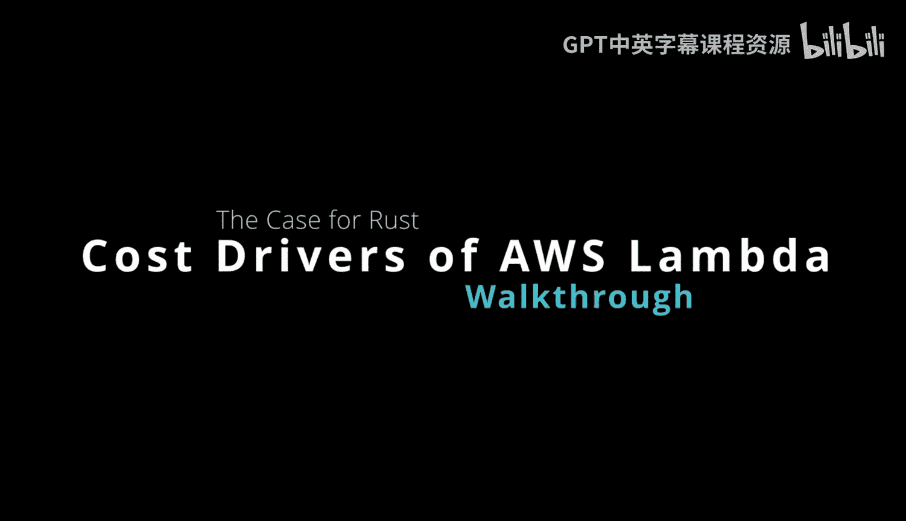
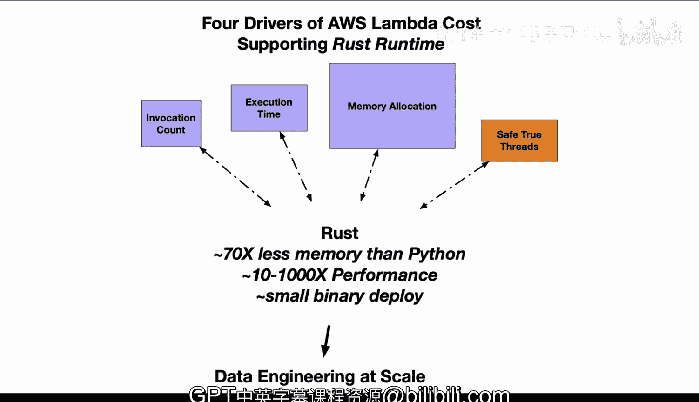

# Rust编程4-5：Cargo Lambda工具入门



## 概述

在本节课中，我们将要学习AWS Lambda成本的四个主要驱动因素，并了解Rust运行时如何在这些方面提供显著优势。我们将逐一分析每个成本驱动因素，并对比Python与Rust在Lambda环境中的性能差异。

---

## 成本驱动因素一：调用次数

上一节我们介绍了课程概述，本节中我们来看看第一个成本驱动因素——调用次数。

AWS Lambda根据函数被调用的次数进行计费。每次函数被调用，都会产生一定的费用。对于高调用频率的应用，这项成本会快速累积。

以下是调用次数相关的关键点：

*   每次Lambda函数被调用都会产生费用
*   高调用频率的应用需要特别注意成本控制
*   需要监控和优化触发机制以确保成本效益

---

## 成本驱动因素二：执行时间

了解了调用次数的影响后，我们来看看第二个成本驱动因素——执行时间。

执行时间指Lambda函数处理单个事件所需的时间。计算速度在这里至关重要，因为更快的执行速度意味着更低的成本。

在Rust与Python的对比中，Rust通常能提供**10到1000倍**的性能提升。这意味着相同的任务，Rust可能只需要毫秒级的时间，而Python可能需要秒级。

---

## 成本驱动因素三：内存使用

除了执行时间，内存使用是另一个重要的成本因素。

Python的内存使用效率远低于Rust。研究表明，Python的内存使用量可能是Rust的**70倍**。在AWS Lambda的定价模型中，内存分配直接决定了费用。

当配置Lambda函数时，您可以设置函数可用的内存量，这会隐式分配CPU能力和网络带宽等资源。Python的内存低效性限制了您在这些方面的选择。

---

## 成本驱动因素四：多线程支持

最后，我们来看看一个较少被讨论但同样重要的因素——多线程支持。

Python不支持真正的线程。这意味着如果您使用具有多核的大型内存Lambda实例，这些核心在大多数时间可能处于空闲状态，除非您使用进程等复杂方法，但这又会增加内存使用。

相比之下，Rust可以轻松利用多核环境。例如，使用`rayon`库，您可以自动为每个核心分配线程，无需太多额外工作。实际上，您可以通过迭代轻松实现每个迭代对应一个核心线程。

```rust
// 使用rayon库进行并行迭代的示例
use rayon::prelude::*;

fn main() {
    let data = vec![1, 2, 3, 4, 5];
    
    // 并行处理每个元素
    data.par_iter().for_each(|&x| {
        println!("Processing {} on thread", x);
    });
}
```

---

## 总结

本节课中我们一起学习了AWS Lambda的四个主要成本驱动因素：调用次数、执行时间、内存使用和多线程支持。通过对比Python和Rust在这些方面的表现，我们看到Rust在服务器无计算环境中具有数量级更高的效率。



虽然理论上Python可以用于大规模数据工程和服务器无计算，但就像“巧克力蛋糕能帮助减肥”这种说法一样，它没有讲述完整的故事。实际上，Rust在服务器无计算中的效率远高于Python，合理地将Rust纳入您的工作流程可以显著节省成本。