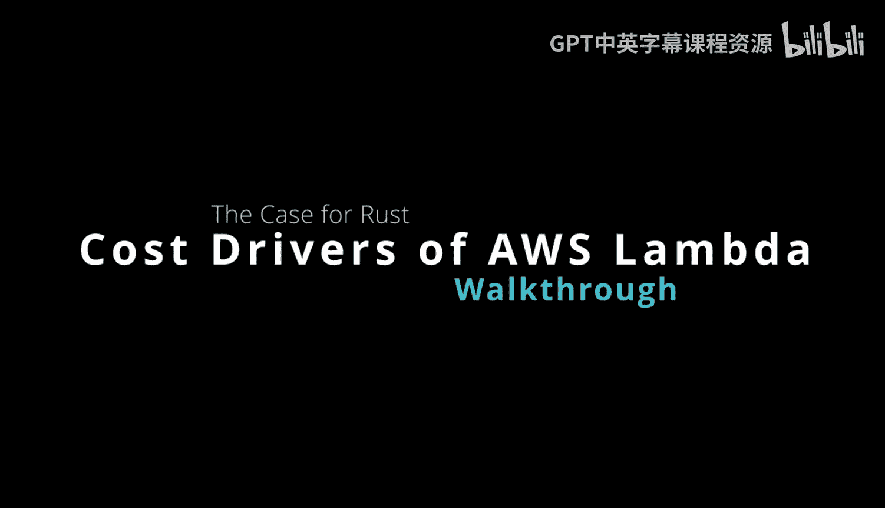
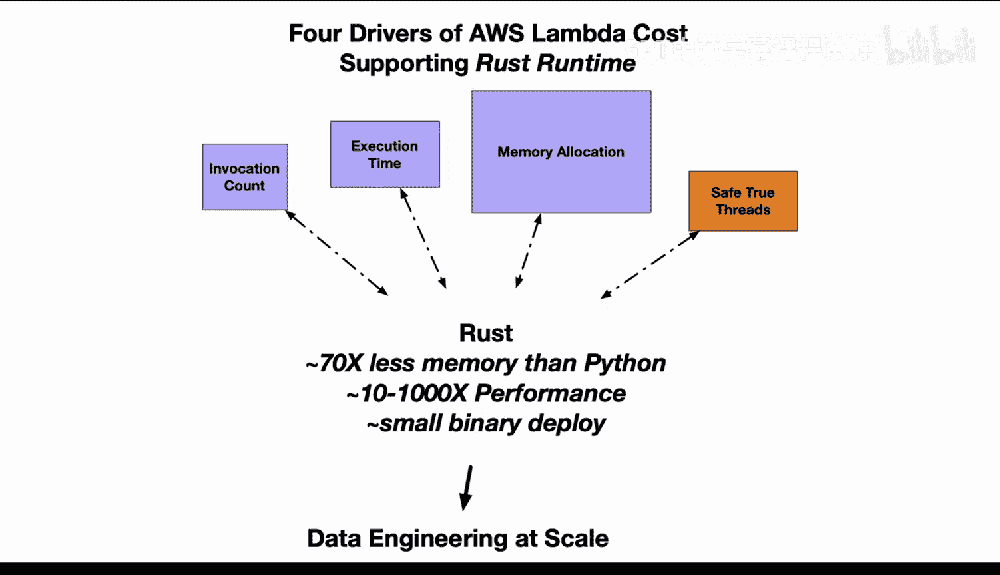

# Rust编程4-5：4.6：Rust在AWS Lambda中的成本优势 💰

在本节课中，我们将探讨Rust运行时在AWS Lambda服务中带来的显著成本优势。我们将分析影响Lambda成本的四个主要驱动因素，并逐一对比Rust与Python在这些方面的表现。

## 概述

AWS Lambda是一种按使用量付费的无服务器计算服务。其成本主要由四个因素决定：**调用次数**、**执行时间**、**内存使用量**以及**多核利用效率**。我们将看到，Rust凭借其高性能和低资源消耗的特性，在每个方面都优于Python，从而能显著降低运营成本。

## 成本驱动因素分析

以下是影响AWS Lambda成本的四个关键驱动因素。

### 1. 调用次数

第一个成本驱动因素是调用次数。Lambda服务根据函数被调用的次数进行计费。这意味着每次函数被触发执行，都会产生相应的费用。

因此，对于一个被频繁调用的Lambda函数，其累积成本可能相当可观。如果你构建的应用程序涉及大量的函数调用，就需要仔细监控和优化这些触发机制，以确保成本可控且调用成功。

### 2. 执行时间

第二个成本驱动因素是执行时间，即处理单个事件所花费的时长。在这个环节，计算速度至关重要。

与Python相比，Rust在执行速度上具有巨大优势。例如，在某些场景下，基于Rust的Linter工具性能可达Python版本的10到100倍。对于其他类型的代码，也可能实现从10倍到1000倍不等的执行时间缩减。更短的执行时间直接意味着更低的计算成本。

### 3. 内存使用量

第三个因素是内存使用量，这是Python难以绕开的瓶颈。无论你如何用C语言优化Python代码，都无法改变Python消耗更多内存的事实。

近期研究表明，Python的内存使用量可能是Rust的**70倍**之多。在AWS Lambda中，你需要为函数配置内存额度，而定价模型与此直接相关：更高的内存配置意味着更高的费用。更大的内存额度也会隐式地分配更多的CPU算力和网络带宽。

因此，Python较低的内存效率迫使你不得不配置更大的实例，而使用Rust则可以在更小的实例上运行，避免了资源浪费。

### 4. 多核利用效率

第四个因素是多核利用效率，这一点常被忽视。Python不支持真正的多线程，这带来了一个问题。

假设你使用一个配置了4核或6核的大内存Lambda实例，这些核心在Python环境下大多会处于空闲状态，除非你采用一些复杂技巧（例如使用多进程），但这又会进一步增加内存消耗。Python在多线程利用上陷入了两难境地。

然而，Rust则能轻松解决这个问题。你可以利用Rust开启多线程，例如使用`rayon`库，它能自动为每个CPU核心分配线程，而无需开发者进行复杂操作。实际上，你甚至可以通过迭代操作，让每次迭代在一个独立的核心线程上执行。

使用Rust，你可以充分利用Lambda环境的多核计算能力，几乎不需要额外的工作。

## 总结

本节课我们一起学习了AWS Lambda的四个核心成本驱动因素：调用次数、执行时间、内存使用量和多核利用效率。通过对比分析，我们发现Rust在**执行速度**、**内存效率**和**并发处理**方面均大幅领先于Python。

当有人说Python适合大规模数据工程和无服务器架构时，这就像说巧克力蛋糕能帮你减肥一样——在极端特定条件下或许成立，但并未反映全貌。事实是，对于无服务器计算，Rust的效率比Python高出数个数量级。关键在于，你需要评估自己的工作流程，找到适合引入Rust的环节。采用Rust运行时，将为你节省可观的成本。