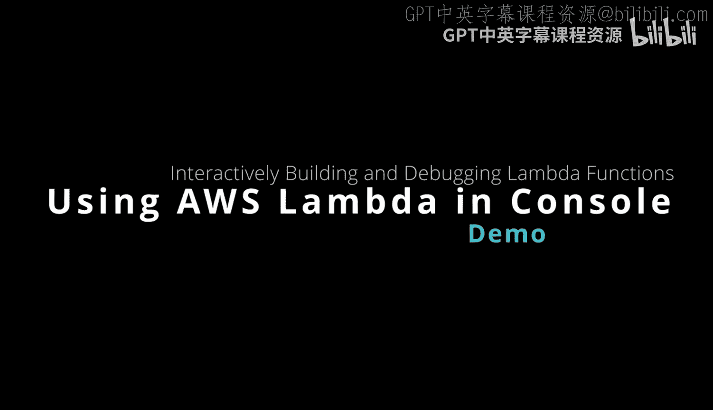
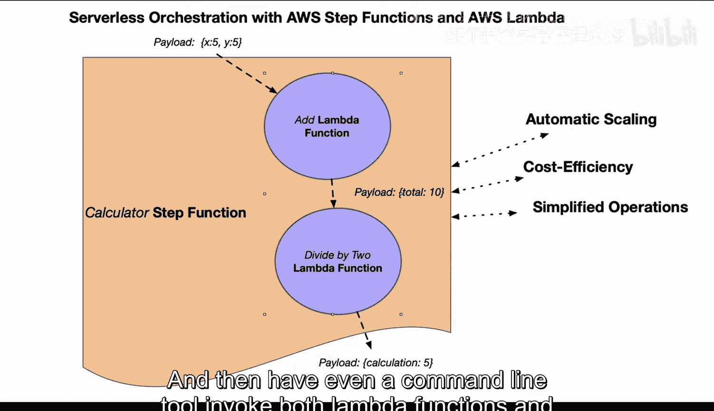

# Rust编程4-5（Linux命令行工具、LLMOps）：73：使用AWS Lambda控制台



## 概述
在本节课中，我们将学习如何在AWS Lambda控制台中快速构建和测试两个简单的Lambda函数。我们将创建一个执行加法运算的函数，以及另一个执行除法运算的函数。通过这个过程，你将了解在云端进行快速原型开发的基本流程。

---

## 构建第一个Lambda函数：加法器

上一节我们介绍了本教程的目标，本节中我们来看看如何构建第一个执行加法运算的Lambda函数。

首先，我们需要在AWS控制台中创建一个新的Lambda函数。以下是具体步骤：

1.  在AWS控制台导航到Lambda服务，点击“创建函数”。
2.  选择“从头开始创作”。
3.  为函数命名，例如 `add`。
4.  在“运行时”选项中，选择 `Python 3.11`。选择Python进行原型设计非常方便，即使后续可能转换为Rust，也能在控制台中直观地查看和测试代码。
5.  在“架构”下，选择 `arm64`。这是为了节省运行成本。
6.  点击“创建函数”。

创建完成后，我们将进入函数代码编辑器。我们将编写一个简单的加法函数。

以下是函数的核心代码逻辑：
```python
import json

def lambda_handler(event, context):
    # 从传入的事件中提取 x 和 y 参数
    x = event['x']
    y = event['y']
    # 执行加法计算
    total = x + y
    # 构造并返回响应
    return {
        'statusCode': 200,
        'body': json.dumps({
            'total': total
        })
    }
```
代码解析：
*   `lambda_handler` 是Lambda函数的入口点。
*   `event` 参数包含了调用函数时传入的数据。
*   我们从 `event` 字典中取出键为 `‘x’` 和 `‘y’` 的值。
*   计算两者之和，并将结果包装在一个JSON响应体中返回。

编写完代码后，点击“部署”按钮保存更改。

---

## 测试第一个Lambda函数

现在我们已经部署了加法函数，接下来需要测试它是否按预期工作。

我们将配置一个测试事件来模拟函数的调用。

1.  在函数控制台界面，点击“测试”选项卡。
2.  点击“创建新事件”。
3.  为测试事件命名，例如 `add_test`。
4.  在事件JSON中，我们需要提供 `x` 和 `y` 的值。一个示例如下：
    ```json
    {
        "x": 10,
        "y": 20
    }
    ```
5.  点击“保存”。
6.  保存后，点击“测试”按钮来执行函数。

如果代码正确，你将在“执行结果”部分看到返回的响应，其中应包含 `“total”: 30`。如果在测试过程中遇到错误（例如缩进或语法问题），需要返回代码编辑器进行修正，然后重新部署并再次测试。

---

## 构建第二个Lambda函数：除以二

在成功构建并测试了加法函数后，本节我们将构建第二个函数，它接收一个数值并将其除以二。

我们重复创建函数的步骤：

1.  返回Lambda函数列表页面，点击“创建函数”。
2.  将新函数命名为 `divide_by_two`。
3.  运行时同样选择 `Python 3.11`，架构选择 `arm64`。
4.  点击“创建函数”。

在新函数的代码编辑器中，我们粘贴以下代码：
```python
import json

def lambda_handler(event, context):
    # 从传入的事件中提取 total 参数
    # 注意：这里期望的输入是上一个加法函数的输出结构
    body = json.loads(event['body'])
    input_number = body['total']
    # 执行除以二的计算
    result = input_number / 2
    # 构造并返回响应
    return {
        'statusCode': 200,
        'body': json.dumps({
            'calculation': result
        })
    }
```
代码解析：
*   这个函数预期接收上一个加法函数的输出作为输入。
*   它首先解析传入事件 `event` 的 `body` 字段（这是一个JSON字符串），将其转换为Python字典。
*   然后从字典中取出 `‘total’` 键对应的值。
*   将该值除以2，并将结果包装返回。

同样，点击“部署”按钮保存代码。

---

## 测试第二个Lambda函数

现在我们来测试除法函数。我们需要模拟一个包含加法函数输出的测试事件。

1.  在 `divide_by_two` 函数的控制台，点击“测试”选项卡。
2.  创建一个新的测试事件，命名为 `payload_test`。
3.  在事件JSON中，我们需要模拟加法函数的输出结构。示例如下：
    ```json
    {
        "body": "{\"total\": 30}"
    }
    ```
    *注意：这里的 `body` 是一个字符串，其内容是JSON格式，包含了键 `total` 和值 `30`。*
4.  点击“保存”，然后点击“测试”。

如果一切正常，执行结果应返回 `{“calculation”: 15.0}`，这表明函数成功接收了输入 `30` 并计算出了 `30 / 2 = 15`。

---

## 总结与展望

本节课中我们一起学习了如何在AWS Lambda控制台中使用Python快速构建和测试两个独立的函数：一个加法函数和一个除法函数。我们涵盖了从创建函数、编写处理逻辑、部署代码到配置测试事件进行验证的完整流程。



通过这个练习，你掌握了在云端进行无服务器函数原型开发的基本方法。使用Python等高级语言可以极大地提升原型开发的速度。未来，你可以将这些函数组合起来，例如使用AWS Step Functions等无服务器编排工具，构建更复杂的工作流，让第一个函数的输出自动成为第二个函数的输入，从而实现连贯的数据处理管道。