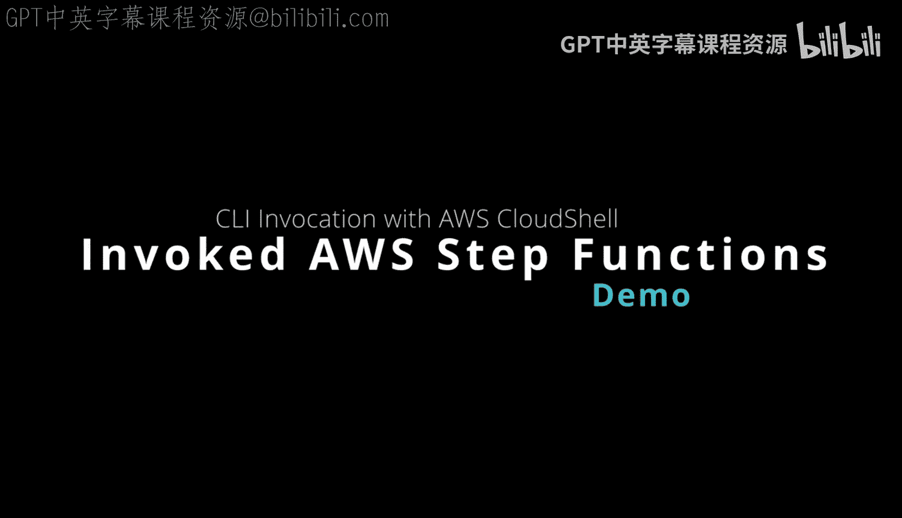
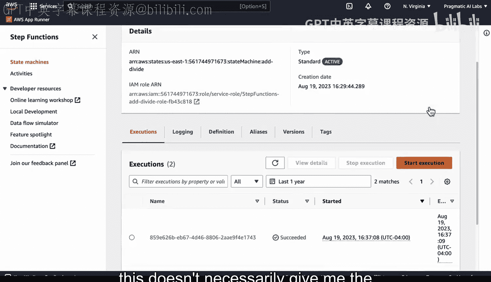
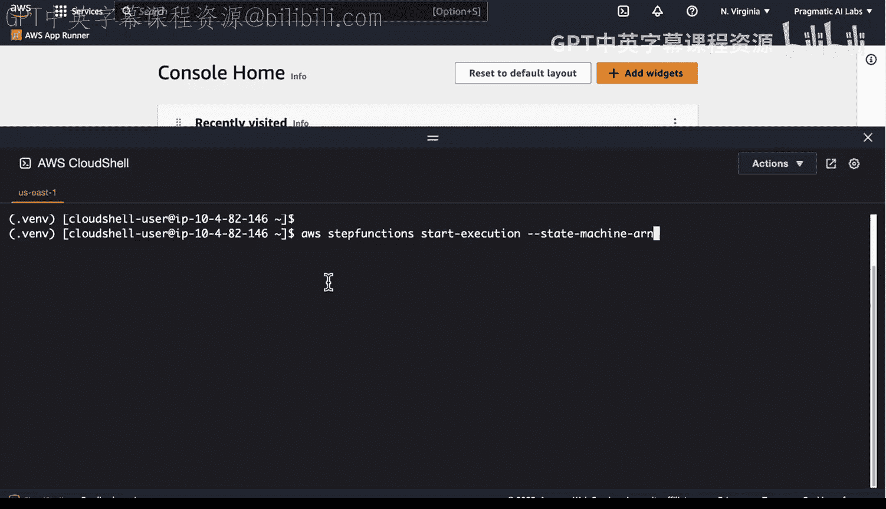
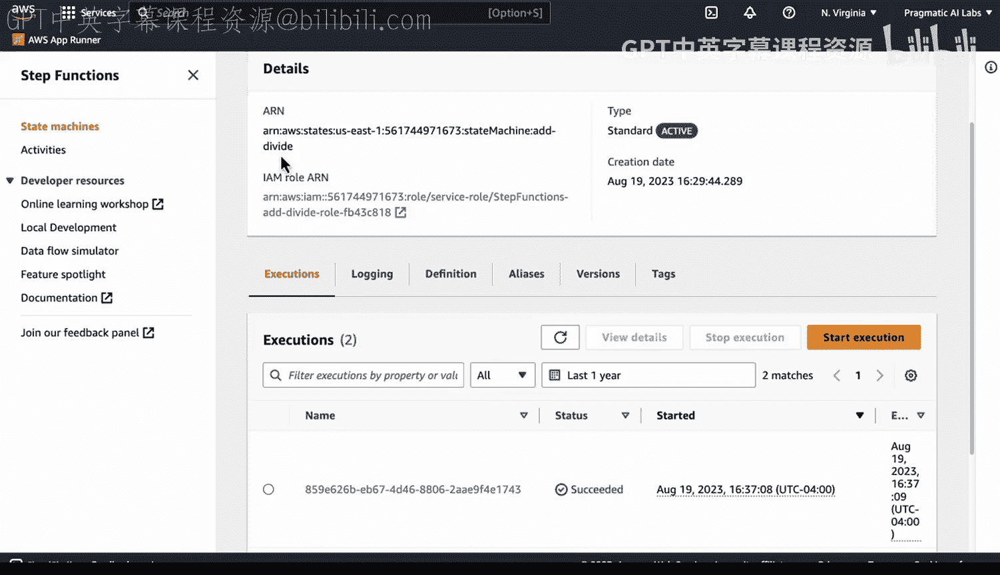
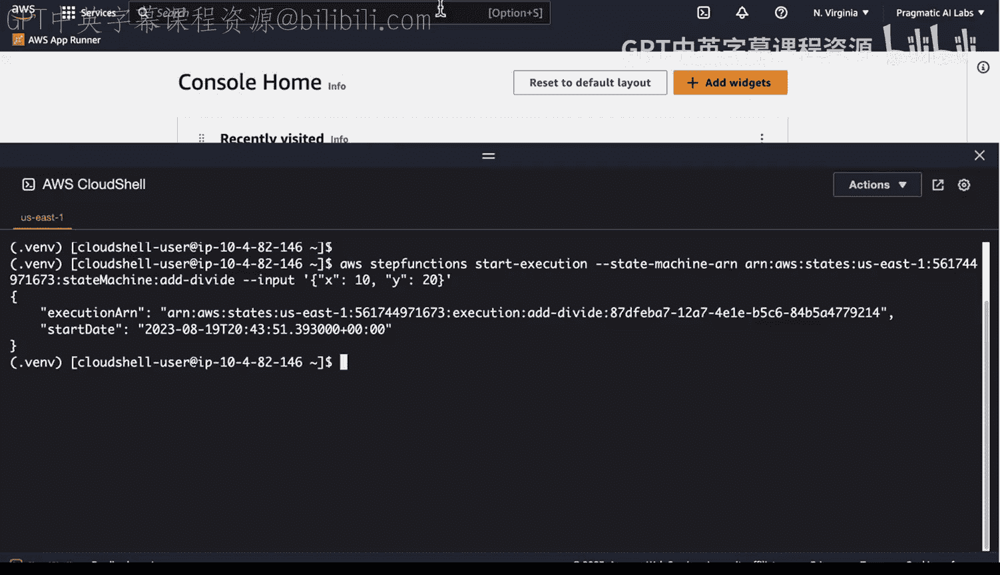
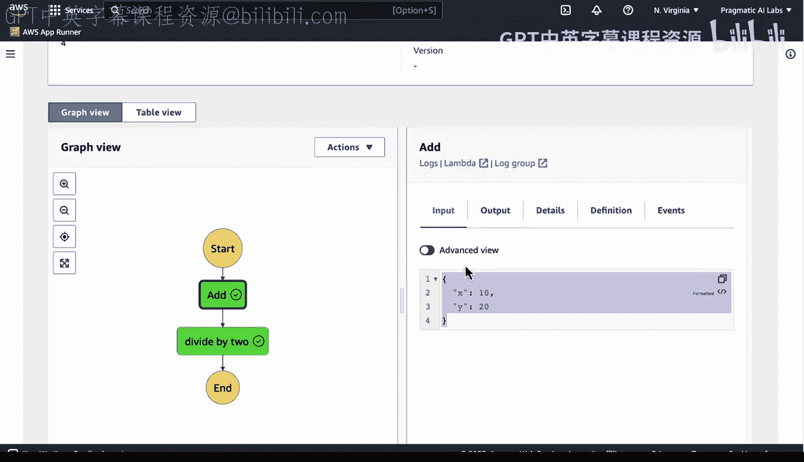
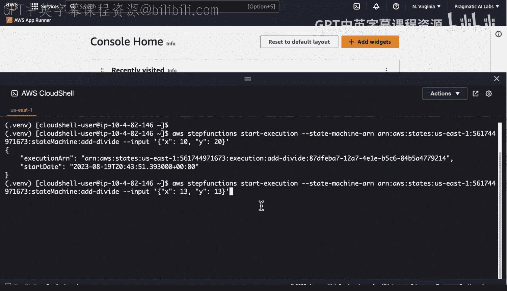
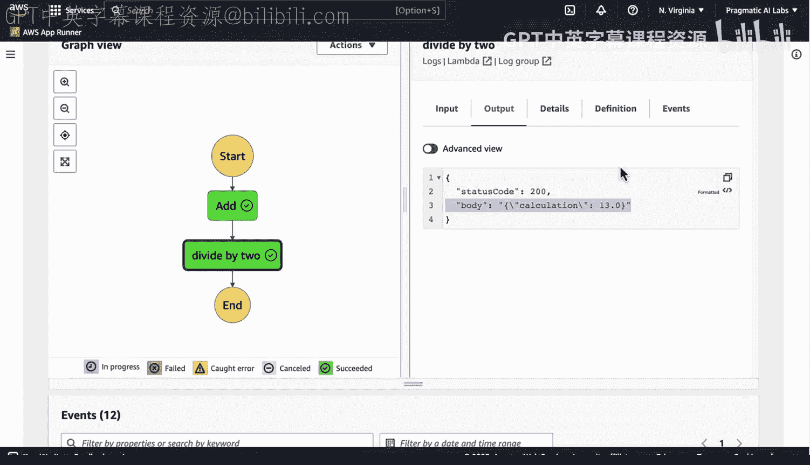
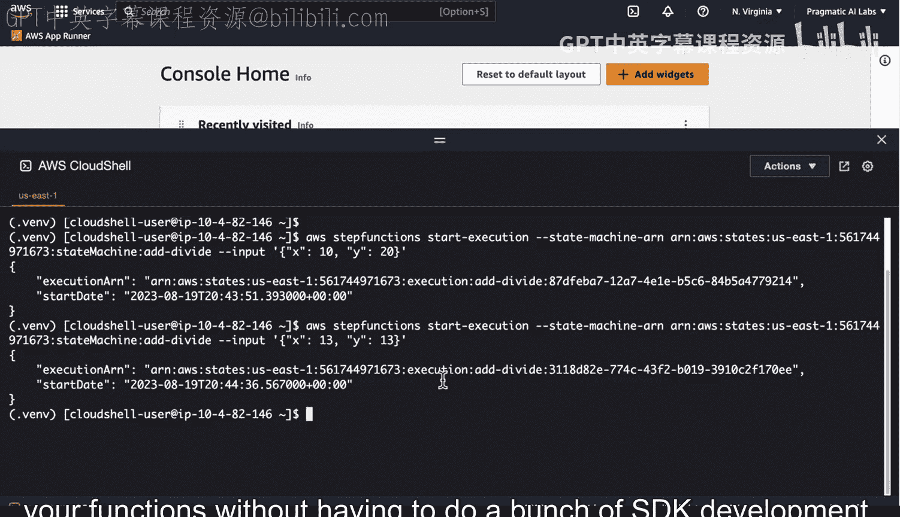
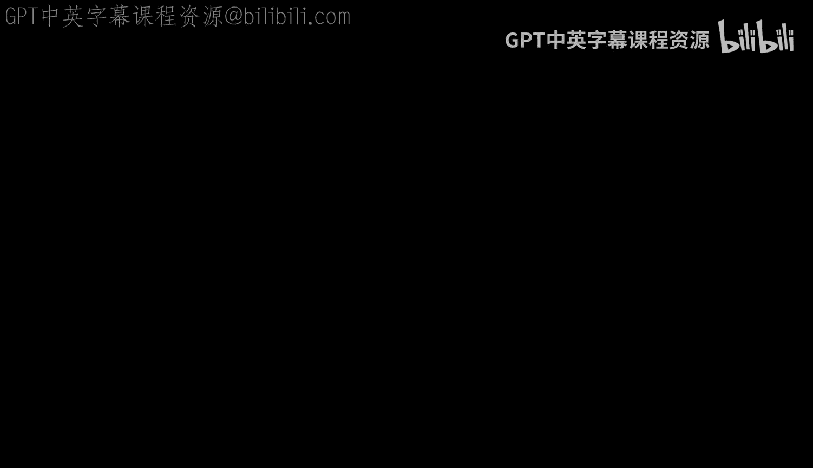

# Rust编程4-5（Linux命令行工具、LLMOps）：75：通过AWS CLI调用Step Functions



在本节课中，我们将学习如何通过AWS命令行界面（CLI）来调用AWS Step Functions，从而以编程方式执行一个编排了多个Lambda函数的分布式应用。这是一种无需进行复杂SDK开发即可测试和验证工作流的方法。

## 概述

当您拥有一个Step Function状态机，它负责编排一个或多个Lambda函数以构成一个协调的分布式应用时，通过AWS Cloud Shell和CLI来执行它是非常高效的方式。本节将演示具体操作步骤。

## 准备工作

首先，您需要有一个已部署的Step Functions状态机。在AWS管理控制台的Step Functions服务页面，可以找到状态机的ARN（Amazon资源名称），这是调用它的关键标识。

上一节我们介绍了Step Functions的基本概念，本节中我们来看看如何通过命令行工具与之交互。



## 使用AWS CLI执行状态机

以下是使用AWS CLI启动状态机执行的核心命令格式：

```bash
aws stepfunctions start-execution --state-machine-arn <您的状态机ARN> --input <JSON格式的输入数据>
```





现在，让我们逐步分解这个过程。

### 步骤一：打开AWS Cloud Shell

您可以直接在AWS管理控制台启动Cloud Shell，这将提供一个预配置了AWS CLI的终端环境。

### 步骤二：构造并执行命令



在Cloud Shell中，您需要完成以下操作：

1.  **获取状态机ARN**：从Step Functions控制台复制您的状态机ARN。
2.  **准备输入数据**：准备一个JSON格式的字符串作为工作流的输入。
3.  **组合命令并执行**：将ARN和输入数据填入上述命令格式并运行。

例如，一个完整的命令可能如下所示：



```bash
aws stepfunctions start-execution --state-machine-arn arn:aws:states:us-east-1:123456789012:stateMachine:MyStateMachine --input "{\"number1\": 7, \"number2\": 7}"
```

执行成功后，CLI将返回本次执行的ARN等信息。



### 步骤三：验证执行结果

执行命令后，您可以立即返回Step Functions控制台查看执行历史。刷新页面后，您应该能看到新的执行记录。点击进入某次执行，可以查看详细的步骤执行情况和输入/输出载荷，这形成了一个强大的迭代反馈循环。

## 进行迭代测试

为了更清晰地观察不同输入下的执行情况，您可以方便地修改输入数据并重新运行命令。例如，将输入值从 `7` 和 `7` 改为 `13` 和 `13`，然后再次执行。在控制台中，您可以验证新的执行是否接收了正确的输入并产生了预期的输出（例如，总和为26）。

通过这种方式，您可以快速测试不同的想法，并确保您的工作流按预期运行。



## 总结





本节课中我们一起学习了如何使用AWS CLI和Cloud Shell来调用Step Functions状态机。这种方法让您能够以编程化、可脚本化的方式触发复杂的工作流，无需编写额外的应用程序代码，非常适合进行快速测试和集成。