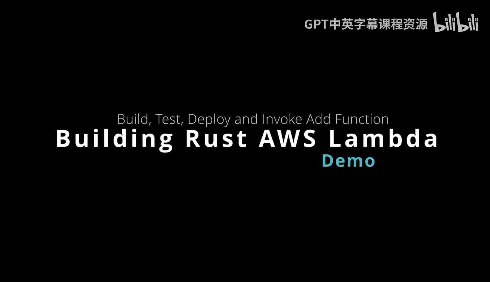
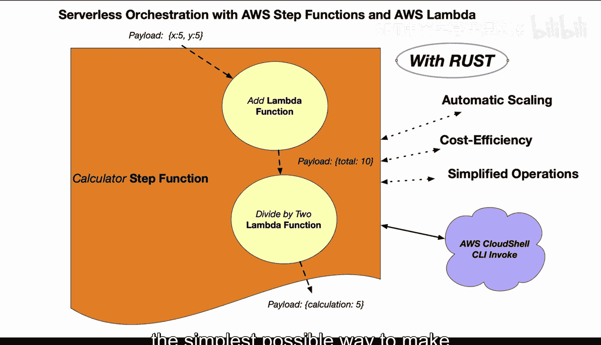
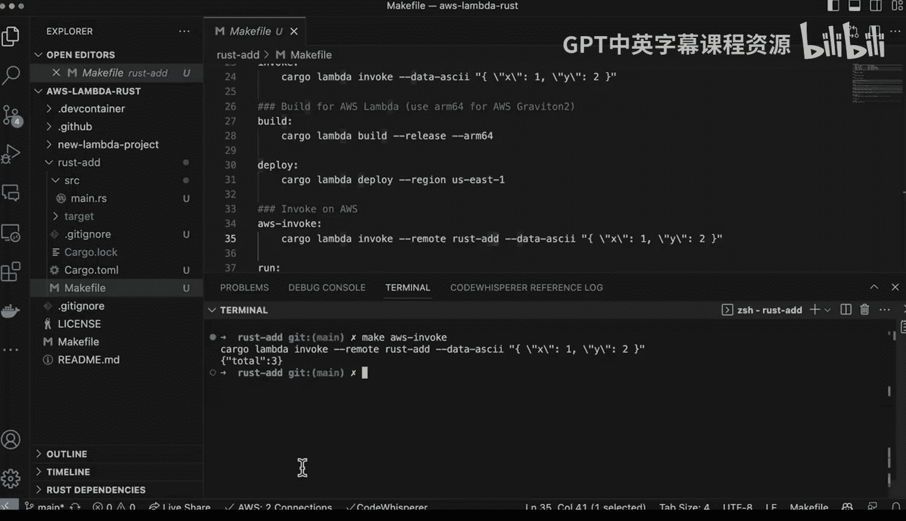
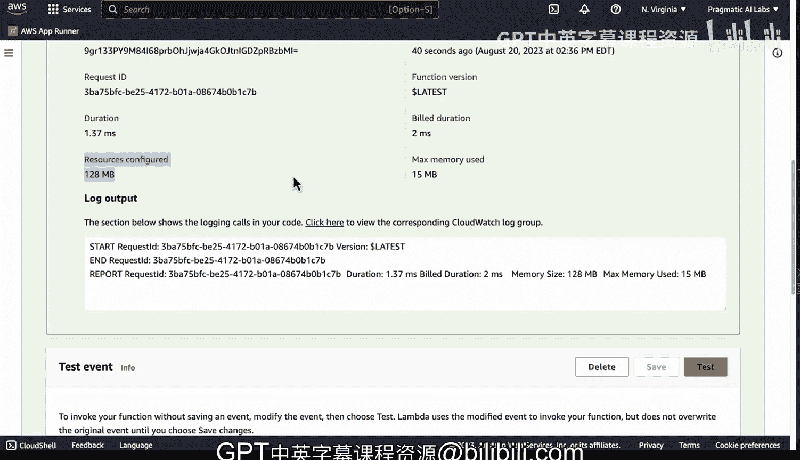

# Rust编程4-5：构建Rust AWS Lambda加法函数



## 概述
在本节课中，我们将学习如何使用Rust语言构建一个简单的AWS Lambda函数。这个函数将接收两个数字作为输入，计算它们的和并返回结果。我们将从项目创建开始，逐步完成本地开发、测试、构建和部署到AWS Lambda的完整流程。

## 项目结构与创建

上一节我们介绍了课程目标，本节中我们来看看如何创建和初始化一个Rust Lambda项目。

我们使用`cargo-lambda`工具来创建项目。这是一个专门为Rust Lambda开发设计的工具，可以快速搭建项目骨架。



以下是创建项目的命令：
```bash
cargo lambda new add_function
```

项目创建后，其目录结构非常简单，主要包含以下文件：
*   `src/main.rs`：Lambda函数的主要逻辑代码。
*   `Cargo.toml`：项目的依赖配置文件。

`Cargo.toml`文件已经预先配置好了Lambda函数所需的核心依赖，例如用于序列化的`serde`、异步运行时`tokio`以及AWS Lambda运行时`lambda_runtime`。

## Lambda函数逻辑解析

了解了项目结构后，我们来看看函数的核心逻辑是如何实现的。

我们构建的是一个简单的加法函数，其目的是清晰地展示Rust Lambda的工作原理。

首先，我们定义了两个结构体（struct）来处理请求和响应。

**请求结构体** `Request` 定义了函数输入的数据格式：
```rust
#[derive(Deserialize)]
struct Request {
    x: i32,
    y: i32,
}
```
`#[derive(Deserialize)]` 属性使得该结构体能够自动从传入的JSON事件中解析出 `x` 和 `y` 字段。

**响应结构体** `Response` 定义了函数返回的数据格式：
```rust
#[derive(Serialize)]
struct Response {
    total: i32,
}
```
`#[derive(Serialize)]` 属性使得该结构体能够被自动序列化为JSON返回。

接下来是核心的**处理函数** `function_handler`：
```rust
async fn function_handler(event: Request, _context: Context) -> Result<Response, Error> {
    let total = event.x + event.y;
    let resp = Response { total };
    Ok(resp)
}
```
这是一个异步函数，它接收 `Request` 和Lambda上下文作为参数。函数内部将 `x` 和 `y` 相加，将结果封装到 `Response` 结构体中，然后通过 `Ok()` 返回。

最后，**主函数** `main` 负责启动Lambda运行时并注册我们的处理函数：
```rust
#[tokio::main]
async fn main() -> Result<(), Error> {
    lambda_runtime::run(service_fn(function_handler)).await
}
```
这部分代码通常由`cargo-lambda`工具自动生成，开发者一般无需修改。

## 本地开发与测试

编写完函数逻辑后，我们需要在本地进行测试，以确保其功能正确。

为了简化开发流程，我们可以创建一个`Makefile`来封装常用的命令。这样我们就不需要记住复杂的命令参数，只需执行简单的`make`指令即可。

以下是`Makefile`中可能包含的几个关键命令：
```makefile
watch:
    cargo lambda watch

invoke:
    cargo lambda invoke --data-file event.json
```

使用 `make watch` 命令可以启动本地开发服务器。它会监控代码变化并自动重新编译。

在另一个终端中，使用 `make invoke` 命令可以调用本地运行的Lambda函数进行测试。我们需要准备一个`event.json`文件来模拟输入事件，例如：
```json
{"x": 5, "y": 3}
```
执行后，我们将得到输出结果 `{"total": 8}`。

## 构建与部署

本地测试通过后，下一步就是将函数构建并部署到AWS云端。

为了获得最佳的成本效益，我们可以选择为ARM64架构构建，这通常能带来更低的执行成本。

以下是构建和部署的命令：
```bash
# 为ARM64架构发布构建
cargo lambda build --release --arm64

# 部署到AWS Lambda
cargo lambda deploy
```

同样，我们可以将这些命令放入`Makefile`：
```makefile
build:
    cargo lambda build --release --arm64

deploy:
    cargo lambda deploy
```
执行 `make build` 进行构建，然后执行 `make deploy` 进行部署。部署过程非常快速，因为Rust生成的二进制文件体积非常小。

## 远程调用与监控

函数部署成功后，我们可以在AWS管理控制台中进行测试和监控。



我们不仅可以在本地调用，还可以直接远程调用已部署的函数：
```bash
cargo lambda invoke --remote --data-file event.json add_function
```

在AWS Lambda控制台的“监控”标签页下，我们可以查看函数的调用指标。对于这个Rust加法函数，你会发现其执行时间通常在**1毫秒左右**，内存使用量也极低（约15MB）。

与Python等解释型语言相比，Rust Lambda在冷启动速度、执行效率和内存开销上具有显著优势。由于AWS Lambda按执行时间和分配的内存计费，因此使用Rust可以显著降低运行成本，尤其适合高性能、高频率调用的场景。



## 总结
本节课中我们一起学习了使用Rust构建和部署AWS Lambda函数的完整流程。我们从使用`cargo-lambda`创建项目开始，逐步实现了函数逻辑、进行了本地测试、为生产环境构建，并最终部署到AWS云端。通过这个简单的加法函数示例，我们看到了Rust在Serverless领域带来的卓越性能与成本效益，其极快的执行速度和极低的内存占用是构建高效、经济Lambda函数的强大工具。