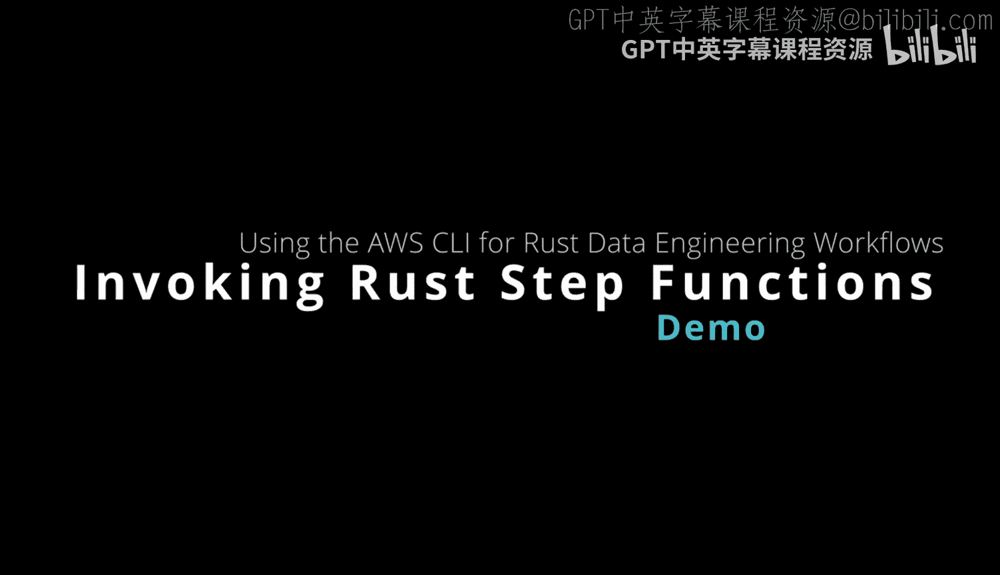
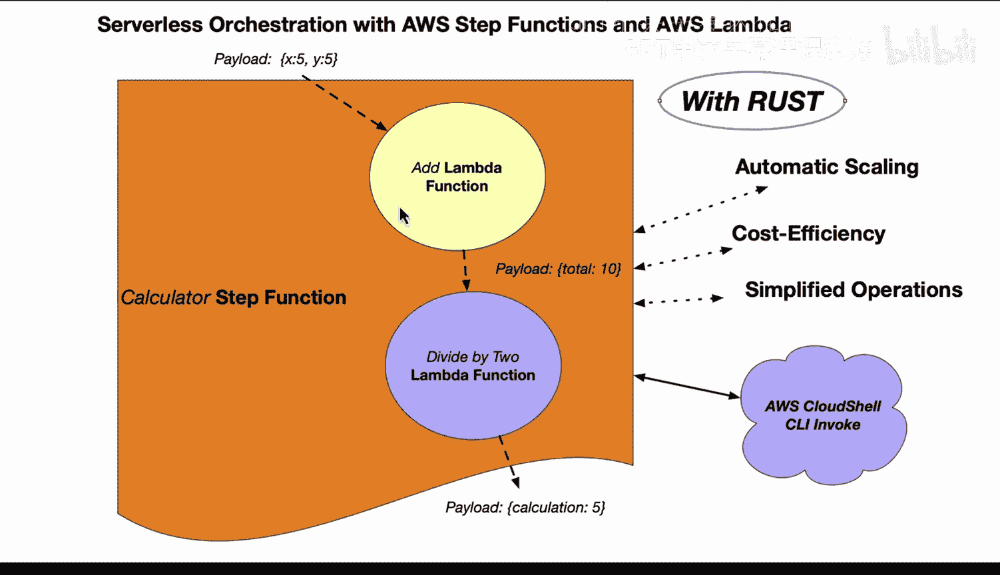
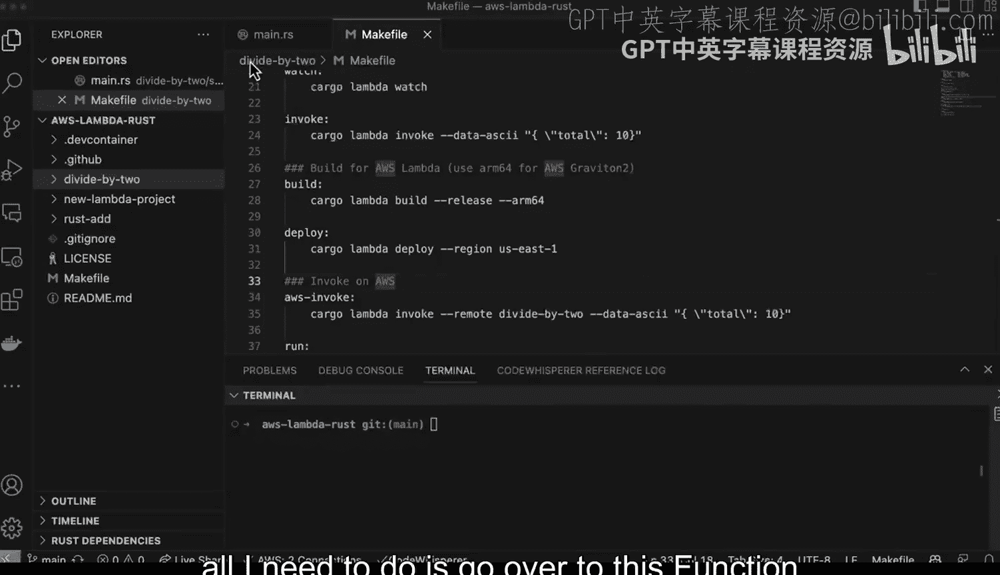
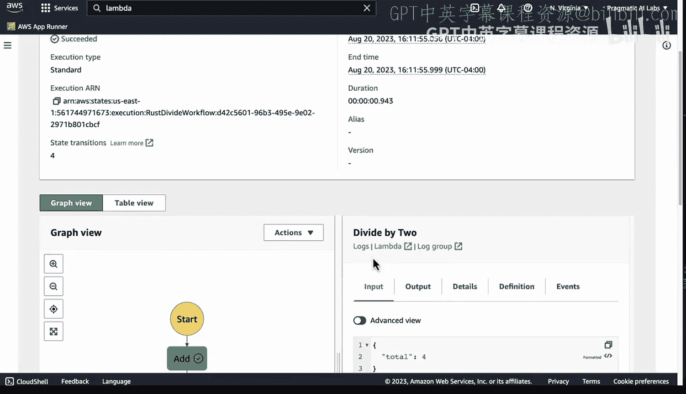
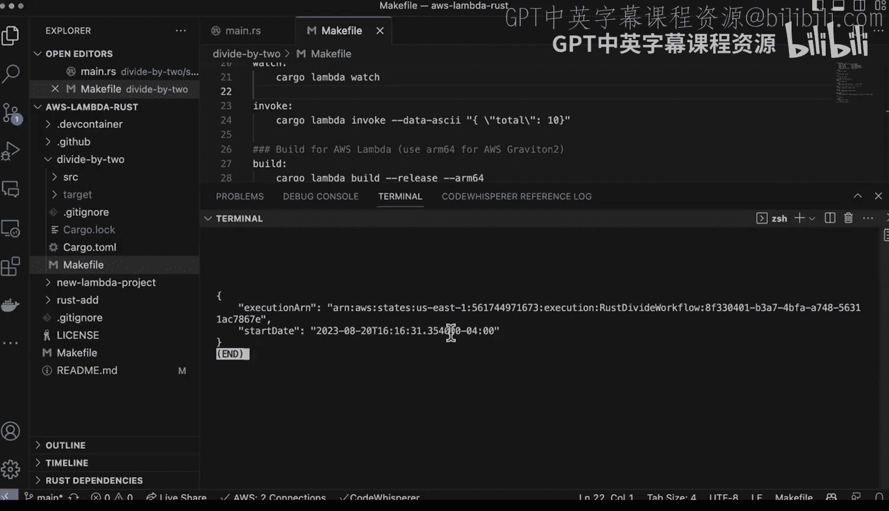
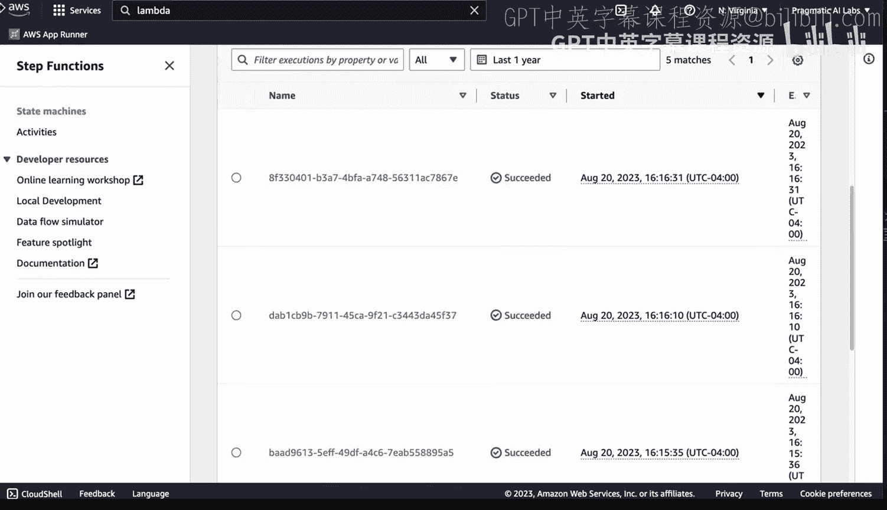
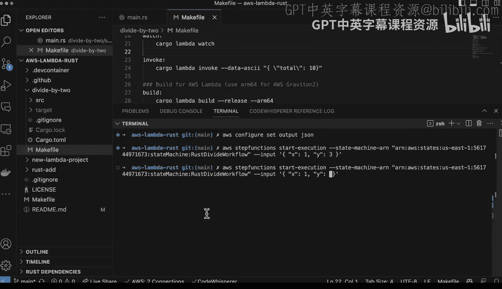
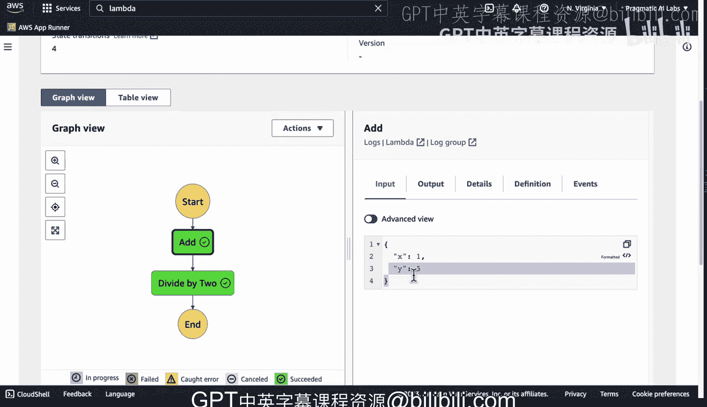

# Rust编程4-5：78_04_03：通过CLI调用AWS Step Function 🚀



在本节课中，我们将学习如何通过命令行界面（CLI）调用一个由Rust编写的AWS Lambda函数组成的AWS Step Functions工作流。我们将从确认已部署的Lambda函数开始，逐步创建并运行一个Step Functions状态机，最后通过CLI命令来触发执行。

---

## 确认已部署的Lambda函数

首先，我们需要确认用于构建工作流的Rust Lambda函数已经成功部署在AWS上。

以下是操作步骤：
1.  在AWS控制台中导航到 **Lambda服务**。
2.  在函数列表中，确认名为 `rustad` 和 `divide_by_two` 的函数存在。
3.  检查这两个函数的运行时环境，确保它们都是 **Rust运行时**。

确认函数部署无误后，我们就可以进入下一步，创建Step Functions工作流。





---

## 创建Step Functions状态机

上一节我们确认了Lambda函数已就绪，本节中我们来看看如何在AWS Step Functions中创建一个可视化的工作流。

1.  在AWS控制台中导航到 **Step Functions服务**。
2.  点击 **“创建状态机”**。
3.  选择 **“使用可视化编辑器设计工作流”** 选项。
4.  为状态机命名，例如 `rust_based_workflow`。
5.  从左侧面板拖拽两个 **“任务”** 状态到设计画布上。
6.  配置第一个任务：
    *   **名称**：`add`
    *   **集成类型**：选择 **Lambda调用函数**
    *   **函数**：选择之前部署的 `rustad` 函数
7.  配置第二个任务：
    *   **名称**：`divide_by_2`
    *   **集成类型**：选择 **Lambda调用函数**
    *   **函数**：选择之前部署的 `divide_by_two` 函数
8.  按照逻辑连接这两个任务状态。
9.  点击 **“下一步”**，预览工作流布局。
10. 点击 **“创建状态机”** 完成创建。

---

## 在控制台执行工作流

状态机创建完成后，我们可以先在AWS控制台中手动执行一次，以验证工作流是否按预期运行。

1.  在状态机详情页，点击 **“开始执行”**。
2.  在输入框中，提供一个JSON格式的输入，例如：
    ```json
    {
      "x": 1,
      "y": 3
    }
    ```
3.  点击 **“开始执行”**。
4.  观察执行详情页面。工作流会先调用 `add` 函数计算 `x + y`，然后将结果传递给 `divide_by_2` 函数进行除以2的操作。
5.  最终输出应类似于：
    ```json
    {
      "output_calculation": 2,
      "input_total": 4
    }
    ```
    这表示 `(1 + 3) / 2 = 2` 的计算成功。



---

## 通过AWS CLI调用工作流

在控制台验证工作流运行成功后，我们将学习如何通过AWS命令行工具（CLI）来触发执行，这是实现自动化的重要一步。

首先，确保你的终端环境已配置好AWS CLI，并且输出格式设置为JSON，以便于解析结果。可以使用以下命令设置：
```bash
aws configure set output json
```

接下来，使用 `start-execution` 命令来触发状态机的执行。你需要提供状态机的Amazon资源名称（ARN）和输入参数。



以下是调用命令的示例：
```bash
aws stepfunctions start-execution \
  --state-machine-arn <你的状态机ARN> \
  --input '{"x": 5, "y": 3}'
```
请将 `<你的状态机ARN>` 替换为你实际创建的状态机ARN。





命令执行后，CLI会返回本次执行的ARN。你可以使用这个ARN在Step Functions控制台中查看详细的执行历史和结果。

为了验证CLI调用是否生效，你可以返回AWS控制台，刷新执行列表。你应该能看到一条新的执行记录，其输入参数正是我们通过CLI传递的 `{"x": 5, "y": 3}`。

---

## 总结



本节课中我们一起学习了如何构建和调用一个基于Rust的AWS Step Functions工作流。我们首先确认了Rust Lambda函数的部署状态，然后使用可视化编辑器创建了一个包含两个任务的状态机。我们在控制台手动执行并验证了工作流的逻辑。最后，我们掌握了通过AWS CLI命令 `aws stepfunctions start-execution` 来远程触发工作流执行的方法，从而实现了将高性能、低成本的Rust计算工作流集成到自动化流程中的目标。