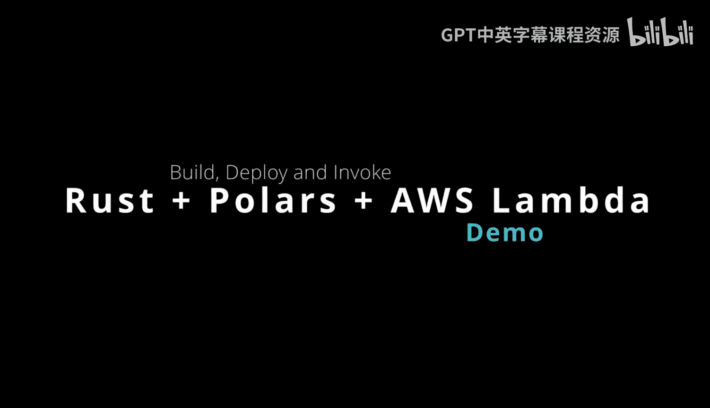
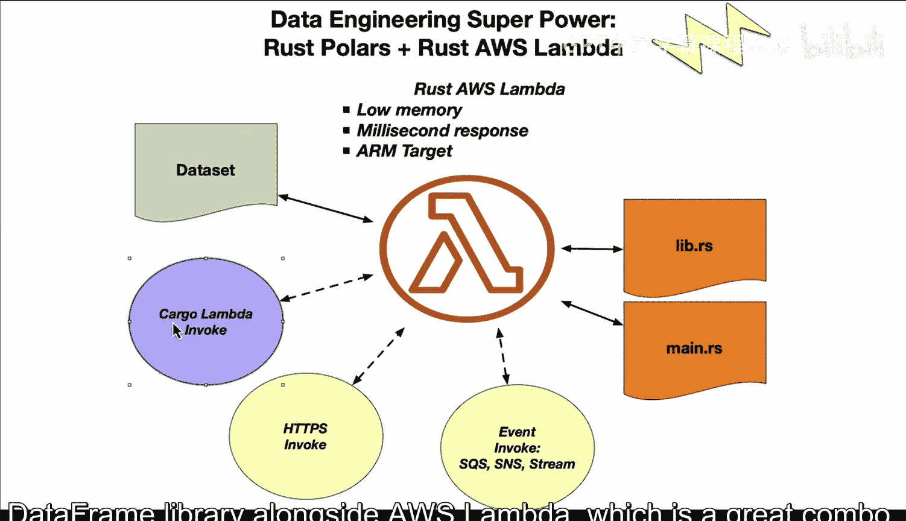
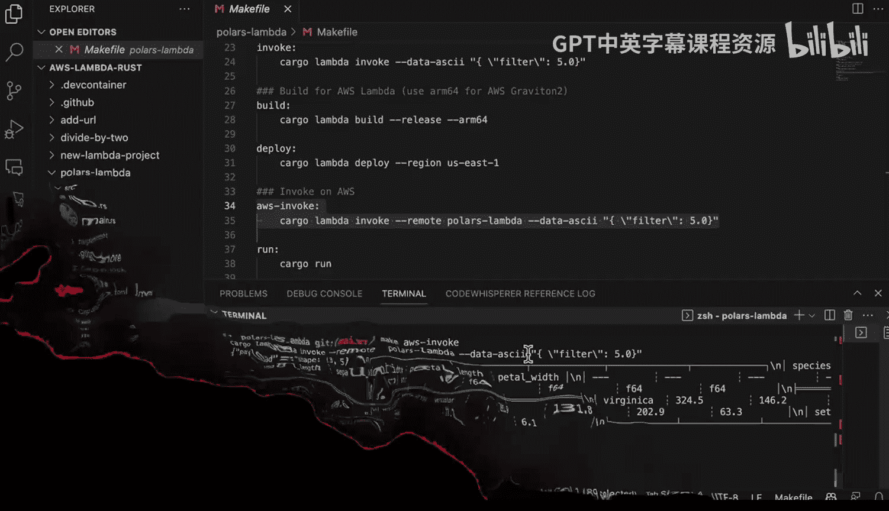

# Rust编程4-5：84_04_02：构建并部署Polars Rust AWS Lambda 🚀



在本节课中，我们将学习如何将高性能的Polars数据框库与AWS Lambda结合，并使用Cargo Lambda工具来构建和部署一个Rust函数。整个过程将展示如何创建一个能够快速处理数据的无服务器应用。

---

## 项目结构概览

首先，我们来看一下项目的基本结构。通过运行 `tree` 命令并排除 `target` 目录，可以清晰地看到项目的核心文件。



```
.
├── Cargo.toml
├── Makefile
└── src
    └── lib.rs
```

项目包含一个Cargo配置文件、一个Makefile以及位于`src`目录下的Rust源代码文件。代码量不大，接下来我们将逐一查看这些文件。

---

## 解析 Cargo.toml 文件

`Cargo.toml` 文件定义了项目的依赖项。我们使用了以下关键库：

*   **序列化/反序列化库**：用于处理Lambda函数的输入和输出。
*   **Polars**：高性能数据框库，用于数据处理。
*   **Tokio**：异步运行时，允许我们编写异步代码。

大部分与Lambda运行时相关的配置都由 `cargo-lambda` 工具自动处理。这个工具极大地简化了开发流程。

---

## 使用 Cargo Lambda 工具

`cargo-lambda` 工具提供了便捷的命令来开发、测试和部署Lambda函数。

以下是开发流程中常用的命令：

*   **本地开发与测试**：运行 `cargo lambda watch` 可以启动一个本地开发服务器，方便交互式测试。
*   **本地调用函数**：运行 `make invoke`（其内部调用 `cargo lambda invoke`）可以模拟AWS环境调用函数，并传递键值对参数。
*   **构建与部署**：运行 `make build` 和 `make deploy` 可以构建项目并将其部署到AWS。为了节省成本，我们可以选择部署到ARM64架构。
*   **远程调用**：部署后，运行 `make aws-invoke` 可以远程调用已部署在AWS上的Lambda函数。

整个反馈循环都由 `cargo-lambda` 高效管理。

---

## 核心代码解析

上一节我们介绍了工具链，本节中我们来看看具体的实现代码。主要逻辑位于 `src/lib.rs` 文件中。

### 数据处理逻辑

代码的核心是使用Polars库对内置的鸢尾花数据集进行一系列数据处理操作，包括过滤、分组和聚合。

```rust
// 示例性代码逻辑：过滤、分组、聚合
let df = df.filter(&filter_condition)?;
let grouped = df.groupby(["column_name"])?;
let result = grouped.agg(&[/* 聚合操作 */])?;
```

为了演示方便，数据集被直接硬编码在Rust文件中。对于大型项目，更常见的做法是将数据文件存储在Amazon S3等对象存储服务中。

### Lambda函数处理器

Lambda函数的主入口是一个异步处理函数。它接收一个包含过滤条件的请求，将其应用于数据框计算，然后返回结果。

```rust
use lambda_runtime::{service_fn, Error, LambdaEvent};
use serde::{Deserialize, Serialize};

#[derive(Deserialize)]
struct Request {
    filter: String, // 接收过滤条件
}

#[derive(Serialize)]
struct Response {
    payload: String, // 响应负载，此处简化地将整个数据框转为字符串
}

async fn function_handler(event: LambdaEvent<Request>) -> Result<Response, Error> {
    let filter_condition = event.payload.filter;
    // 调用计算函数，传入过滤条件
    let result_df = calculate(&filter_condition)?;
    // 将结果数据框转换为字符串（仅用于演示）
    let payload = result_df.to_string();
    Ok(Response { payload })
}
```

处理函数从事件中提取过滤条件，传递给计算逻辑，并将结果封装成响应。响应会被自动序列化为JSON格式。

### 主函数

主函数使用Tokio运行时启动Lambda运行时，并设置必要的日志追踪。

```rust
#[tokio::main]
async fn main() -> Result<(), Error> {
    // 初始化追踪
    tracing_subscriber::fmt()
        .with_max_level(tracing::Level::INFO)
        .init();
    // 启动Lambda运行时
    lambda_runtime::run(service_fn(function_handler)).await?;
    Ok(())
}
```

---

## 测试与部署流程

### 本地测试

在部署之前，强烈建议在本地进行测试。我们可以分屏操作：一个终端运行 `make watch` 启动本地模拟环境；另一个终端运行 `make invoke` 来调用函数并查看输出结果。这能确保代码逻辑正确无误。

### 构建与部署

本地测试通过后，就可以进行部署了。整个过程非常简单：

1.  运行 `make build` 编译项目。
2.  运行 `make deploy` 将编译好的二进制文件部署到AWS Lambda。

`cargo-lambda` 工具会处理所有与AWS交互的复杂细节。

### 远程验证

部署完成后，运行 `make aws-invoke` 可以远程调用部署在AWS上的Lambda函数。你会看到函数在毫秒级别内返回结果，这充分展示了Rust和Polars在无服务器环境下的高性能优势。

---

## 总结



本节课中我们一起学习了如何构建和部署一个集成Polars库的Rust AWS Lambda函数。我们了解了项目的结构，解析了核心的Cargo配置和数据处理代码，并实践了使用 `cargo-lambda` 工具进行本地测试、构建和部署的完整流程。这种组合为需要快速、高效处理数据的无服务器应用提供了一个强大的解决方案。