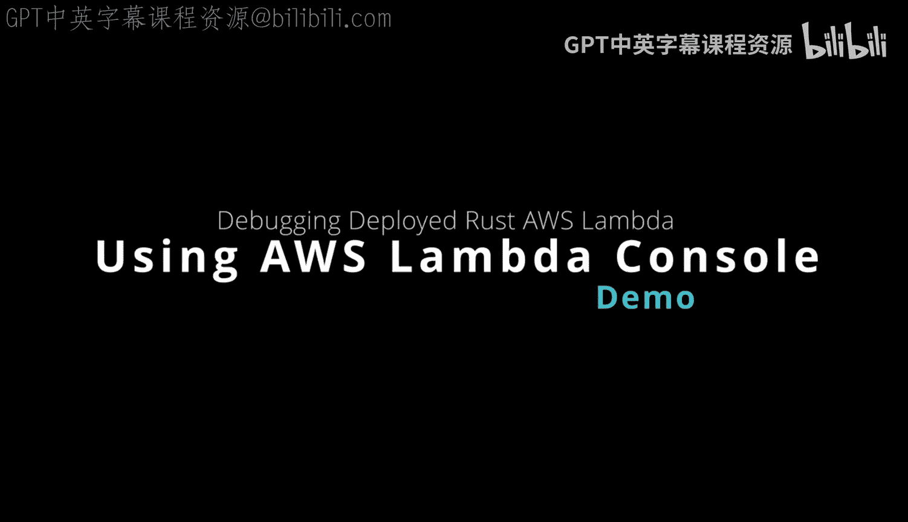
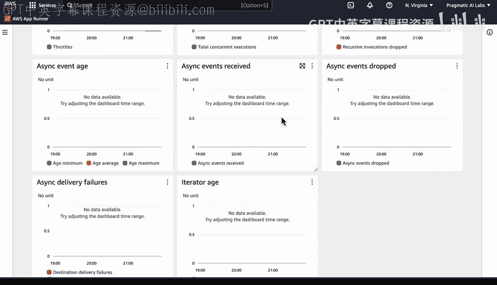
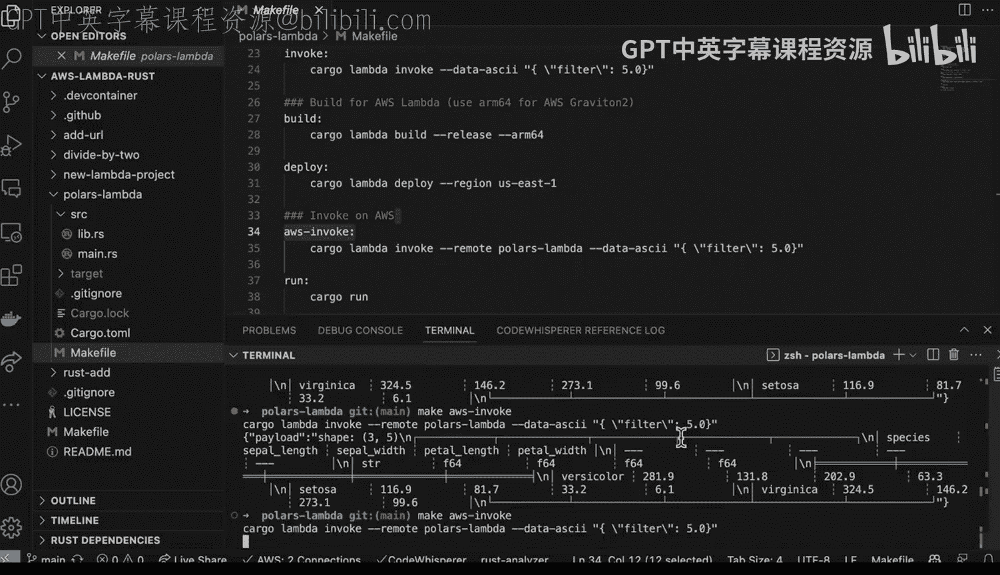
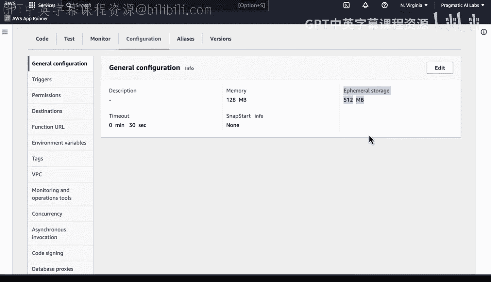
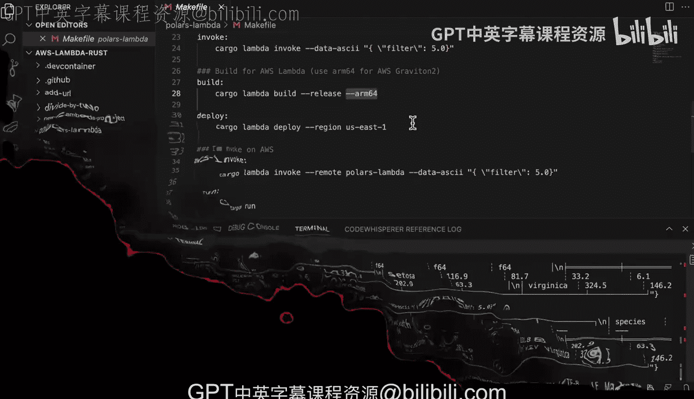

# Rust编程4-5：4.3：在AWS控制台操作已部署的Polars Rust Lambda 🚀

在本节课中，我们将学习如何在AWS Lambda控制台中操作一个已部署的、使用Rust和Polars库编写的Lambda函数。我们将探索如何查看其指标、进行测试、分析性能，并了解Rust在无服务器计算环境中的独特优势。

---

## AWS Lambda控制台概览

这是AWS Lambda控制台，它允许我查看可用的不同指标，并深入了解已部署的Lambda函数的运行情况。

在这个案例中，我使用Rust语言，并借助`cargo-lambda`工具来部署这个函数。

接下来，我将查看已修改的部分。看，这里有一个最近部署的、使用Polars库的Rust Lambda函数。如果我们点击查看，可以看到更多关于其运行状态的信息。

---

## 触发器与集成

这个函数会指向某个目的地吗？例如，它是否配置了触发器？很多时候，当你使用Rust构建高性能代码时，配置触发器是构建大规模数据工程管道的绝佳方式。这是因为Rust性能卓越，并且能与其他服务很好地协同工作。

以下是你可以为Rust Lambda函数配置的一些触发器类型：
*   负载均衡器或CloudFront
*   用于批量处理数据的服务
*   从S3或SQS等服务中拉取数据

Rust Lambda函数拥有大量优秀的触发器选项。

---

## 测试Lambda函数

由于这个函数是作为二进制文件部署的，我们无法直接查看其代码。但我们可以对其进行测试。

那么，我们如何测试它呢？在这个案例中，我知道将要发送的载荷（payload）会包含一个关键词过滤器和一个数字`5`。

如果我格式化这个载荷并点击“测试”，我们实际上可以看到执行结果。完美。

---

## 性能分析

现在，关于这个结果，一个有趣的点是：你可以看到这里初始化耗时**34毫秒**，而首次构建的持续时间为**1387毫秒**。

如果我再次运行这个测试，回到测试界面并再次点击“测试”，下一次的执行速度会快得多。你可以看到这里的持续时间仅为**6毫秒**。

因此，我们从这个Lambda函数中获得了惊人的响应时间和卓越的性能。

事实上，我们可以深入查看诸如**持续时间**、**构建持续时间**、**内存大小**和**最大内存使用量**等细节。

---

## Rust在AWS Lambda中的成本优势

这里需要指出关于Rust的一个非常重要且独特之处：AWS Lambda的计费是基于分配给函数实例的内存量。

如果你使用像Python或Ruby这样的脚本语言，可能需要分配更多内存，因此会被收取更多费用。但在Rust的情况下，请看这里，它的内存使用量远低于分配值，即使我正在用Rust执行一些相对繁重的操作，包括处理数据帧等。

所以，当你的Lambda部署后，这是一个需要关注的关键洞察点。

---

## 监控与日志

我们还可以进入“监控”选项卡，查看诸如日志等信息，了解最近发生了多少次调用、哪些调用最昂贵。

我们也可以查看指标，例如Lambda函数的执行时长（查看这个通常是个好主意）、被调用了多少次，以及是否存在任何错误或其他问题。

你可以在这里深入挖掘海量的细节信息。

---

## 手动调用与反馈循环

那么，我们如何实际调用这个函数并进行操作呢？既然它已经在运行，我只需要回到控制台，输入命令再次调用AWS Lambda。

这将再次调用它一次，我们甚至可以多次调用它来进行测试。

我们可以看到它在这里获得了非常好的性能。

然后，如果我们回到这里，实际上可以查看最近的调用记录，刷新后能看到许多不同的运行实例。

因此，在初始开发阶段，一个很好的实践是建立反馈循环，通过手动调用和查看日志流来深入了解细节。当然，你也可以在代码中添加更多日志，以获取更深入的运行洞察。

---

## 配置选项

现在，我想提一下另一个配置项。如果我们进入“配置”页面，查看“常规配置”，你还可以配置**快照启动**（这可以帮助你），以及配置**临时存储**。

在我们的具体案例中，还有一点需要注意：你也可以选择**ARM运行时**。ARM的好处在于可以节省**34%或更多**的成本。所以，使用Rust本身已经节省了大量费用，而当你转向ARM架构时，还能节省更多。

---

## 总结

本节课中，我们一起学习了如何在AWS Lambda控制台中操作一个已部署的Polars Rust函数。我们涵盖了从查看指标、配置触发器、进行测试，到深入分析性能表现和成本优势的全过程。关键点在于，Rust凭借其卓越的性能和极低的内存占用，使其成为构建高性能数据工程、MLOps或云计算应用的理想选择，尤其是在AWS Lambda这种按资源消耗计费的无服务器环境中。通过利用ARM架构，还能进一步优化成本。