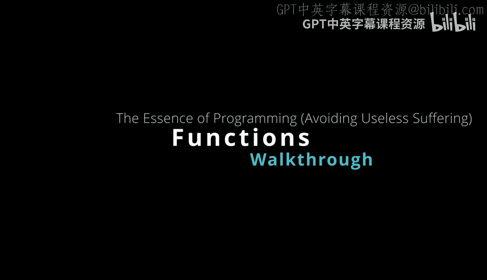
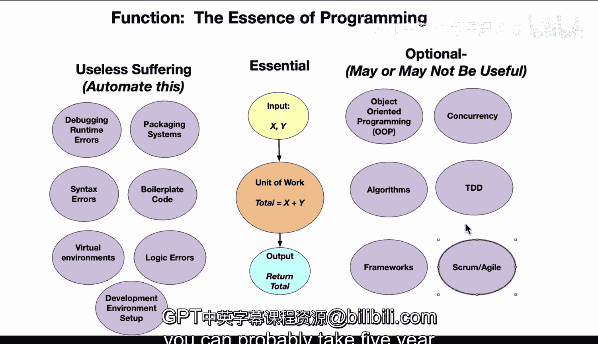

# Rust编程：4-5：编程的本质



## 概述

在本节课中，我们将探讨编程的核心本质，并帮助你区分哪些是必须掌握的编程核心，哪些是可以通过工具自动化或暂时忽略的“无用痛苦”，以及哪些是可选技能。理解这一点，可以帮助初学者避免常见误区，更快地提升编程效率。

## 编程的核心：输入、处理与输出

当你刚开始学习编程时，一个非常令人困惑的问题是：哪些是必须经历的“痛苦”，哪些是无用的“痛苦”？掌握这个区分的过程可能需要数年时间。

我将以一种我认为能帮助人们缩短这个过程的方式来进行分解，或许能节省五年时间。首先，让我们看看什么是真正的编程，以及什么是必不可少的。

如果你思考一个函数，它有一个输入 `x` 和一个 `y`，它执行一个工作单元，并返回 `x` 和 `y` 的总和。

```rust
fn add(x: i32, y: i32) -> i32 {
    x + y // 工作单元：求和
}
```

这就是所有编程语言的本质。它可以是 Rust、Python、JavaScript 或 Ruby。但编程的本质是：你有一个工作单元，它接收输入，执行工作，然后返回输出。

除此之外的任何事情，要么是无用的痛苦（你应该将其自动化），要么是可选的。它可能有用，也可能没用。

## 无用的痛苦：应该自动化的事情

以下是初学者常陷入的“无用痛苦”，你应该利用工具将它们自动化，而不是手动处理。

### 1. 调试运行时错误

这确实不应该是你手动完成的事情。刚开始编程时，你可能会感到不知所措，因为你觉得自己犯了所有这些错误。在编程中，一切总是出问题，这是事实。但程序员的角色是通过自动化来修复这些问题。

你应该使用持续集成、Makefile、优秀的代码检查工具，并可能使用 Copilot 或其他编码助手来帮助你处理运行时错误。

### 2. 包管理系统

这是另一个让初学者非常困惑的领域。他们认为使用 Conda、PIP 或其他工具就是编程。事实上，这与编程无关，甚至可能被称为糟糕的环境管理。许多包管理解决方案设计得并不好，而且彼此竞争，这与编程本身无关。

如果你感觉自己没有进步，可能只是因为你把时间浪费在了一些对经验丰富的开发者来说也没有意义的事情上。这同样应该被自动化，作为新手，你不应该为此花费大量时间担心。

### 3. 语法错误

如果你使用能自动检查这些问题的代码格式化和检查工具，你真的不需要担心这个。编辑器可以帮助你处理语法问题。这不是你应该花费大量时间的事情。

### 4. 样板代码

假设你正在定义一个类，或者在使用某种框架，其中的样板代码如果你不理解，就毫无意义。这只是无用的痛苦，可以通过生成式 AI 或优秀的编辑器等工具来解决。

### 5. 虚拟环境

我认为这在 Python 这类语言中是一种“生产力税”。因为它是一种脚本语言，你必须不断记住自己是否在正确的虚拟环境中。这与编程绝对无关，是你希望可以自动化的痛苦。

### 6. 逻辑错误

一旦你开始构建一些代码，为什么不设置一些自动化，以避免犯逻辑错误呢？这就是单元测试。如果单元测试在你提交代码时自动运行，你就不必担心这个问题。

### 7. 开发环境设置

现在，借助 GitHub Codespaces 等工具，这个问题已经基本解决了。你不应该花两周时间来设置环境。在我职业生涯早期，这很常见，一个新来的硕士或博士毕业生会花两周时间设置环境。他们显然非常有才华，但开发环境的设置过程非常可怕。

如今，有了 GitHub Codespaces、Docker 或基于云的环境，这应该是即时的。你不应该在这方面花费大量时间。

## 可选技能：可能有用也可能没用

上一节我们介绍了应该自动化的“无用痛苦”，本节中我们来看看那些可能有用也可能没用的可选技能。这也是编程新手容易混淆的地方。

### 1. 面向对象编程

一种可能有点精英主义的程序员会对别人说：如果你不做面向对象编程，你就不是在编程。这是错误的。

原因在于，这就是编程，但它不是面向对象编程。你可以进行不需要对象的编程。面向对象编程可能是一个有用的抽象，但它与学习成为一名程序员或进行编程无关。你只需要输入、工作单元和输出就能解决编程问题。

### 2. 并发

刚开始编程时，很容易陷入一种思维定式，认为你应该总是创建线程或进程，或者进行异步网络 I/O。但事实上，对于你试图解决的问题来说，这可能是一个真正的负担。所以，它可能有用，也可能没用。

### 3. 复杂算法

很容易对你所能想到的最复杂的算法感到兴奋。但最初当你刚起步时，使用最好的算法可能有用，也可能没用。

### 4. 测试驱动开发

很多时候，你会听到那些在测试方面可以说是“狂热分子”的人告诉你，你必须在写代码之前先写测试。这根本不是真的。测试驱动开发对你正在进行的项目来说，可能有用，也可能没用。

### 5. 框架

很多时候，人们将编程与框架混淆。框架是由第三方开发者编写的。一个 Web 框架或命令行工具框架可能有用，也可能没用。事实上，它可能非常复杂，以至于你无法理解。这并不意味着反映了你的能力，可能只是这个框架本身设计得不好。

### 6. 项目管理

许多非技术人员尤其倾向于 Scrum 和敏捷，因为容易获得认证。然后他们将这些“议程”强加给开发人员。开发人员可能会感到困惑，因为他们没有取得进展。但现实是，方法论本身可能就是有缺陷的。

## 总结

本节课中，我们一起学习了编程的核心本质。重要的是识别出核心（输入、工作单元、输出），以便你能专注于重要的事情。

如果你理解这一点，并在此基础上逐步积累成果，将可以自动化的东西自动化，并避免在真正需要之前去做那些可选的事情，你很可能能在职业生涯的生产力上走一条五年的捷径。



关键在于：**专注于核心，自动化琐事，明智地选择工具和方法**。