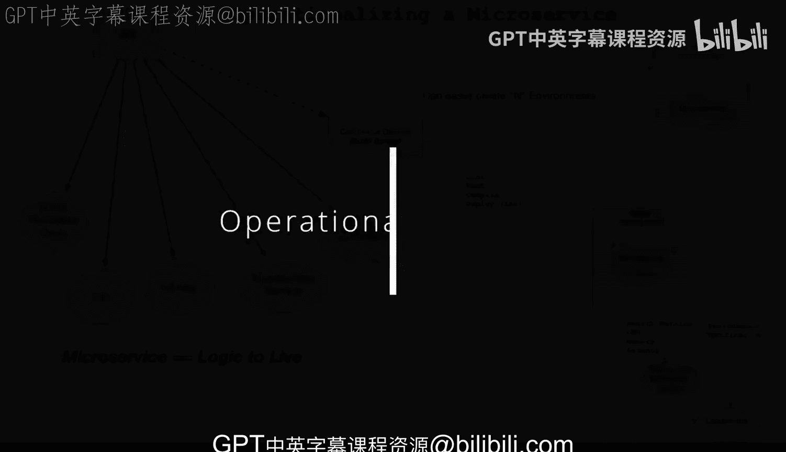
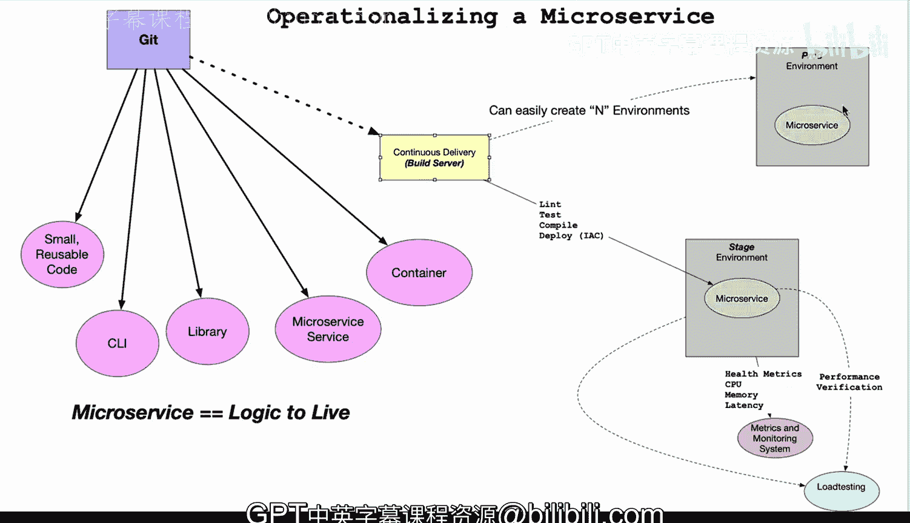

# Rust编程4-5：3.1.4：微服务运维化 🚀

在本节课中，我们将学习如何将一个微服务进行“运维化”。这意味着我们将探讨如何将一段代码逻辑，通过一系列自动化流程，转变为可部署、可监控、可扩展的线上服务。核心在于理解从代码提交到生产环境部署的完整生命周期。

---

上一节我们介绍了微服务的基本概念，本节中我们来看看如何将其付诸实践。下图展示了一个微服务运维化的典型流程。

图中描绘了将一个微服务进行运维化的过程。请注意，在Git版本控制系统中，微服务的某些优势开始显现。

我喜欢将微服务视为一段可以上线运行的逻辑概念。它具备以下一些特征：代码规模小，并且可复用。

因此，你可以将这段逻辑转化为多种形式。以下是几种可能的转化方向：

*   可以将其制作成一个**命令行工具**。
*   可以将其封装成一个**代码库**。
*   当然，可以将其构建成一个**微服务**。
*   也可以将其转换为一个**Docker容器**。

这些特性共同构成了微服务的本质。它就像是一个被“运维化”并赋予了新形态的函数。

---

上一部分我们了解了微服务的多种形态，接下来我们看看它如何进入自动化流程。当代码进入持续交付系统或构建服务器时，会经历一系列标准步骤。

这个过程通常包括代码检查、测试、编译，可能还会将构建产物推送到容器仓库，最后通过基础设施即代码的方式进行部署。

将基础设施即代码与容器技术结合使用，会带来一个关键优势：**你可以轻松创建任意数量的环境**。

例如，你可以创建：

*   一个**预发布环境**
*   一个**生产环境**
*   一个**负载测试环境**
*   一个**开发环境**

并且，你可以根据服务被部署到的不同环境，执行相应的自动化操作。

---

在了解了多环境部署的优势后，我们以预发布环境为例，看看具体的验证流程。在预发布环境中（这也是我在微服务实践中常做的），你的微服务会暴露健康指标。

这些指标包括CPU使用率、内存占用、请求延迟等。它们会被收集到某种监控系统中，例如**Prometheus**或AWS的**CloudWatch**。

随后，系统会进行**性能验证**。这一步的核心目的是确认实际情况是否符合你的预期。

一旦验证通过并获得批准，你就可以轻松地将代码合并到一个新的分支，并直接推送到生产环境。

---

本节课中我们一起学习了微服务运维化的完整流程。总而言之，一个微服务最简洁的解释就是：**一段被你推送上线的逻辑**。

通过版本控制、持续集成/持续部署、容器化、基础设施即代码以及监控告警这一系列环节，这段逻辑得以可靠、高效地运行在复杂的生产环境中。

