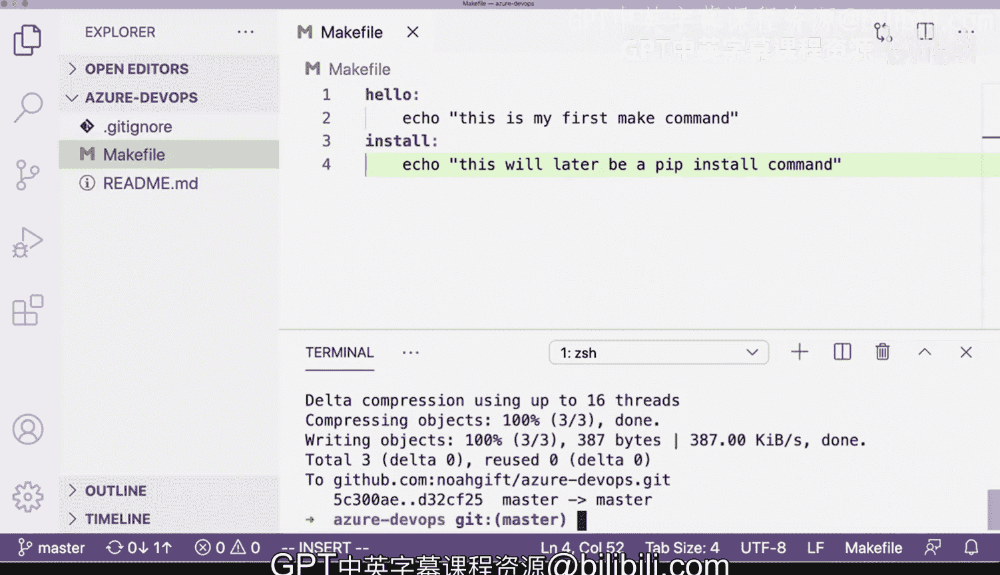

# Rust编程4-5（Linux命令行工具、LLMOps）：05_01_06：Makefile是什么及如何使用 🛠️


在本节课中，我们将学习什么是Makefile，它的用途是什么，以及如何创建和运行Makefile中的命令。Makefile是一个用于自动化构建步骤的工具，在Unix类系统（如macOS和Linux）中广泛使用。

## 什么是Makefile？

Makefile是一个包含一系列规则的文件，用于定义如何编译和构建项目。它通常用于自动化软件构建过程，但也可以用于运行任何你希望自动化的命令序列。

## 如何创建和运行Makefile

上一节我们介绍了Makefile的基本概念，本节中我们来看看如何实际创建一个Makefile并运行其中的命令。

首先，你可以在终端中键入 `which make` 命令来检查你的系统是否安装了 `make` 工具。在大多数Unix类机器上，`make` 命令都是预装的，或者很容易安装。

以下是检查 `make` 是否安装的步骤：
1.  打开终端。
2.  输入命令 `which make`。
3.  如果已安装，终端会显示 `make` 命令的安装路径（例如 `/usr/bin/make`）。

接下来，我们将使用 `touch` 命令创建一个名为 `Makefile` 的空文件。请注意，文件名必须精确地是 `Makefile`（首字母大写M很重要）。

创建文件后，你可以用任何文本编辑器打开它，并开始定义命令。例如，你可以定义一个名为 `hello` 的规则。

以下是创建一个简单 `Makefile` 的步骤：
1.  在项目目录中，运行 `touch Makefile`。
2.  使用编辑器打开 `Makefile`。
3.  输入你的第一条规则，例如：
    ```makefile
    hello:
        echo "This is my first make command."
    ```
4.  保存文件。
5.  在终端中运行 `make hello` 来执行该命令。

Makefile 的优点在于你可以将任何命令封装在其中，从而隐藏一些复杂性。例如，你可以定义一个 `install` 规则来运行安装步骤。

以下是定义 `install` 规则的示例：
```makefile
install:
    # 这里以后可以替换为实际的安装命令，例如 pip install
    echo "This will later be a pip install command."
```
保存后，运行 `make install` 即可执行该规则下的命令。

## 版本控制与后续开发

创建并测试了基本的Makefile后，通常的下一步是将其添加到版本控制系统中。

以下是管理Makefile的常见步骤：
1.  使用 `git add Makefile` 将文件添加到暂存区。
2.  使用 `git commit -m "adding a Makefile"` 提交更改。
3.  使用 `git push` 将更改推送到远程仓库。

完成这些步骤后，你就设置好了一个Makefile，并可以在后续的开发步骤中在此基础上进行构建，添加更复杂的构建、测试或部署规则。

## 总结



本节课中我们一起学习了Makefile的基础知识。我们了解了Makefile是一个用于自动化项目构建和任务执行的工具，学会了如何检查 `make` 命令、创建 `Makefile` 文件、在其中定义简单的规则（如 `hello` 和 `install`），以及如何运行这些规则。最后，我们还介绍了如何将Makefile纳入版本控制，为项目的自动化流程奠定基础。