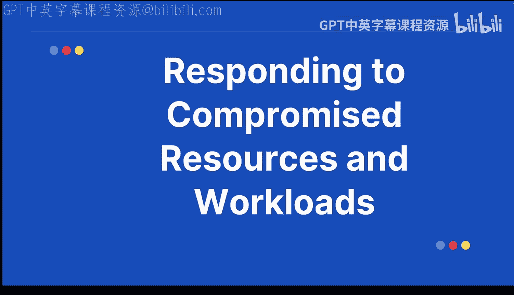
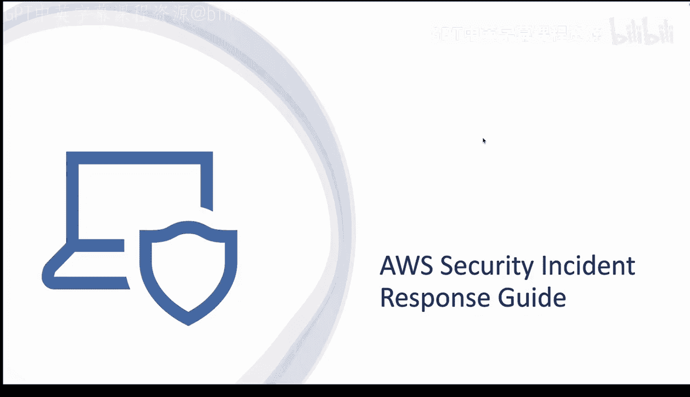
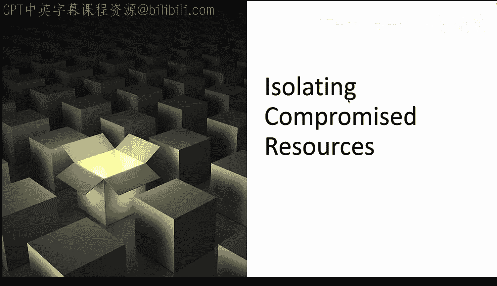
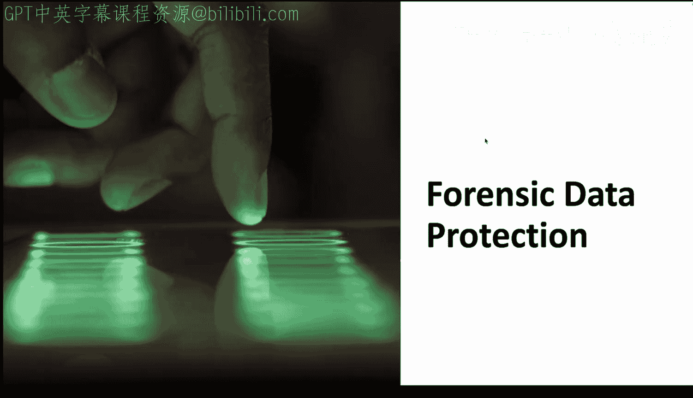

# AWS安全运维：第09章：应对受损资源与工作负载 🛡️

在本节课中，我们将学习如何在AWS环境中识别、隔离和分析被恶意篡改的资源与工作负载，并探讨自动化响应、取证保护以及事后的准备与恢复流程。掌握这些技能对于维护云环境的安全、合规性和业务连续性至关重要。

## 什么是受损资源？🔍

上一节我们介绍了课程概述，本节中我们来看看核心概念。受损资源是指任何被恶意篡改的网络或设备。例如，一个被入侵的EC2实例，或一个遭到未授权访问的S3存储桶。其影响范围广泛，可能从数据丢失延伸到法律责任的承担。因此，迅速响应至关重要。

## AWS安全事件响应指南 📘

了解基本概念后，我们来看看AWS提供的官方指导。AWS提供了一份专门针对其环境的安全事件响应指南。这份指南是任何AWS安全专业人员的必备资源。

以下是该指南涵盖的关键步骤：
*   **识别事件**：确认安全事件的发生。
*   **隔离受影响系统**：防止损害扩大。
*   **与法律实体协调**：确保符合法律和合规要求。

## 隔离受损资源 🚧

上一节我们介绍了响应指南，本节中我们来看看具体操作。隔离受损资源意味着阻止其造成进一步危害，就像隔离病毒一样。在AWS中，这可能意味着断开EC2实例的网络连接，或限制S3存储桶的访问权限。这种快速隔离能最大限度地降低风险，是大多数响应流程的第一步。

## 根本原因分析技术 🔬

成功隔离资源后，下一步是找出问题根源。根本原因分析旨在理解资源为何会受损，这是防止未来事件发生的关键。

以下是常用的分析技术：
*   **查看CloudTrail日志**：审计API调用活动。
*   **分析GuardDuty发现结果**：利用威胁检测服务的洞察。
*   **使用其他AWS工具**：如VPC流日志、Config规则等。

核心目标是理解出错原因，并制定未来的改进措施。

## 数据与日志分析 📊

除了分析原因，收集和分析现场数据同样重要。其核心思想是捕获关键数据，例如创建EBS卷快照或进行内存转储。这有助于理解事件发生时系统的实际状态。

以下是相关的日志分析概念：
*   **查询S3中的日志**：从存储的日志中提取信息。
*   **提供上下文信息**：将不同来源的数据关联起来。

这些技术支持对事件进行详细理解和生成准确的报告。

## 自动化修复 🤖

在分析了原因和数据后，我们可以利用自动化来加速响应。自动化修复意味着利用AWS服务实现自动响应。例如，可以构建无服务器自动化响应流程，用于发送电子邮件或通知。这能加快恢复速度，减少人为错误，并且可以根据特定事件进行定制。自动化是现代事件响应与编排中的一个强大工具。

## 取证数据保护 ⚖️

为了满足法律和合规性要求，保护取证数据至关重要。取证数据保护对于调查的完整性和任何潜在的法律程序都至关重要。

以下是可用于保护证据的工具示例：
*   **S3对象锁定**：使用`S3 Object Lock`功能防止证据被篡改或删除。
*   **隔离的取证账户**：在独立的AWS账户中保存和分析证据。

## 准备与恢复 📈

最后，我们必须认识到，安全事件管理是一个持续的过程。这意味着在事件发生前就做好准备，制定计划、准备工具并进行培训。恢复工作则包括恢复服务、从事件中学习经验教训，并为未来进行改进。这些是有效安全管理组织中持续进行的流程，意味着你需要不断更新这些程序。

## 总结 📝

本节课中，我们一起学习了应对AWS中受损资源与工作负载的全过程。要记住，响应工作需要综合运用技术技能、周密计划和对AWS的理解。这包括**隔离**、**恢复**以及事后维护安全与合规的步骤。同样重要的是，持续学习和实践对于维护一个安全的组织环境至关重要。